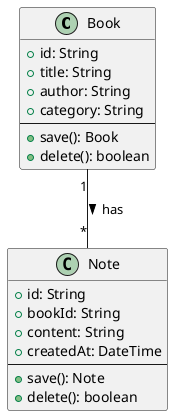

# 产品需求文档（PRD）

## 向导Agent与编程Agent多智能体协同开发平台

> 版本：v0.2 | 日期：2026-05-29 | 状态：修订版待审
>
> 变更摘要：
> - 新增 BDD+GWT 验收标准体系、PlantUML 机读约束格式
> - 新增点选纠错、时间轴线性回滚、异常自愈机制
> - 细化 Agent 角色切换机制与职责边界
> - 补充工程模板自动推断、埋点事件清单
> - 删除极速/协作子模式概念，保持快消型/长期迭代型两道门
> - 用户画像保持简洁分类，不引入过度细分

---

## 目录

1. [产品概述](#1-产品概述)
2. [用户画像](#2-用户画像)
3. [两种产品模式](#3-两种产品模式)
4. [Agent架构体系](#4-agent架构体系)
5. [文档体系标准](#5-文档体系标准)
6. [工作流与流程设计](#6-工作流与流程设计)
7. [UX与交互设计](#7-ux与交互设计)
8. [BDD+GWT 验收标准与 PlantUML 强约束层](#8-bddgwt-验收标准与-plantuml-强约束层)
9. [裁判Agent机制](#9-裁判agent机制)
10. [PRD-测试强对应体系](#10-prd-测试强对应体系)
11. [工程模板体系](#11-工程模板体系)
12. [数据采集与分析体系](#12-数据采集与分析体系)
13. [技术架构概述](#13-技术架构概述)
14. [开发路线图](#14-开发路线图)

---

## 1. 产品概述

### 1.1 产品定位

一款**桌面应用**（基于 Proma fork），通过"向导Agent + 编程Agent"双脑协同，让**完全不具备编程能力的普通用户**，仅凭自然语言对话即可驱动完整软件制品的开发与持续迭代。

### 1.2 核心价值主张

> "告诉它你想做什么，它帮你做好。"

- **对用户**：不需要学编程、不需要懂架构、不需要配置开发环境。用户只需要描述想法，系统完成从需求→设计→编码→测试→交付的全闭环。
- **对研究者**：全量采集用户交互数据，量化分析非专业人员使用自然语言驱动AI开发的最佳范式。

### 1.3 产品形态

- 桌面应用（Windows / macOS / Linux）
- 基于 Proma 源码 fork，保留其核心框架能力，新增向导Agent + 编程Agent协同体系
- 编程Agent在用户**本地**运行（SaaS版本为远期规划）

---

## 2. 用户画像

### 2.1 主要目标用户（P0）

**完全零基础的非专业用户**：不具备任何编程知识，不懂HTML/CSS/JS，不了解数据库、前后端等概念。典型代表：文科生、商学院学生、普通办公人员。

他们的需求特征：
- 有明确的想法但不知如何技术实现
- 希望做出实际可用的软件工具来解决问题
- 不能/不愿投入时间学习编程

### 2.2 次要用户（P1）

**有一定基础概念但不写代码的人**：知道网页、数据库等基本概念，能理解技术术语，但自己不会写代码。

### 2.3 研究用户（内部）

**课题组成员/研究者**：通过后台数据看板分析用户行为数据，提炼"自然语言最佳交互指令范式"。

### 2.4 核心恐惧点与产品应对

| 恐惧点 | 产品应对 |
|--------|---------|
| 怕看到代码 | 默认不展示源码，预览优先 |
| 怕搞坏东西 | 操作前自动快照，随时可回滚 |
| 怕隐私泄露 | 数据脱敏说明，本地运行保障 |
| 怕AI做的东西不对 | 原型预览确认 + 测试报告收口 |
| 怕操作太复杂 | 卡片选择代替文本输入，单选代替填空 |
| 怕等待焦虑 | 超过5秒显示进度提示文案 |

---

## 3. 两种产品模式

用户启动应用后，面对**两道门**，必须明确选择其一（不可模糊进入）。快消型可在进行中切换为长期迭代型（系统强烈建议先完成快消型全过程后再切换）。

### 3.1 快消型（Quick MVP）

**适用场景**：一次性工具、小应用、验证想法。用户想要快速得到一个能用的东西。

**核心理念**："快速实现，测试收口"——允许AI在充分沟通后大撒把实现，以测试用例全部通过作为交付标准。

**关键特征**：
- 文档精简，尽快进入原型和编码
- **BDD+GWT为核心验收机制**，PlantUML可省略或极简
- AI主导多轮自动化测试，测试用例全量通过 = 交付合格
- 架构设计师和工程经理**隐于后台**，自动化决策，不对用户暴露
- 编程Agent在编程层自主解决异常，不倒回向导Agent改需求
- 交付用户试用 + 反馈改进循环
- 可升级为长期迭代型项目（具体规则见§3.3）

### 3.2 长期迭代型（Long-term Iteration）

**适用场景**：需要持续更新版本的项目，如开源工具、商业产品、长期维护的个人项目。

**核心理念**：完整的软件工程方法论驱动，PRD→架构→设计→编码→测试→版本交付→持续迭代。

**关键特征**：
- 全文档完备后才开工编码
- **PlantUML类图+时序图为主约束，BDD+GWT为行为验证补充**，两者互补
- 架构设计师和工程经理**跳到前台**，与用户确认设计方案和Sprint规划
- Sprint规划、版本管理、变更日志
- 编程Agent执行异常时可出具变更说明，告知用户原因并调整实现方案（不倒回需求阶段）
- 不同Agent在版本间可平滑交接，上下文不丢失

### 3.3 模式转换

快消型项目进行中或完成后，用户均可将其升级为长期迭代型项目。系统建议先完成快消型全过程以充分激发想法。已完成的软件作为起点文档，补全正式文档体系后进入规范化迭代流程。

---

## 4. Agent架构体系

### 4.1 总览

系统包含三大Agent体系 + 一个独立裁判模块：

```
┌──────────────────────┐     ┌──────────────────────┐
│    向导Agent团队      │     │    编程Agent团队      │
│                      │     │                      │
│  ┌────────────────┐  │     │  ┌────────────────┐  │
│  │  需求分析师      │  │     │  │   架构师        │  │
│  │  UI/UX顾问      │  │     │  │   前端开发      │  │
│  │  架构设计师      │  │     │  │   后端开发      │  │
│  │  工程经理        │  │     │  │   全栈开发      │  │
│  └────────────────┘  │     │  │   测试工程师    │  │
│                      │     │  │   代码审查员    │  │
│                      │     │  │   DevOps工程师  │  │
│                      │     │  │   项目经理      │  │
│                      │     │  └────────────────┘  │
└──────────┬───────────┘     └──────────┬───────────┘
           │                             │
           │   文档体系交接                │
           └──────────┬──────────────────┘
                      │
              ┌───────┴───────┐
              │   裁判Agent    │
              │  (独立模块)    │
              │ 流程门禁       │
              └───────────────┘
```

### 4.2 用户视角

用户**始终只面对一个"向导Agent"**进行对话。角色在后台静默切换，UI自然过渡。用户不需要知道也不应该感知到背后有多少个Agent角色在工作。

### 4.3 向导Agent内部角色

每个角色是独立的 System Prompt 文件 + 模型API配置。系统根据对话阶段自动路由加载。

| 角色 | 职责 | 模型策略 | 激活时机 |
|------|------|---------|---------|
| **需求分析师** | 与用户对话、挖掘需求、引导思考、撰写PRD | 对话能力强、有耐心、善于引导 | 项目启动、需求变更时 |
| **UI/UX顾问** | 设计页面布局、交互流程、产出可交互HTML原型 | 带视觉能力的国产多模态模型 | 与需求分析师**并行**，涉及前端UI需求时 |
| **架构设计师** | 技术选型、PlantUML建模、API规范设计 | 逻辑推理强、长上下文SOTA模型 | PRD确认后（快消型隐于后台，长期迭代型跳到前台） |
| **工程经理** | 确定编程Agent团队配置、协作流程、Sprint规划 | 长上下文SOTA、理解软工方法论 | 架构设计后（快消型隐于后台，长期迭代型跳到前台） |

**关键协作关系**：
- **需求分析师 + UI/UX顾问并行工作**：图形化界面的描述也是揭示需求的过程，两者共同完成完整PRD（含UX原型）
- **架构设计师 + 工程经理的模式差异**：快消型全自动决策，不对用户暴露；长期迭代型需用户确认设计方案和工程计划

> **⚡ "并行"语义澄清（2026-07-25 A1 文档治理 P0 补注 · worker=macp2-B1b-worker）**
> 本文（含本节表格、§5/§6 流程图、§10 交付物清单、§11 工程模板等处）出现的"并行"表述——如"需求分析师 + UI/UX顾问并行"、"前端+后端并行开发"、"前后端并行 Sprint"——均指**逻辑并行 / 角色分工**：各角色在各自职责范围内**独立推进**产出，通过**文件系统交接中间产物**（如 PRD 草案、UX 原型、API 规约、代码模块）完成协同，**无运行时耦合**。
>
> **不是**进程级/线程级并发：本平台采用**零依赖文件交接架构**——Agent 之间**无消息队列、无 HTTP/RPC 调用、无共享内存、无锁竞争**，不要求两个角色在同一时刻物理同时运行，也不依赖任何实时通信通道或同步原语。"并行"强调的是**职责解耦与基于文件交接的产出协同**（一角色产出落盘 → 另一角色读取继续），而非时间片上的并发执行。读者请勿将其误解为需要并发运行时、线程调度或实时消息总线。

### 4.4 编程Agent内部角色

向导Agent根据项目特征，从角色池中激活所需的编程Agent角色。激活哪些角色、采用什么协作流程，由工程模板 + 向导Agent动态判断。

**角色池**：

| 角色 | 职责 | 激活条件 |
|------|------|---------|
| **架构师** | 审核设计规约、保证代码结构符合PlantUML约束 | 长期迭代型必选 |
| **前端开发** | 实现UI界面、对接API、交互逻辑 | 有UI需求时激活 |
| **后端开发** | 实现API、数据库、业务逻辑 | 有后端需求时激活 |
| **全栈开发** | 前后端一体实现（小型项目） | 快消型或小型项目 |
| **测试工程师** | 编写运行GWT测试用例、回归测试、输出测试报告 | 所有项目必选 |
| **代码审查员** | 代码质量检查、安全审查、合规校验 | 长期迭代型必选 |
| **DevOps工程师** | CI/CD配置、部署脚本、环境管理 | 需要部署时激活 |
| **项目经理** | 追踪Sprint进度、协调阻塞、风险预警 | 大型多Sprint项目 |

**团队配置由向导Agent/工程经理决定，对用户完全透明。**

### 4.5 测试Agent与裁判Agent的职责边界

```
编程Agent产出代码
        │
        ▼
┌──────────────────┐
│   测试Agent       │  ← 执行者（运动员）
│   执行GWT测试用例 │     "代码能不能跑通验收场景？"
│   输出测试报告    │     关注测试覆盖率、通过率
└──────┬───────────┘
       │ 测试报告
       ▼
┌──────────────────┐
│   裁判Agent       │  ← 判定者（裁判员/流程门禁）
│   综合判定        │     检查：
│   输出通过/退回   │     - 测试是否全部通过？
│                    │     - 代码结构是否匹配PlantUML？
│                    │     - PRD功能是否全部有测试对应？
│                    │     不管代码质量和具体实现细节
└──────────────────┘
```

**裁判Agent是流程门禁，不是质量审计员。** 它只检查"交接是否到位"，不深入审计具体代码质量——那是编程Agent内部各角色的职责。

---

## 5. 文档体系标准

### 5.1 文档即约定

向导Agent团队与编程Agent团队之间以**完整文件体系（目录结构）**作为交付物和沟通基础。所有文档必须满足两个标准：
- **机器可解析**：结构化格式，裁判Agent可自动校验
- **人可阅读**：零基础用户也能大致看懂PRD和原型

### 5.2 长期迭代型——完整文档目录

```
project-root/
├── 01_PRD/                          # 产品需求文档（含UX）
│   ├── prd.md                       #   需求文档正文
│   └── user-stories.md              #   用户故事拆解（符合INVEST原则）
│
├── 02_UX_DESIGN/                    # UX与交互设计
│   ├── sitemap.md                   #   页面结构/信息架构
│   ├── user-flows.md                #   关键用户旅程
│   ├── wireframes/                  #   可交互HTML原型
│   │   ├── page-home.prototype.html
│   │   ├── page-detail.prototype.html
│   │   └── ...
│   ├── design-system.md             #   颜色/字体/间距/组件规范
│   └── interaction-spec.md          #   动效/过渡/状态变化规则
│
├── 03_ARCHITECTURE/                 # 架构设计
│   ├── architecture.md              #   架构总览与技术选型
│   ├── class-diagram.puml           #   类图 — PlantUML机读格式 ★
│   ├── sequence-diagrams/           #   关键交互时序图 — PlantUML ★
│   │   ├── user-login.seq.puml
│   │   └── ...
│   └── data-model.md                #   数据模型设计
│
├── 04_API_SPEC/                     # 接口规范
│   └── api-spec.md                  #   REST/GraphQL接口完整定义
│
├── 05_PROJECT_PLAN/                 # 项目规划
│   ├── sprint-plan.md               #   Sprint分解与里程碑
│   ├── team-config.md               #   编程Agent团队角色配置
│   └── workflow.md                  #   团队协作流程定义
│
├── 06_TESTS/                        # 测试（BDD+GWT格式）
│   ├── features/                    #   GWT Feature文件 ★
│   │   ├── feature-01.feature
│   │   └── ...
│   ├── step-definitions/            #   步骤定义（自动生成）
│   └── test-plan.md                 #   测试策略概述
│
├── 07_VERSIONS/                     # 版本管理
│   └── changelog.md                 #   版本变更记录
│
└── README.md                        # 项目总览（自动生成）
```

### 5.3 快消型——精简文档目录

```
project-root/
├── 01_PRD/
│   └── prd.md                       # 精简PRD（含UX原型描述）
│
├── 02_UX_DESIGN/
│   └── wireframes/                  # 核心页面原型
│       └── page-main.prototype.html
│
├── 03_ARCHITECTURE/
│   └── architecture.md              # 简版架构，技术选型概要
│                                    # PlantUML可省略或极简
│
├── 04_API_SPEC/
│   └── api-spec.md                  # 自动推断的接口定义
│
├── 06_TESTS/                        # ★ 收口环节
│   ├── features/                    #   GWT Feature文件 ★核心
│   └── test-plan.md                 #   测试策略
│
└── README.md
```

**关键差异**：快消型砍掉 PROJECT_PLAN、VERSIONS、user-stories 等工程管理文档。聚焦于"PRD→原型→代码→BDD测试收口"的最短路径。PlantUML仅在有明确需要时生成精简版。

---

## 6. 工作流与流程设计

### 6.1 快消型流程

```
用户说想法
    │
    ▼
[需求分析师 + UI/UX顾问并行]
  │  多轮深度对话（最少3-5个问题/轮，动态上限）
  │  逐步诱发用户真实意图
  │  同步产出HTML原型帮助可视化沟通
  │
    ▼
精简PRD + 核心页面原型 → 用户确认
    │
    ▼
[架构设计师 · 隐于后台]
  │  自动技术选型
  │  自动推断API
  │  简版架构方案（不暴露给用户）
    │
    ▼
[工程经理 · 隐于后台]
  │  分配全栈开发 + 测试Agent
    │
    ▼
[编程Agent] 编码实现
  │  失败 → 自动修复（最多3次）
  │  3次仍失败 → 回滚到上一健康快照 → 换个方式重试
  │  全程不倒回向导Agent改需求
    │
    ▼
[测试Agent] 跑全量GWT测试用例 → 输出测试报告
    │
    ▼
[裁判Agent] 判定：测试全部通过？PRD功能全覆盖？ → 通过/退回
    │
    ▼
交付用户试用 → 收集反馈 → 改进 → 可升级为长期项目
```

### 6.2 长期迭代型流程

```
用户说想法
    │
    ▼
[需求分析师 + UI/UX顾问并行]
  │  深度沟通（多轮，每轮最少3-5个问题）
  │  完整PRD + 用户故事（符合INVEST原则）
  │  全页面HTML原型 + 设计系统 + 交互规范
  │  用户签字确认
    │
    ▼
[裁判Agent · 第一道关]
  │  文档体系硬约束+软约束审查 → 退回/通过
    │
    ▼
[架构设计师 · 跳到前台]
  │  PlantUML类图 + 时序图 + 数据模型
  │  技术选型方案 → 用户确认
    │
    ▼
[工程经理 · 跳到前台]
  │  编程Agent团队配置 + Sprint分解 + 协作流程
  │  与用户确认开发节奏
  │  产出 team-config.md + sprint-plan.md
    │
    ▼
[编程Agent团队] Sprint 1 开工：
    架构师审核规约 → 前端+后端并行开发 → Reviewer审查
    → 测试Agent执行GWT → 裁判Agent校验（代码结构 ≡ PlantUML？）
    → 通过则合并
  │  异常处理：
  │    编程Agent自修复（最多3次）
  │    若涉及设计约束不可实现 → 出具变更说明 → 用户确认 → 调整方案
  │    不倒回需求阶段
    │
    ▼
Sprint 1 交付 → Sprint 2 → ... → 版本发布
    │
    ▼
更新 changelog → 下一版本规划 → 循环迭代
```

### 6.3 异常自愈机制

**适用两种模式**，由编程Agent团队自主决策修复策略。

```
编程Agent执行任务
    │
    ▼
生成/构建/测试
    │
┌───┴───┐
│       │
成功    失败
│       │
▼       ▼
继续    自动修复（最多3次）
        │  每次可选择不同修复策略
        │  具体策略由编程Agent团队自主决策
    ┌───┴───┐
    │       │
  成功    失败（3次后）
    │       │
    ▼       ▼
  继续    熔断触发
            │
            ▼
        回滚到上一个健康快照
            │
            ▼
        告知用户：
        "刚才的修改没有成功，
         已回到上一个正常版本，
         你的内容没有丢失。"
            │
        快消型：换个技术方案重新尝试（编程层闭环）
        长期迭代型：如涉及设计约束不可实现 →
         出具变更说明 → 用户确认 → 调整方案（不倒回需求阶段）
```

---

## 7. UX与交互设计

### 7.1 设计原则

- **零门槛**：用户只看到一个聊天界面，没有技术配置面板
- **可视化**：关键决策点展示原型截图或HTML预览。原型预览是用户最主要的确认方式
- **渐进式**：不一次性抛出大量问题，每轮最少3-5个问题引导思考
- **安全感**：每次大改动前自动快照，出错时可以一键回滚

### 7.2 原型方案

**主力方案：可交互HTML原型**

- 向导Agent（UI/UX顾问角色）生成带内联CSS/JS的单文件HTML原型
- 用户双击即可在浏览器中预览交互效果
- 原型内容包含模拟数据，可点击、可跳转页面
- 前端开发Agent**直接以原型HTML作为UI实现模板**

**视觉模型辅助**：
- 向导Agent调用带视觉能力的国产多模态模型
- 截图HTML原型 → 视觉模型审查UI布局、可用性问题
- 用户也可以直接截图标注问题发回给Agent

**Figma集成**（远期可选增强）：
- 通过Figma REST API导出设计稿
- 不作为主路径，仅作为有Figma账号用户的备选方案

### 7.3 点选纠错（Click-to-Fix）

用户在与原型预览交互时，可直接点击不满意的界面元素，系统自动将该元素位置和上下文转换为修改意图，交给编程Agent执行修改。

**功能行为描述**：
1. 用户在预览区点击或框选不满意的界面元素
2. 系统捕获点击目标及其上下文信息
3. 向导Agent将点击位置和上下文转换为修改规约
4. 编程Agent根据修改规约更新代码
5. 预览区自动刷新展示修改结果

**技术实现方案留待架构设计阶段确定。**

### 7.4 时间轴与线性回滚

**功能行为描述**：
1. 系统在关键节点自动保存版本快照
2. 快照触发时机：初版生成时、用户确认修改前后、模式转换时、异常回滚前
3. 用户可查看历史版本列表，每个快照附带时间戳和自然语言描述
4. 用户可一键回到任意旧版本
5. 回滚不丢失当前版本（当前版本也保存为快照）
6. **只做线性回滚，不做版本分支**——回到旧版本后继续修改，旧版本之后的快照仍保留但仅作存档
7. 用户不可手动创建快照，系统自动管理快照生命周期

**零基础用户不需要理解"分支"概念。**

### 7.5 心理防御文案

超过5秒的操作显示进度提示。出错时使用安抚文案：

| 场景 | 文案示例 |
|------|---------|
| 等待中 | "我正在帮你生成可运行的版本，这个过程只发生在安全环境里，不会影响你的电脑文件。" |
| 修改成功 | "改好了，你看看效果？不满意随时告诉我。" |
| 修改失败 | "刚才的修改没有成功，我已经帮你回到上一个正常版本，你的内容没有丢失。我们换个思路试试？" |
| 回滚完成 | "已经回到之前的版本了，一切都在。要继续的话随时告诉我。" |
| 操作超时 | "这次操作花了比预期更长的时间，我还在处理中。如果等太久，你可以催我。" |

### 7.6 零基础用户的交互设计要点

- 向导Agent不说技术术语，用生活化语言描述
- 原型预览是用户**最主要的确认方式**（比文档更直观）
- "你觉得这个页面看起来对吗？"比"请确认PRD第3.2节"有效100倍
- 偏好卡片选择而非长文本输入，偏好单选而非填空
- 每个选择问题提供"你帮我决定"选项

---

## 8. BDD+GWT 验收标准与 PlantUML 强约束层

### 8.1 核心思路

**BDD+GWT 管"外部行为契约"**（用户可见的功能对不对），**PlantUML 管"内部结构契约"**（代码架构对不对）。两者互补，各自解决不同层次的问题。

| 维度 | BDD + GWT | PlantUML（类图+时序图） |
|------|----------|------------------------|
| 约束对象 | 系统对外行为 | 系统内部结构 |
| 驱动方式 | 验收场景→测试→代码 | 设计蓝图→代码骨架 |
| 可执行性 | 可自动运行验收测试 | 不可直接执行，裁判Agent做结构校验 |
| 主要用途 | 需求澄清、验收测试、快消型收口 | 架构约束、代码生成指导、长期稳定性 |
| 对用户 | 不可见（Agent内部生成） | 不可见（Agent内部校验，长期迭代型设计确认时除外） |

### 8.2 两种模式的分工

```
快消型：以 BDD+GWT 为核心，PlantUML 可省略或极简
  ┌──────────┐     ┌──────────┐
  │   PRD    │ ──→ │ GWT测试  │ ← 收口判定
  └──────────┘     └──────────┘
  PlantUML：仅在有必要时生成简版架构草图

长期迭代型：PlantUML主约束 + BDD行为验证，两者互补
  ┌──────────┐     ┌──────────┐     ┌──────────┐
  │   PRD    │ ──→ │ PlantUML │ ──→ │ GWT测试  │
  └──────────┘     └────┬─────┘     └──────────┘
                        │                  │
                  裁判Agent           裁判Agent
                  校验结构一致性      校验行为正确性
```

### 8.3 BDD+GWT 验收标准

**GWT格式（Given-When-Then）** 作为验收标准的基本格式：

```gherkin
Feature: 读书笔记管理

  Scenario: 成功添加一条读书笔记
    Given 用户在笔记列表页面
    When 用户输入书名"百年孤独"
    And 用户输入笔记内容"精彩的开篇"
    And 用户点击"保存"按钮
    Then 笔记列表中显示"百年孤独"
    And 系统提示"保存成功"

  Scenario: 空书名提交被拒绝
    Given 用户在笔记列表页面
    When 用户不输入书名
    And 用户点击"保存"按钮
    Then 系统提示"请输入书名"
    And 笔记不会被保存

  Scenario: 按分类筛选笔记
    Given 用户已有分类为"文学"的笔记2条
    And 用户已有分类为"技术"的笔记3条
    When 用户选择分类"文学"
    Then 列表只显示2条笔记
    And 所有显示的笔记分类均为"文学"
```

**GWT场景的生成与维护**：
- PRD定稿后，向导Agent自动为每个功能需求（F-xx）生成对应的GWT场景
- 每个场景覆盖：正常路径 + 边界条件 + 异常输入
- 用户可在PRD阶段补充自己关心的测试场景（用自然语言："我想确认一下如果..."）

**开发与测试的博弈**：
- 开发人员（编程Agent）基于GWT编写产品代码
- 测试人员（测试Agent）基于GWT编写自动化步骤定义（step definitions）
- 测试方持续补充新的GWT场景（边界、异常、复杂组合）来考验产品代码
- 两者围绕同一套GWT契约形成"建设性博弈"——测试想发现问题，开发想证明正确

### 8.4 PlantUML 强约束

**PlantUML作为UML的文本化实现**，产出 `.puml` 代码文件而非图片。裁判Agent可直接解析文本进行代码结构校验。

**约束类型（Phase 1 轻量起步）**：

| 阶段 | UML图类型 | 约束内容 | 机读表示 |
|------|----------|---------|---------|
| **Phase 1** | 类图 | 有哪些类、属性、方法、类间关系 | PlantUML `.puml` |
| **Phase 1** | 时序图 | API调用序列、参与者、消息顺序 | PlantUML `.puml` |
| **Phase 2** | 状态图 | 系统状态、合法转移路径 | PlantUML `.puml` |
| **Phase 3** | 活动图 | 业务逻辑流程、分支条件 | PlantUML `.puml` |

**PlantUML 示例（类图）**：



**校验逻辑**：
- 裁判Agent读取编程Agent产出的代码 → 提取实际的类结构/API调用序列
- 与PlantUML规约逐项对比 → 输出合规报告（类是否存在？属性类型是否匹配？关系是否正确？）
- PlantUML对非专业用户**完全透明**（长期迭代型中架构设计方案确认除外，此时用户只看到结构化的功能描述，不接触PlantUML代码）

---

## 9. 裁判Agent机制

### 9.1 定位

裁判Agent是两个Agent团队之间的**独立流程门禁**。文档/代码不经裁判通过，不能进入下一阶段。

**裁判Agent是流程门禁，不是质量审计员。** 它检查交接是否到位，不深入审计代码质量（那是编程Agent内部Reviewer的职责）。

### 9.2 双重约束

#### 硬约束

不可通融的结构化检查。不通过直接退回。

| 检查对象 | 硬约束示例 |
|---------|----------|
| PRD | 必须包含：项目名称、目标用户、核心功能列表、验收标准 |
| 架构设计 | 必须包含：技术选型及理由、模块划分、模块依赖关系 |
| PlantUML | 类图/时序图语法有效，类关系完整 |
| API Spec | 每个端点必须定义：Method、Path、Request/Response Schema |
| Sprint Plan | 必须拆分到 ≤2周粒度的可交付增量 |
| Team Config | 必须列出激活的角色、职责边界、交付物 |
| GWT测试 | 每个PRD功能项必须有对应的GWT场景 |
| 代码结构 | 代码结构与PlantUML类图的一致性 |

#### 软约束

裁判Agent以AI方式评估质量维度，给出通过/建议改进/退回。

| 评估维度 | 评估内容 |
|---------|---------|
| 逻辑一致性 | PRD的功能与架构的模块是否对齐？ |
| 可测试性 | PRD中每个功能是否都有对应的GWT测试场景？ |
| 完整性 | 异常情况、边界条件是否被覆盖？ |
| 可读性 | 零基础用户能否大致理解文档内容？ |

### 9.3 两种模式的裁判严格度

| | 快消型 | 长期迭代型 |
|------|--------|-----------|
| 硬约束检查 | 核心项（PRD + GWT测试存在性） | 全量硬约束 |
| 软约束评估 | PRD-GWT对应关系 | 全部维度 |
| 退回次数上限 | 2次（超过则人工介入提示） | 不限，必须通过 |

### 9.4 裁判Agent的复用

裁判Agent可兼职**调度Agent**——在编程Agent团队内部，根据不同阶段的工作包，调度对应的编程Agent角色按流程协作。

---

## 10. PRD-测试强对应体系

### 10.1 快消型的核心闭环

快消型模式的交付质量全靠这一体系保证：**PRD中每个功能需求 → 自动生成GWT测试场景 → 绑定为验收条件 → 全部通过才交付。**

### 10.2 对应规则（GWT格式）

```
PRD功能项                      GWT验收场景（自动生成）
────────                      ──────────────────
[F-01] 用户能添加读书笔记    → Scenario: 成功添加一条笔记
                                  Given... When... Then...
                              → Scenario: 空书名被拒绝
                                  Given... When... Then...
                              → Scenario: 超长内容不崩溃
                                  Given... When... Then...

[F-02] 用户能按分类筛选      → Scenario: 按分类筛选正确
                                  Given... When... Then...
                              → Scenario: 空分类显示提示
                                  Given... When... Then...
```

### 10.3 生成与维护

- PRD定稿后，向导Agent自动为每个功能项生成对应的GWT场景
- GWT场景覆盖：正常路径 + 边界条件 + 异常输入
- 用户可在沟通阶段补充自己关心的验收场景（自然语言即可）
- 交付时，裁判Agent运行全量GWT，输出通过率报告
- **全部通过 = 交付合格**

---

## 11. 工程模板体系

### 11.1 模板即预设

每个项目类型模板预定义：推荐团队角色配置、标准文档清单、协作流程、Sprint节奏。**模板由向导Agent根据用户对话内容自动推断，对用户透明。**

### 11.2 模板分类

| 模板 | 典型项目 | 团队配置 | 流程特点 |
|------|---------|---------|---------|
| **Web全栈** | 博客、商城、管理后台 | 架构师 + 前端 + 后端 + 测试 | 前后端并行Sprint |
| **移动App** | Flutter/React Native | UI + 逻辑 + 后端 + 测试 | 多端适配验证 |
| **桌面工具** | PyQt/Tauri 效率工具 | 全栈 + 测试 | 平台兼容验证 |
| **CLI/脚本** | 数据处理、自动化 | 全栈Agent（单Agent） | 轻量流程 |
| **硬件联调** | IoT、嵌入式 | 固件 + 上位机 + 硬件测试 | 硬软分离、仿真验证 |
| **AI应用** | 调用LLM API的应用 | 后端 + Prompt工程 + 测试 | API联调验证 |

### 11.3 模板自动推断

向导Agent从用户对话中提取关键词，自动匹配模板。**对用户不可见。**

| 用户表述 | 推断结果 | 匹配模板 |
|---------|---------|---------|
| "做个网站/网页/博客/商城/后台" | Web项目 | Web全栈 |
| "做个手机App/小程序" | 移动端项目 | 移动App |
| "做个电脑工具/桌面软件" | 桌面应用 | 桌面工具 |
| "帮我处理数据/批量操作" | 无UI脚本 | CLI/脚本 |
| "连接XX设备/控制硬件" | 硬件项目 | 硬件联调 |
| "调用AI/做智能XX" | AI应用 | AI应用 |

**推断规则的具体实现留待架构设计阶段确定。**

### 11.4 模板可扩展性

- **插件机制**：第三方可开发自定义模板插件，注册到模板库
- **模板导入**：支持从JSON/YAML文件导入自定义模板配置
- **模板社区**（远期）：用户可分享经过验证的模板配置

### 11.5 模板配置结构示例（Web全栈）

```markdown
# 模板：Web全栈

## 团队配置
- 架构师：1个（SOTA长上下文模型）
- 前端开发：1个
- 后端开发：1个
- 测试工程师：1个
- 代码审查员：1个（长期迭代型必选）

## 协作流程
1. 架构师产出API Spec → 前后端同步开工
2. 前端使用Mock数据，不阻塞后端
3. 后端接口完成后，前后端联调
4. Reviewer审查 → 测试Agent执行GWT → 裁判校验 → 合并

## Sprint节奏
- 每Sprint ≤ 2周
- 每个Sprint结束时交付可运行增量

## 文档要求
- 长期迭代型：全部文档 + PlantUML + GWT
- 快消型：精简文档 + GWT
```

---

## 12. 数据采集与分析体系

### 12.1 核心原则

**全量采集，无侵入式静默埋点。** 用户在系统中的每一句话、每一次操作都被完整记录。想不清楚分析方法的也先采集再说，分析能力后续迭代。

### 12.2 数据保留与隐私

- 用户项目数据：默认保存30天，用户可手动删除
- 科研分析数据：脱敏后长期保存
- 科研数据不得包含真实业务payload（如用户的私人笔记内容）

### 12.3 采集维度

| 数据层 | 采集内容 | 粒度 |
|--------|---------|------|
| **用户交互** | 每轮对话原始输入、编辑/撤回次数、对话放弃节点 | 逐轮 |
| **向导Agent** | 角色切换触发次数、各角色Token消耗、PRD迭代轮次 | 逐角色 |
| **编程Agent** | 代码生成轮次、报错类型与次数、自修复成功率 | 逐轮 |
| **裁判Agent** | 文档退回次数、违规类型、通过率 | 逐次 |
| **Token经济** | 需求/设计/编码/测试各阶段Token分布 | 逐阶段 |
| **项目元数据** | 项目类型、模板、模式、最终状态（完成/放弃） | 逐项目 |

### 12.4 关键埋点事件

| # | 埋点事件 | 说明 |
|---|---------|------|
| 1 | 项目创建 | 模式选择（快消/长期）+ 推断的模板类型 |
| 2 | 每轮对话提交 | 用户原始输入 + 时间戳 + 轮次编号 |
| 3 | 向导Agent角色切换 | 触发原因 + 当前阶段 + 切换方向 |
| 4 | PRD确认 | 迭代轮次 + 总耗时 + 功能项数量 |
| 5 | 原型预览确认 | 预览次数 + 修改次数 + 总耗时 |
| 6 | 用户主动撤销 | 撤销对象 + 当前阶段上下文 |
| 7 | 点选纠错 | 点击目标类型 + 是否成功修改 |
| 8 | 模式转换（快消→长期） | 触发原因 + 快消阶段项目状态 |
| 9 | 编程Agent执行 | 任务类型 + Token消耗 + 成功/失败 |
| 10 | 自修复触发 | 尝试次数 + 最终结果（成功/熔断） |
| 11 | 裁判Agent判定 | 通过/退回 + 违规类型 + 耗时 |
| 12 | 用户满意度标记 | 主动评分或行为推断 |
| 13 | 项目完成/放弃 | 最终状态 + 总耗时 + 总Token消耗 |
| 14 | 架构确认（2026-07-04 补，A 层补审 ISSUE-003 #3） | 架构阶段产出后的用户确认 + 迭代轮次 + 模块数 |

### 12.5 成功标准定义

**项目成功率** = 裁判Agent判定通过 + 用户主动标记满意（或不主动放弃）的项目 / 总启动项目数

**实验对比标准**：实验组成功率显著高于对照组（p<0.05），不设硬性百分比提升目标。

### 12.6 分析看板（后台）

面向研究者的数据分析界面：

1. **效率看板**：MVP触达时间、成功闭环率、不同项目类型对比
2. **Token效率图**：各阶段Token消耗占比，定位最佳投入比
3. **认知摩擦指数**：用户意图修正次数 / 总交互轮数
4. **文档合规趋势**：裁判Agent通过率的项目间对比
5. **范式挖掘**：聚类分析"高效用户"的对话模式特征

### 12.7 科研实验设计（远期）

- **A/B分组**：控制组（原生大模型聊天）vs 实验组（本平台）
- **核心指标**：控制权让渡偏好、认知摩擦度、工程效能（Time-to-MVP、首次构建成功率、自修复成功率）
- **目标产出**：《自然语言编程最佳指令范式》、《非专业用户控制权让渡研究报告》

---

## 13. 技术架构概述

### 13.1 基础框架

- Fork Proma 作为桌面应用基础
- 编程Agent在用户本地环境运行
- Agent间通过文件系统（项目目录）交接，不使用消息队列等重量级中间件

### 13.2 模型调度

- 多模型API并发调用（国内SOTA模型 + 国际模型按需）
- 视觉多模态模型用于UI原型审查和点选纠错
- 长上下文SOTA模型用于架构设计和全局把控
- 不同Agent角色绑定不同模型和独立System Prompt文件

### 13.3 关键模块

| 模块 | 功能 |
|------|------|
| **对话路由层** | 判断当前阶段，按规则加载对应Agent角色的System Prompt |
| **文档生成引擎** | 产出标准化PRD/架构/GWT测试文档 |
| **原型生成引擎** | 产出可交互HTML原型 |
| **PlantUML规约引擎** | 产出 `.puml` 格式的架构约束文件 |
| **裁判引擎** | 硬约束规则执行 + 软约束AI评估 + 调度控制 |
| **埋点采集层** | 全量无侵入式数据采集 |
| **GWT测试执行器** | 自动运行GWT测试场景，产出通过率报告 |
| **快照管理器** | 自动快照创建、版本列表、线性回滚 |

**原则**：能用文件就别用数据库，能用内存就别用Redis，能用函数调用就别用消息队列。

---

## 14. 开发路线图

### Phase 1：核心主轴（MVP）

**交付物**：
- 快消型完整流程跑通（需求对话 → 精简PRD + 原型 → 代码 → GWT测试收口）
- 向导Agent基础角色（需求分析师 + UI/UX顾问并行 + 架构设计师隐于后台）
- 编程Agent（全栈开发 + 测试Agent）
- 裁判Agent硬约束基础版
- HTML原型生成
- 线性回滚快照

### Phase 2：长期迭代型

**交付物**：
- 长期迭代型完整流程
- 完整文档体系 + PlantUML类图/时序图编程与校验
- 编程Agent团队多角色激活
- 架构设计师/工程经理跳到前台交互
- 裁判Agent软约束AI评估
- GWT Feature文件自动生成与执行

### Phase 3：体系完善

**交付物**：
- 工程模板体系全部实现 + 自动推断
- 编程Agent角色池全部激活（架构师、前端、后端、Reviewer、DevOps、PM）
- 版本管理与跨会话上下文交接
- 点选纠错完整实现
- 异常自愈 + 熔断回滚

### Phase 4：数据与科研

**交付物**：
- 全量埋点采集系统
- 分析看板上线
- A/B对照实验设计支持
- 论文数据产出

---

> 文档结束。
>
> 附：v0.1 → v0.2 主要变更
> - 新增第8章 BDD+GWT + PlantUML 双约束体系（合并原第8章UML和第10章测试对应）
> - 新增第6.3节异常自愈机制
> - 新增第7.3节点选纠错、第7.4节时间轴线性回滚、第7.5节心理防御文案
> - 新增第4.5节测试Agent与裁判Agent职责边界
> - 新增第11.3节模板自动推断
> - 新增第12.4节关键埋点事件、第12.5节成功标准定义
> - 新增第2.4节核心恐惧点与产品应对
> - 用户画像保持简洁，不引入过度细分
> - PlantUML替代JSON作为UML机读格式
> - 删除极速/协作子模式概念
> - Agent架构保持v0.1设计，不简化
> - 数据保留改为30天+脱敏，科研指标改为p<0.05
