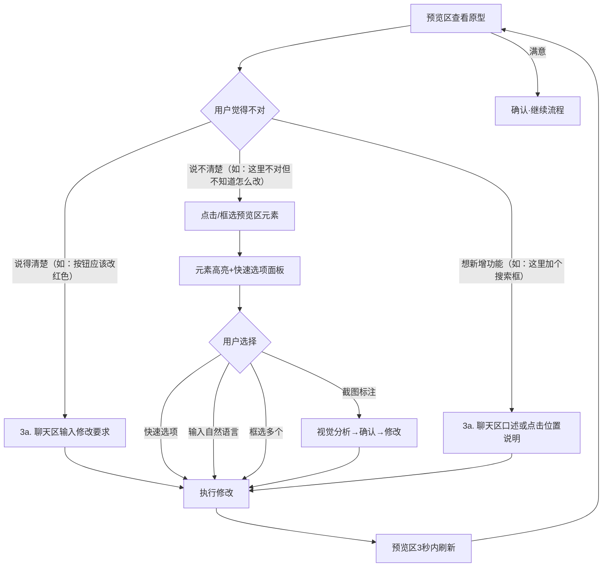
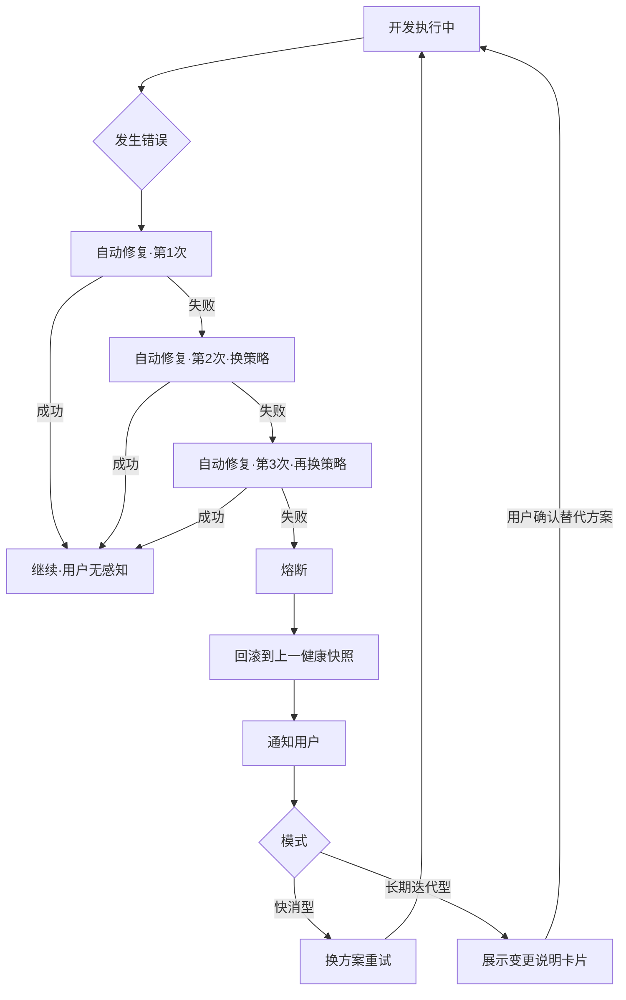
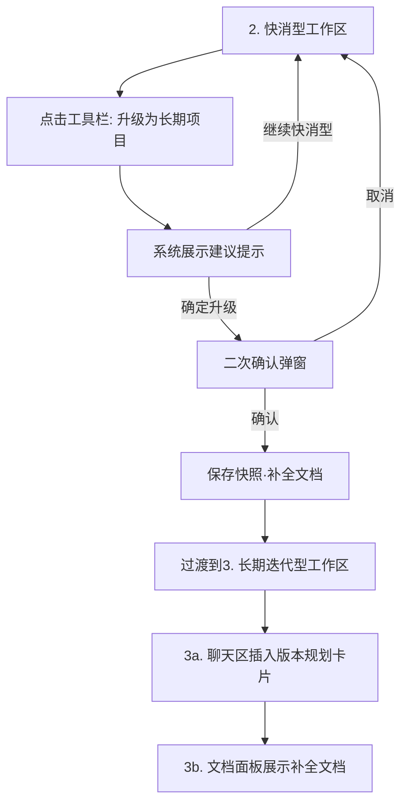

# 关键用户旅程

> 项目：向导Agent与编程Agent多智能体协同开发平台
> 文档ID：DOC-2.2
> 版本：v0.2 | 日期：2026-06-05 | 状态：收敛
> 依赖：01_PRD/prd.md (v0.2), 01_PRD/user-stories.md (v0.6), 02_UX_DESIGN/sitemap.md (v0.3)
> 变更：v0.1→v0.2，Agent Teams两轮审计（A+B），第1轮15项/第2轮1项残余（<30%）→收敛

---

## 术语约定

本文档中出现的以下术语仅供设计/开发参照，**零基础用户永远不会看到**：PlantUML、GWT、编程Agent、裁判Agent、iframe、Sprint、架构设计师、工程经理。用户可见的对应表达见各Flow步骤描述中的"用户看到"或"系统展示"部分。


## Flow 1：零基础用户首次使用 → 快消型 → 完成第一个项目

```mermaid
flowchart TD
    A[打开应用] --> B[1. 模式选择页]
    B -->|点击"快速做一个工具"| C[2a. 聊天区]
    C --> D{向导理解需求}
    D -->|信息不足| E[继续提问·卡片选择]
    E --> D
    D -->|信息充分| F[生成需求摘要]
    F -->|用户确认| G[状态栏: 正在设计原型]
    G --> H[2b. 预览区展示原型]
    H --> I{用户看原型}
    I -->|满意| J[确认原型]
    I -->|不满意| K[点选纠错或口述修改]
    K --> H
    J --> L[状态栏: 正在开发中]
    L --> M[2a. 测试结果摘要卡片]
    M -->|全部通过| N[裁判判定]
    N -->|通过| O[交付完成]
    N -->|退回| L
```

**步骤详情**：

| 步 | 用户所在位置 | 用户做什么 | 系统做什么 |
|----|------------|-----------|-----------|
| 1 | 桌面 | 双击应用图标 | 启动应用，加载 → 模式选择页 |
| 2 | 1-模式选择页 | 看到两个卡片。阅读副标题和场景举例。点击左侧"快速做一个工具"卡片 | 卡片高亮 → 过渡动画 → 进入快消型工作区。状态栏显示"快速做一个工具"，聊天区显示欢迎消息："嗨！你想做一个什么样的工具？可以随便说说。" |
| 3 | 2a-聊天区 | 输入"我想做个记录读书笔记的东西" | 向导在3秒内回复，不直接生成代码，提出第一轮引导问题，至少3个，至少一个为卡片选择形式。如："你想记录哪些信息？"附带卡片：`书名和作者` `阅读进度` `读书笔记和感想` `以上都要` `你帮我决定` |
| 4 | 2a-聊天区 | 点击卡片选择，或输入补充想法 | 向导消化回答，如信息仍不足则继续提问（每轮3-5个问题，不重复已确认内容）。同时后台同步产出页面草图 |
| 5 | 2a-聊天区 | 多轮对话后回复"差不多了，先做出来看看" | 向导停止追问，生成需求摘要展示在对话流中："我理解你想做的是[一句话]。具体包括：[F1]、[F2]...。不包括：[明确不做的事]。对吗？" |
| 6 | 2a-聊天区 | 回复"对"或"差不多" | 状态栏更新为"正在设计原型…"。不超过30秒后，2b预览区展示原型首页（含模拟数据）。聊天区插入消息："你看看这个效果怎么样？" |
| 7 | 2b-预览区 | 在预览区查看页面、点击按钮、浏览页面 | 原型中的交互产生响应。每个可交互元素有唯一标识，支持点选纠错 |
| 8a | 2b-预览区 | **（满意路径）** 回复"挺好的，就这样做吧" | 状态栏更新为"正在开发中…"。后台自动完成技术方案和团队配置（用户不可见）。开工 |
| 8b | 2b-预览区 | **（修改路径）** 点击不满意的元素，或说"这个按钮不应该在这里" | 点选纠错：元素高亮 → 弹出快速选项。用户选择后预览区3秒内刷新。修改前自动创建快照。循环至用户满意 |
| 9 | 2a-聊天区 | 等待 | 编码完成+自动测试。聊天区插入测试结果摘要卡片："我们测试了[8]个场景，全部通过 ✓"。卡片列出每个场景的通俗描述，可点击展开详情 |
| 10 | 2a-聊天区 | 等待 | 系统自动校验测试覆盖和代码结构。通过后项目标记为完成 |
| 11 | 2a-聊天区 | 看到测试全部通过，关闭应用或点击"我的项目" | 自动保存最终快照。用户可在我的项目页随时重新打开继续修改 |

**心理防御节点**：
- 步骤6超过5秒无响应 → 聊天区插入进度消息
- 步骤9测试未全通过 → 自动修复（最多3次），修复过程对用户透明
- 步骤9自修复全部失败 → 状态通知显示安抚消息："刚才的修改遇到了一点技术问题…已回到上一个正常版本"
- 断网/崩溃后重新打开 → 恢复到上次对话状态，向导提示："欢迎回来！我们上次聊到[简要总结]。要继续吗？"
- 全流程不展示：代码、错误日志、技术术语、红色报错


## Flow 2：零基础用户 → 长期迭代型 → 第一个版本规划完成

```mermaid
flowchart TD
    A[打开应用] --> B[1. 模式选择页]
    B -->|点击"做一个长期维护的项目"| C[3a. 聊天区]
    C --> D{深度沟通+预览草图}
    D --> E[产出完整PRD草案]
    E -->|用户逐章确认| F{审查文档}
    F -->|退回| E
    F -->|通过| G[3b. 文档面板激活]
    G --> H[3a. 聊天区插入设计建议卡片]
    H -->|用户确认| I[3a. 聊天区插入版本规划卡片]
    I -->|用户确认| J[状态栏: 开发中]
    J --> K[3a. 测试结果摘要卡片]
    K -->|全部通过| L[交付完成]
```

**步骤详情**：

| 步 | 用户所在位置 | 用户做什么 | 系统做什么 |
|----|------------|-----------|-----------|
| 1 | 1-模式选择页 | 点击右侧卡片"做一个长期维护的项目" | 过渡动画 → 进入长期迭代型工作区。三栏布局：左聊天、中文档面板（初始隐藏）、右预览（初始为空）。状态栏标签"做一个长期维护的项目"。欢迎消息："你好！我们来好好聊一下你想做的项目。" |
| 2 | 3a-聊天区 | 描述项目想法（如"我想做一个社团管理平台"） | 向导持续提问（不设轮次上限）：①至少1个使用场景问题 ②至少1个未来扩展问题 ③至少1个追问"为什么"。同时后台同步产出页面草图 |
| 3 | 3a-聊天区 + 3c-预览区 | 持续多轮深度对话，同时在预览区看到页面草图给予视觉反馈 | 向导产出完整PRD草案，以自然语言分章节展示于聊天区。每个章节附带"确认""修改"按钮 |
| 4 | 3a-聊天区 | 逐章确认PRD所有章节 | PRD确认完毕。3b文档面板激活，显示文档目录树。系统自动校验文档完整性 |
| 5 | 3a-聊天区 | 看到聊天区插入的设计建议卡片。卡片头部标注"AI建议"。内容："根据你的项目，我的建议是：[通俗选项A/B/C]。简单说，[选A]的好处是[快速稳定]，[选B]的好处是[以后容易扩展]。你觉得哪个方向更合适？"附带选项按钮 | 后台完成技术方案分析，以通俗语言在聊天区插入内嵌卡片（不弹出独立面板，保持聊天连续性） |
| 6 | 3a-聊天区 | 点击选项或说"你帮我决定" | 设计确认。聊天区再插入版本规划卡片（标注"AI建议"）："第一个版本先做[核心功能A和B]，大概能看到[效果]。第二个版本加[C和D]。这样行吗？"用户可调整优先级 |
| 7 | 3a-聊天区 | 确认版本规划 | 开发团队开工。状态栏更新为"开发中…"。前后端协作开发 → 代码审查 → 自动测试 |
| 8 | 3a-聊天区 | 等待或在文档面板中查看进度 | 测试全部通过后，聊天区插入测试结果摘要卡片。最终判定通过 |
| 9 | 3a-聊天区 | 看到交付结果 | 第一个版本交付。用户可在3b文档面板查看完整文档体系。工具栏可进入下一版本规划 |

**快消型对比**：
- 不出现的步骤：设计确认卡片、版本规划卡片、文档面板激活
- 多出的步骤：PRD逐章确认、前后台角色交互


## Flow 3：用户发现不满意 → 纠正修改 → 确认结果



**步骤详情**：

| 步 | 用户所在位置 | 用户做什么 | 系统做什么 |
|----|------------|-----------|-----------|
| 1 | 2b/3c-预览区 | 查看原型，发现某处不满意 | — |
| 2a | 2a/3a-聊天区 | **（说得清楚路径）** 直接聊天输入："那个按钮改成红色""搜索框应该放到顶部" | 向导理解修改意图 → 生成修改方案 → 执行修改 → 预览区3秒内刷新。修改前自动创建快照 |
| 2b | 2b/3c-预览区 | **（说不清楚路径）** 点击不满意的按钮 | 元素高亮边框（持续3秒）。聊天区向导回复："好的，我看到了这个按钮。你想怎么改？"附带快速选项：`换个颜色` `换个位置` `改文字` `删掉它` `其他` |
| 3b | 2b/3c-预览区 | **（快速选项）** 点击"换个颜色"→"红色" | 执行修改。预览区3秒内刷新。聊天区确认："改好了，你看看效果？" |
| 3c | 2b/3c-预览区 | **（自然语言）** 不选卡片，直接输入"把它挪到右上角，再小一点" | 向导理解 → 执行 → 预览区刷新 |
| 3d | 2b/3c-预览区 | **（框选路径）** 拖拽框选一个区域包含2-3个相邻元素 | 批量高亮。向导："好的，我看到了这几个元素。你想怎么改它们？"支持统一颜色/字号/对齐/整体移动 |
| 4 | 2b/3c-预览区 | **（误点空白）** 点击了页面空白区域 | 友好提示："这个位置好像没有可以修改的组件。你想改哪个具体元素？可以试试点按钮、文字或图片。"不报错 |
| 5 | 2b/3c-预览区 | **（连续快速点击）** 2秒内连续点3个不同元素 | 以最后一次点击为准高亮。追加确认："我高亮了最后一个——这是你想改的那个吗？如果不是，再点一下你想改的元素。" |
| 6 | 2b/3c-预览区 | **（截图标注路径）** 点击预览区工具栏"截图标注"按钮 → 截取区域 → 用内置画圈工具标注 → 发送 | 视觉分析标注截图，确认："我看到你在[圈内位置]画了圈——你是想改这个地方吗？"确认后转修改方案 |
| 7 | 2a/3a-聊天区 | **（想新增功能路径）** 输入："这里加一个搜索框""这个页面能不能再放一个登录按钮" | 向导理解新功能诉求 → 生成修改方案（含新增元素的布局位置建议） → 预览区刷新。修改前自动创建快照 |
| 8 | 2b/3c-预览区 | 确认满意，回复"可以了" | 完成本轮修改。时间轴自动记录修改前后快照 |


## Flow 4：开发异常 → 自愈失败 → 用户感知回滚



**步骤详情**（列名说明：Flow 4中用户为被动感知方，故用"用户感知"替代"用户做什么"，用"系统内部动作"替代"系统做什么"——其他Flow的用户主动操作列名不受影响）：

| 步 | 用户所在位置 | 用户感知 | 系统内部动作 |
|----|------------|---------|------------|
| 1 | 2/3-工作区 | 正常使用中，状态栏显示"正在开发中…" | 开发团队正在生成/构建代码 |
| 2 | 同 | 无感知 | 发生构建或运行错误。捕获错误 → 分析原因 → 启动第1次自动修复 |
| 3 | 同 | 无感知 | 第1次修复成功 → 继续正常流程 |
| 4 | 同 | 如修复耗时超5秒：聊天区插入进度消息"我正在处理一个技术细节，请稍等几秒…"（带加载动画） | 第1次失败，换策略尝试第2次修复 |
| 5 | 同 | 如超30秒：追加"比预期多花了些时间，我还在处理中。你可以稍等，也可以让我先跳过这个功能" | 第2次失败，再换策略尝试第3次修复 |
| 6 | 同 | **首次感知异常**。底部弹出通知（黄色，非红色），零术语："刚才的修改遇到了一点技术问题，没有成功。我已经帮你回到了上一个正常版本，你的内容没有丢失。" | 3次修复全部失败 → 熔断 → 代码回滚到上一个健康快照 |
| 7a | 2a-聊天区 | **（快消型）** 向导追问："我们可以换个方式来实现这个功能。你想试试吗？"附带卡片选项 | 换技术方案重新尝试，用户不感知内部方案变更 |
| 7b | 3a-聊天区 | **（长期迭代型）** 聊天区插入说明卡片（标注"AI建议"）："关于[功能X]：目前的方式遇到了一些困难，原因是[通俗解释]。建议换个方式：[替代方案]，这样对你的影响是[效果说明]。你觉得可以吗？" | 出具变更说明 → 翻译为通俗语言 → 用户确认后继续 |
| 8 | 2a/3a-聊天区 | **（连续第3次遇到异常）** 向导额外提示："这个功能似乎实现起来比我预期的困难。要不要我们先做一个简化版？或者你描述一下你最在意的核心是哪个部分？" | 累计异常次数，第3次触发额外安抚 |

**断网/崩溃恢复**：应用意外关闭后重新打开 → 自动恢复到上次对话状态 → 向导提示："欢迎回来！我们上次聊到[简要总结]。要继续吗？"
**绝对不展示**：代码堆栈、错误日志、技术术语、红色报错、HTTP错误码


## Flow 5：快消型项目升级为长期迭代型项目



**步骤详情**：

| 步 | 用户所在位置 | 用户做什么 | 系统做什么 |
|----|------------|-----------|-----------|
| 1 | 2-快消型工作区 | 项目进行中或已完成。觉得"这个东西挺好的，想继续认真做下去" | — |
| 2 | 2e-工具栏 | 点击"升级为长期项目"按钮 | 展示建议提示："建议你先完成快消型全过程，充分交流想法后再升级。不过如果你想现在切换也可以——之前的沟通和成果都会保留，作为长期项目的原始素材。"两个选项：`继续快消型` `确定升级` |
| 3 | 提示框 | 点击"确定升级" | 二次确认："确定要升级为长期项目吗？升级后会有更多设计确认环节，项目节奏会更规范。" `取消` `确定` |
| 4 | — | 确认升级 | ①保存当前状态为快照 ②保留全部对话记录和成果 ③基于之前的沟通内容+已实现功能，正向重新生成技术设计文档和完整项目文档体系 ④过渡动画切换到长期迭代型工作区（三栏布局） |
| 5 | 3-长期迭代型工作区 | 看到三栏布局，文档面板已激活 | 每条自动生成的内容标注"AI建议"。聊天区插入版本规划卡片（标注"AI建议"），基于已完成的功能建议后续版本节奏 |
| 6 | 3a-聊天区 | 查看补全文档和版本建议。逐条确认或修改标注"AI建议"的内容 | 用户确认后移除"AI建议"标注。项目正式进入长期迭代型流程 |
| 7 | — | — | 升级后可继续迭代，也可在时间轴中回到升级前的快消型版本 |

**关键约束**：升级时不从已有代码逆向提取设计信息（快消型代码无清晰架构）。基于之前的沟通记录+已实现的功能清单正向生成新的技术设计文档。


## 旅程交叉引用

| Flow | 涉及页面/面板 | 涉及用户故事 |
|------|------------|------------|
| Flow 1 | 1 / 2a / 2b / 2c / 2d / 2e | US-U01, US-U02, US-U04, US-U05, US-U08 |
| Flow 2 | 1 / 3a / 3b / 3c / 3f / 3g / 3h | US-U01, US-U03, US-U04, US-U05, US-U08 |
| Flow 3 | 2a/3a / 2b/3c | US-U05 |
| Flow 4 | 2a/3a / 2d/3g | US-U07, US-P02 |
| Flow 5 | 2e / 3a / 3b / 3h | US-U09 |


## 心理防御节点汇总

| Flow | 节点 | 触发条件 | 措施 |
|------|------|---------|------|
| 1 | 步骤6 | 原型生成超过30秒 | 聊天区进度消息 |
| 1 | 步骤9 | 测试未全通过 | 自动修复（用户透明） |
| 1 | 步骤9 | 3次修复全失败 | 通知安抚+回滚 |
| 1+2+4 | 任意 | 断网/崩溃后重开 | 恢复对话状态+"欢迎回来"提示 |
| 2 | 步骤8 | 测试未全通过 | 同Flow 1 |
| 3 | 步骤4 | 点击空白 | 友好提示，不报错 |
| 3 | 步骤5 | 连续快速点击 | 高亮最后一个+确认追问 |
| 4 | 步骤4 | 修复超5秒 | 进度消息 |
| 4 | 步骤5 | 修复超30秒 | 追加提示+跳过选项 |
| 4 | 步骤6 | 熔断回滚 | 黄色安抚通知 |
| 4 | 步骤8 | 连续3次异常 | 简化方案建议 |
| 5 | 步骤2 | 用户可能冲动升级 | 建议提示+二次确认 |


## 审查报告（Agent Teams审计·A+B并行）

### 审查历史

| 轮次 | 审查员 | 审查版本 | 发现问题 | 收敛判定 |
|------|--------|---------|---------|---------|
| 第1轮 | A + B 并行 | v0.1 → v0.2 | 1阻塞 + 4严重 + 10建议（15项） | — |
| 第2轮 | A + B 回归 | v0.2 | 1项残余（A6：Flow 4表头缺少说明） | 新问题=1 < 15×30%=4.5，无阻塞/严重 → 收敛 |

### 第1轮审查详情

**审查员A：PRD一致性 + sitemap对齐**

| # | 严重度 | 位置 | 问题 | 修正 |
|---|--------|------|------|------|
| A1 | 严重 | Flow 2 Mermaid | 仍引用3d/3e独立节点（sitemap v0.3 E1已移除，合并入3a子项） | Mermaid改为`H[3a. 聊天区插入设计建议卡片]`和`I[3a. 聊天区插入版本规划卡片]`，交叉引用表同步更新 |
| A2 | 严重 | Flow 2 Mermaid 第66行 | 引用"2b预览"（快消型预览区），应为"3c预览"（长期迭代型预览区） | Mermaid已修正。步骤详情原本正确使用"3c-预览区" |
| A3 | 建议 | Flow 1/2 Mermaid | 聊天区引用混用"2. 快消型工作区·聊天区"而非sitemap规范的"2a. 聊天区" | 全部统一为`2a. 聊天区`/`3a. 聊天区` |
| A4 | 建议 | Flow 1 Mermaid | 缺少裁判Agent判定步骤（PRD §6.1显式要求） | Mermaid新增N节点（裁判判定），含退回循环回L |
| A5 | 建议 | Flow 3 Mermaid | "满意"路径从用户选择节点直接跳到确认，跳过了修改执行和预览刷新 | 重构Mermaid：满意从预览区查看节点（A）分支出来，而非从选择节点（G） |
| A6 | 建议 | Flow 4 步骤表 | 列名"用户感知""系统内部动作"与其他Flow的"用户做什么""系统做什么"不一致 | 保留Flow 4的特殊列名（因其用户被动感知的特性），但表头加注说明特殊性 |
| A7 | 建议 | Flow 4 Mermaid | 快消型"换方案重试"节点为死端点，无循环回边 | 新增`K --> A`回边，形成完整的重试闭环 |

**审查员B：零基础用户可用性**

| # | 严重度 | 位置 | 问题 | 修正 |
|---|--------|------|------|------|
| B1 | 阻塞 | Flow 1-步骤7 | "浏览器/iframe"出现在用户动作描述中 | 改为"在预览区查看页面、点击按钮" |
| B2 | 阻塞 | Flow 3-步骤表 | "说得清楚"路径在Mermaid中有但步骤表中完全缺失 | 新增步骤2a，专门描述"说得清楚→聊天区口述→执行修改"路径 |
| B3 | 严重 | Flow 2-步骤6 | "Sprint"术语在用户可见的卡片文案中出现隐患 | 全文档统一改为"版本规划"；Flow 2/5所有出现处已替换 |
| B4 | 严重 | Flow 3-步骤5 | 连续快速点击只高亮最后一个，未追问用户确认 | 追加确认回复："我高亮了最后一个——这是你想改的那个吗？如果不是，再点一下你想改的元素。" |
| B5 | 严重 | Flow 所有 | 断网/崩溃后恢复场景缺失（US-U10明确要求） | 心理防御节点汇总表新增"断网/崩溃恢复"行；Flow 1心理防御节点+Flow 4末尾各新增恢复场景描述 |
| B6 | 严重 | Flow 2-步骤5 | "架构设计师"角色标签出现在用户感知的卡片中 | 卡片头部统一标记"AI建议"；文档新增"术语约定"节，明确所有技术术语的可见性规则 |
| B7 | 建议 | Flow 3-步骤6 | 截图标注路径缺少"不会截图"场景处理 | 步骤6改为"点击预览区工具栏'截图标注'按钮"——内建工具，无需用户依赖第三方 |
| B8 | 建议 | Flow 3 | 缺失"想新增元素"交互路径（US-U04要求） | Mermaid新增分支：`B -->|想新增功能| I[3a. 聊天区口述]`；步骤表新增步骤7 |
| B9 | 建议 | Flow 2-步骤3 | "UI草图"术语 | 全部改为"页面草图" |
| B10 | 建议 | 全文档 | "PlantUML""编程Agent""裁判Agent"等术语频繁出现于系统动作列 | 文档头部新增"术语约定"节说明不可见性；系统动作列术语保留但标注仅供设计/开发参照 |

### 收敛判定

15项问题全部已修正（1阻塞、4严重、10建议）。v0.2关键改动：

- Mermaid流程图与sitemap v0.3 100%对齐（页面ID、3d/3e合并、2b/3c正确引用）
- Flow 3补全"说得清楚"路径和"新增功能"路径，共7种交互分支
- 全文档统一"版本规划"替代Sprint、"AI建议"标签替代角色名
- 新增断网/崩溃恢复的心理防御覆盖
- 新增"术语约定"节，明确零基础用户不可见的术语清单

**v0.2 收敛通过。→ 可产出 design-system.md + wireframes/**

---

> 下一步：DOC-2.4 design-system.md + DOC-2.3 wireframes/*.prototype.html（可并行fork）
