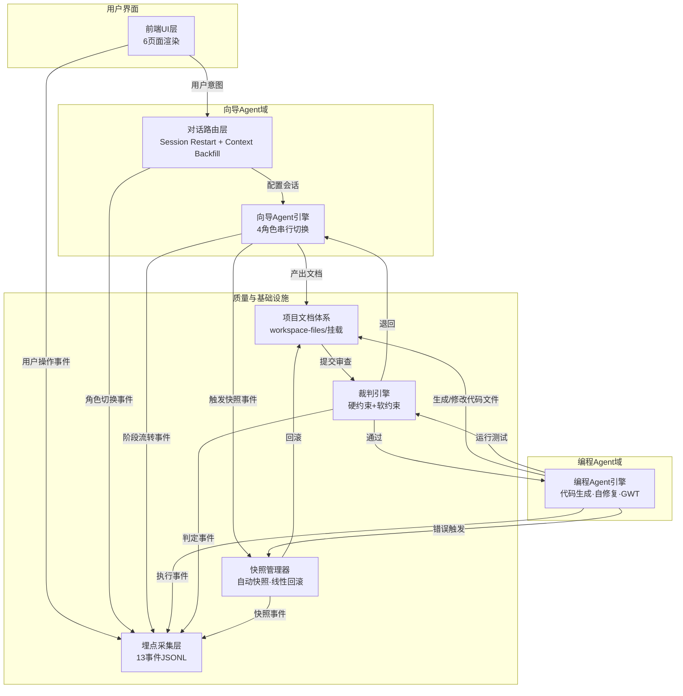

# 架构总览

> 项目：向导Agent与编程Agent多智能体协同开发平台
> 文档ID：DOC-3.1 | 版本：v0.3 | 日期：2026-06-06 | 状态：终审收敛
> 依赖：PRD v0.2, exploration/技术架构探索总报告.md, B1~B4报告, C1~C2报告, UX sitemap v0.3, UX design-system v0.2
> 审计：两轮四维审计(A/B/C/D)→通用四维终审(A/B/C/D)，发现问题全部修正。遗留项：§7点选纠错L2(无Proma源码验证路径)、TabContent/MainArea修改需人类决策

---

## 1. 技术选型

### 1.1 前端

| 组件 | 选型 | 理由 | 否决方案 |
|------|------|------|---------|
| 桌面壳 | Electron ^39.5.1 | Proma自带，无需额外引入 | — |
| UI框架 | React ^18.3.1 + TypeScript ^5.0.0 | Proma技术栈，直接继承 | — |
| 构建 | Vite ^6.0.3(渲染) + esbuild ^0.24.0(主进程) | Proma现有构建体系 | — |
| 状态管理 | Jotai ^2.17.1 | Proma原子化状态管理，新增atom即可扩展 | Redux(重)、Context(性能) |
| 样式 | Tailwind CSS ^3.4.17 + Radix UI(14组件) + Lucide React ^0.460.0 | Proma现有UI体系，design-system Token可直映射 | MUI(与Radix冲突) |

**扩展方式**：Proma无插件机制，所有新增功能通过代码级集成——新增Jotai atom → React组件 → 扩展TabContent.tsx的类型枚举和渲染分支 → MainArea.tsx挂载Dialog。

### 1.2 后端/服务层

| 组件 | 选型 | 理由 | 否决方案 |
|------|------|------|---------|
| Agent通信 | 文件系统 + 直接函数调用 | 零依赖，无网络开销，Proma原生支持 | Kafka/Celery/CrewAI(企业级过度设计) |
| 存储 | JSONL(埋点/快照元数据) + JSON索引(项目列表) | 零依赖原则，JSONL复用Proma conversation存储模式，JSON索引复用Proma conversations.json模式 | SQLite(引入新npm依赖，原则违反)、Redis(需额外服务)、PostgreSQL(太重) |
| 沙箱 | L0：文件系统工作区隔离 + L1：子进程资源限制 | 零安装门槛，全语言支持 | Docker(用户安装门槛)、WebContainer(无Python)、iframe(能力不足) |
| 模型API | Proma现有API调用机制扩展 | 复用Proma `mcp__proma-cloud` 调用链路 | — |
| PlantUML解析 | TypeScript Compiler API提取AST + LLM原生理解 | plantuml-parser npm不够成熟，LLM对PUML语义理解已足够 | python plantuml(需Python环境) |
| GWT执行 | Agent原生GWT执行器 | 零依赖，Agent直接理解GWT语义并执行验证 | @cucumber/cucumber(引入Java/Ruby依赖链) |
| 快照存储 | `fs.linkSync`硬链接 | 零依赖，复制目录树但共享inode，复用Proma safe-file机制 | Git stash(引入Git依赖)、diff快照(不适用代码) |
| 埋点采集 | JSONL追加写入 | 零依赖，每事件一行JSON，复用Proma JSON写入能力 | SQLite(小数据量反增开销)、专用时序DB |

**零依赖原则**：能用文件就别用数据库，能用内存就别用Redis，能用函数调用就别用消息队列。所有选型优先复用Proma现有能力。新增依赖包：**0**——PlantUML/GWT/快照/埋点/沙箱均为零依赖实现，存储复用Proma JSON模式。

**Proma核心文件修改声明**（需人类决策）：§4.2扩展方案中，`TabContent.tsx`（扩展TabType枚举+渲染分支）和`MainArea.tsx`（挂载Dialog/Portal）属于对Proma核心文件的修改。其余扩展点（atoms/components/hooks/services/prompts）均为新增文件，不修改Proma核心。

---

## 2. 模块划分

| 模块 | 职责（一句话） | 输入 | 输出 | 关键实现 |
|------|---------------|------|------|---------|
| **前端UI层** | 渲染6页面，管理对话交互和原型预览 | 用户操作事件 | 渲染结果 + 用户意图事件 | 复用Proma Tab体系、Jotai状态管理 |
| **对话路由层** | 按项目阶段加载对应Agent角色的System Prompt和模型 | 当前项目阶段标识 | 配置好的Agent会话 | Session Restart + Context Backfill |
| **向导Agent引擎** | 需求分析、UX原型生成、架构设计、工程规划四个阶段的Agent编排 | 用户自然语言输入 + PRD/UX文档 | 完整文档体系(01~07目录) | 串行角色切换，共享上下文摘要 |
| **编程Agent引擎** | 代码生成、自修复(3次)、GWT测试执行 | 文档体系目录路径 | 可运行的项目代码 + 测试报告 | 调用GLM 5.1，子进程执行 |
| **裁判引擎** | 硬约束(PRD必填项/PlantUML语法/API端点Schema/Sprint粒度/角色职责/GWT文件存在性/代码类图一致性) + 软约束(逻辑一致性/可测试性/完整性/可读性) | 文档目录路径 或 代码目录路径 | 通过/退回 + 问题清单 | 文件元数据检查 + PlantUML解析 + LLM语义评估 |
| **快照管理器** | 关键节点自动快照、版本列表、线性回滚 | 项目目录路径 + 触发事件 | 快照目录树 | `fs.linkSync`硬链接，元数据JSON记录 |
| **埋点采集层** | 13事件全量无侵入采集（项目创建/每轮对话/角色切换/PRD确认/原型确认/用户撤销/点选纠错/模式转换/编程执行/自修复/裁判判定/满意度/项目完成） | 埋点事件(type + payload + timestamp) | JSONL日志文件 | JSONL追加写入，异步非阻塞，与PRD §12.4一致 |
| **项目文档体系** | 维护标准化7目录项目结构 | 向导Agent产出文档 + 编程Agent生成的代码文件 + 快照管理器回滚操作 | 规范化的项目目录树 | `workspace-files/`挂载，与PRD §5.2一致 |

---

## 3. 模块依赖图



---

## 4. Proma对接方案

### 4.1 页面挂载

| 页面(sitemap) | 挂载方式 | 实现要点 |
|------|---------|---------|
| 模式选择页 | 替换现有Tab页作为启动首页，或作为Portal覆盖层 | 应用启动时判断是否已有活跃项目，无则展示 |
| 快消型工作区 | 新增Tab类型 `QUICK_WORKSPACE` | 聊天区(左侧)+预览区(右侧)双区布局 |
| 长期迭代型工作区 | 新增Tab类型 `LONG_WORKSPACE` | 聊天区+文档面板+预览区三区布局 |
| 我的项目 | 新增Tab类型 `PROJECT_LIST` | 项目列表组件，复用Proma现有列表模式 |
| 设置页 | Dialog形式 | 复用Proma `SettingsDialog` 模式 |
| 分析看板 | 新增Tab类型 `ANALYTICS` | 图表组件(recharts或自研) + 筛选器 |

### 4.2 扩展点

| 扩展位置 | 改动内容 | 改动量 |
|---------|---------|--------|
| `atoms/` | 新增：项目模式atom、Agent角色atom、快照列表atom、埋点缓冲atom、预览状态atom | ~8 atoms |
| `components/` | 新增：模式选择卡片、聊天面板、预览面板、文档面板、时间轴面板、测试结果卡片、项目列表、看板图表 | ~18 components |
| `TabContent.tsx` | 扩展TabType枚举(4个新类型)，新增对应渲染分支 | ~1文件, <50行 |
| `MainArea.tsx` | 挂载Dialog(设置页)、Portal(模式选择) | ~1文件, <30行 |
| `hooks/` | 新增：useAgentRole、useSandbox、useSnapshots、useTelemetry | ~4 hooks |
| `services/` | 新增：router(对话路由)、guide(向导引擎)、coder(编程引擎)、judge(裁判引擎) | ~4 service |
| `prompts/` | 新增4角色System Prompt文件 | ~4 .md文件 |

### 4.3 改动量预估

- 新增/修改文件：**45-60文件**
- 新增代码行：**3500-5000行**
- 新增依赖包：**0**（全部复用Proma现有依赖或零依赖实现）
- 工作量：**~9小时**(串行角色切换核心) + ~3小时(UI) + ~2小时(沙箱) + ~2小时(埋点+快照) = **~16小时**

---

## 5. Agent角色切换机制

### 5.1 总体方案

**Session Restart + Context Backfill**，MVP采用串行切换。

序列：`需求分析师 → UI/UX顾问 → 架构设计师 → 工程经理`

探索阶段对比了并行方案(需~30h，涉及架构级变更)和串行方案(~9h)，选择串行。PRD中"需求分析师与UI/UX顾问并行"的需求通过串行快速交替实现——同一会话内快速切换Prompt，用户感知为两个角色同时在线的协作感。

### 5.2 实现步骤

1. **阶段结束判定**：路由层监测阶段完成信号(PRD确认/原型确认/架构确认)
2. **序列化上下文**：提取对话摘要(核心需求、已确认决策、关键约束)，存入`session-context.json`
3. **释放当前会话**：保存当前对话历史，关闭API连接
4. **加载目标角色**：读取目标角色的System Prompt文件 + 模型配置
5. **注入上下文**：将步骤2的摘要作为System Prompt的Context段落注入
6. **恢复对话**：以自然语言提示开始："好的，关于[上阶段总结]，接下来我们看看效果——"（UI/UX角色）/ "明白了，我来设计技术方案——"（架构师角色）

### 5.3 快消型与长期迭代型的差异

| 阶段 | 快消型 | 长期迭代型 |
|------|--------|-----------|
| 需求分析师→UI/UX顾问 | 切换，用户感知到预览出现 | 同快消型 |
| UI/UX顾问→架构设计师 | **跳过后台执行**：路由层自动调用架构师Prompt生成PlantUML，用户看到"AI正在设计技术方案..."，无前台交互 | 切换，用户参与技术选型确认 |
| 架构设计师→工程经理 | **跳过后台执行**：自动配置全栈+测试Agent，制定单Sprint计划，用户无感知 | 切换，用户参与Sprint优先级调整 |

跳过后台执行时，路由层仍执行完整的Prompt加载和模型切换流程，但不渲染对话界面，上下文摘要直接写入文档。

---

## 6. 沙箱方案

### 6.1 L0层：文件系统工作区隔离

**边界**：项目根目录即为沙箱边界。本文档中 `project-root/` 等价于 `workspace-files/<project-name>/`（见§9），每个项目目录独立隔离。

- 所有文件读写操作限定在 `workspace-files/<project-name>/` 内部
- 编程Agent的cwd设为项目目录
- 环境变量沙箱化：`HOME`/`USERPROFILE` 映射到项目目录内的虚拟路径
- 子进程禁止访问父目录路径

### 6.2 L1层：子进程资源限制

- **内存**：< 1GB (通过OS进程组限制)
- **CPU时间**：单次构建最长3分钟，超时自动SIGTERM→SIGKILL
- **子进程数量**：最多10个并发
- **网络**：白名单模式，默认放行npm registry、PyPI、GitHub API等必要域名

### 6.3 否决方案

| 方案 | 否决原因 |
|------|---------|
| Docker | 零基础用户无法完成Docker安装和配置 |
| WebContainer | 不支持Python，无法覆盖全栈场景 |
| iframe沙箱 | 仅限浏览器环境，无法运行Node.js/Python |

Phase 3+预留L2加固：OS原生沙箱(macOS sandbox-exec / Windows AppContainer)和远程CubeSandbox。

---

---

## 7. 点选纠错（Click-to-Fix）

PRD §7.3定义了点选纠错功能——用户在预览区点击不满意元素，系统自动理解并修改。架构采用分阶段实现路径，引用B4报告结论。

### Phase 1（MVP）：data-ai-id标注为主路径

**原理**：HTML原型生成时，为每个可交互元素注入`data-ai-id`和`data-ai-type`属性作为唯一标识。用户点击时通过事件委托捕获标识，传递至向导Agent，Agent根据ID和上下文生成修改规约JSON，编程Agent执行修改。

**交互链路**：
1. UI/UX顾问生成原型时注入标注属性（如 `data-ai-id="btn-submit" data-ai-type="button"`）
2. 预览区事件委托捕获用户点击 → 读取 `data-ai-id` 和 `data-ai-type`
3. 通过 postMessage 或桥接层传递至前端UI层
4. 前端调用向导Agent，附上元素ID + 页面上下文
5. 向导Agent生成修改规约JSON：`{target, action, newValue, scope}`
6. 编程Agent根据规约修改代码 → 预览区自动刷新

**技术选型依据**：探索B4报告对4种方案加权对比（准确率×0.3 + 复杂度×0.2 + 生成影响×0.15 + 兼容性×0.15 + Agent理解×0.2），data-ai-id标注（评分3.6）和混合方案（评分3.6）并列最高，选用data-ai-id作为MVP主路径。

### Phase 2：混合兜底

当用户点击的元素缺乏`data-ai-id`（如用第三方组件或后期手动添加的元素），切至混合方案：
- 截图当前预览 → 视觉模型（MiniMax）分析点击位置元素
- 视觉描述 + DOM路径作为补充定位信息
- 其余流程同Phase 1

### Phase 3：框选多元素协同修改

用户拖拽框选区域（PRD US-U05边界场景），在Phase 3实现。

---

## 8. 模型-角色映射表

| 角色 | 所属 | 模型 | 依据 | 数据等级 |
|------|------|------|------|---------|
| 需求分析师 | 向导Agent | deepseek-v4-flash | 通用推理：对话流畅、1M上下文、Proma内置低成本模型 | L1 |
| UI/UX顾问 | 向导Agent | MiniMax 2.7/M3 | C2验证：6原型视觉审查全部通过，等效路径验证收敛 | L3 |
| 架构设计师 | 向导Agent | deepseek-v4-pro | 通用推理：强推理能力、架构分析、PlantUML生成质量。C1报告标注deepseek-v4-pro为"待测"，待后续补充实测 | L1 |
| 工程经理 | 向导Agent | deepseek-v4-pro | 通用推理：SOTA长上下文、软件工程方法论理解。同上，待后续补充实测 | L1 |
| 全栈开发 | 编程Agent | GLM 5.1 | C1验证：T1.3三测试通过+T3.9端到端全栈项目5/5验收场景通过 | L3 |
| 测试工程师 | 编程Agent | GLM 5.1(备选flash) | C1验证GLM编程能力间接推断；flash做轻量测试场景 | L2 |
| 裁判Agent | 独立模块 | deepseek-v4-flash | 通用推理：快速判定、成本低、仅需模板匹配和简单AI评估 | L1 |
| 代码审查员 | 编程Agent | GLM 5.1 | C1验证推断；与全栈开发共享模型上下文(P1角色，长期迭代型激活) | L2 |
| 前端开发 | 编程Agent | GLM 5.1 | C1验证推断(P1角色，有UI需求时激活) | L2 |
| 后端开发 | 编程Agent | GLM 5.1 | C1验证推断(P1角色，有后端需求时激活) | L2 |
| 架构师 | 编程Agent | GLM 5.1 | C1验证推断(P0角色，长期迭代型必选，Phase 2激活，负责审核PlantUML规约与代码一致性) | L2 |
| DevOps工程师 | 编程Agent | GLM 5.1(备选flash) | 通用推理(P1角色，需部署时激活，Phase 3激活) | L1 |
| 项目经理 | 编程Agent | deepseek-v4-flash | 通用推理(P1角色，大型多Sprint项目激活，Phase 3激活) | L1 |

**数据等级说明**：L3=探索阶段实测数据支撑，L2=源码分析或验证推断，L1=通用推理(基于模型已知能力描述)。L1标注项已在探索C1报告中留"待测"标记，`model-capability-matrix.md`未独立产出，待后续补充实测。Phase 2/3激活的角色可在集成阶段通过Proxy降级使用已有模型。

**备选策略**：若GLM 5.1不可用，全栈开发→deepseek-v4-pro，测试工程师→deepseek-v4-flash。

---

## 9. 项目文档体系挂载

**挂载点**：Proma的 `workspace-files/` 目录。本文档中 `project-root/` 等价于 `workspace-files/<project-name>/`（见§6.1）。

每个用户项目创建一个以项目名称命名的子目录，内含完整7目录文档树(与PRD §5.2一致)：

```
workspace-files/
├── project-读书笔记管理/
│   ├── 01_PRD/prd.md + user-stories.md
│   ├── 02_UX_DESIGN/(sitemap/flows/wireframes/design-system/interaction-spec)
│   ├── 03_ARCHITECTURE/(architecture.md + .puml + data-model)
│   ├── 04_API_SPEC/api-spec.md
│   ├── 05_PROJECT_PLAN/(sprint-plan + team-config + workflow)
│   ├── 06_TESTS/(features/ + test-plan.md)
│   ├── 07_VERSIONS/changelog.md
│   └── README.md
├── project-奶茶店点单/
│   └── (同上结构，快消型精简版)
└── ...
```

**优势**：
- 文档即文件系统，裁判Agent可直接遍历校验
- 编程Agent读取时零解析开销
- 用户可自行在文件管理器中查看(但不鼓励)
- 快照管理器对整个目录做快照(硬链接)时覆盖完整状态

---

## 10. 工程模板自动推断

对应PRD §11工程模板体系。向导Agent从用户对话中提取关键词，自动匹配6个模板之一，**对用户透明**。

### 推断规则

| 用户表述关键词 | 推断模板 | 激活角色 |
|--------------|---------|---------|
| "网站/网页/博客/商城/后台" | Web全栈 | 架构师+前端+后端+测试 |
| "手机/App/小程序" | 移动App | UI+逻辑+后端+测试 |
| "电脑工具/桌面软件" | 桌面工具 | 全栈+测试 |
| "数据处理/批量/自动化" | CLI/脚本 | 全栈Agent(单Agent) |
| "连接XX设备/控制硬件/嵌入式" | 硬件联调 | 固件+上位机+硬件测试 |
| "调用AI/大模型/智能对话" | AI应用 | 后端+Prompt工程+测试 |

### 实现路径

- 推断逻辑在向导Agent工程经理角色中被调用
- 工程经理分析用户PRD内容 → 按关键词匹配 → 加载对应模板的团队配置和Sprint预设
- 推断结果写入 `05_PROJECT_PLAN/team-config.md`，不暴露给用户
- 快消型统一使用"桌面工具"模板（最小集）

### 可扩展性（对应PRD §11.4）

模板体系通过JSON配置文件扩展，新增模板只需添加配置条目，无需修改推断逻辑代码。

---

## 11. 技术风险与缓解

| 风险 | 严重度 | 缓解措施 | 来源 |
|------|--------|---------|------|
| GLM 5.1 API稳定性未知(第三方模型，非Proma内置) | 中 | 全栈开发角色备选deepseek-v4-pro，测试工程师备选flash | C1验证虽通过，生产环境仍需后备 |
| PlantUML校验准确率不足(当前仅校验类名存在性) | 中 | Phase 1仅做浅层校验(类名匹配)，Phase 2增加方法签名匹配，Phase 3引入关系图匹配 | A3.1 |
| 文件系统隔离非真沙箱(恶意代码可逃逸) | 中 | L1进程限制加固(内存/CPU/时间)；Phase 3+引入OS原生沙箱；编程Agent生成的代码不包含eval/exec动态执行路径 | B3 |
| Proma版本升级导致合并冲突 | 低 | 所有扩展通过新增文件实现(不修改Proma核心)，atoms/components独立目录，TabContent扩展点控制在枚举+分支，关注Proma更新日志 | A1 |
| 串行角色切换+多次API调用导致端到端延迟过高 | 低 | 快消型跳过架构师+工程经理前台交互(省2轮)，上下文摘要压缩在500 tokens内，模型响应目标<3s | B2 |
