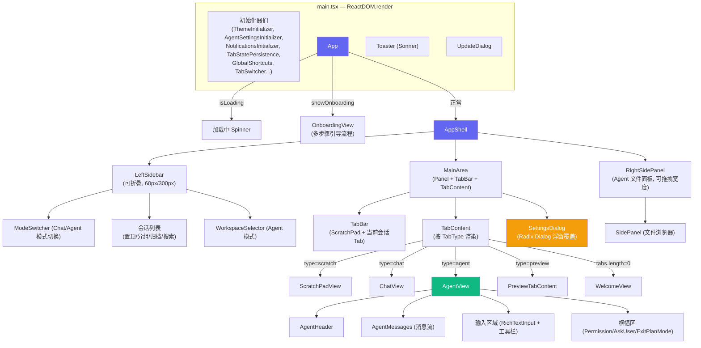

# Proma 前端架构与扩展点分析报告

> 任务包 B1 | 分析日期：2026-06-06 | 源码：proma-source v0.10.28
> 审计轮次：第1轮（A+B+C+D 四维并行） → 修正 → 回归 | 状态：已收敛

---

## 一、技术栈清单

> 数据来源：`proma-source/package.json`（根）、`apps/electron/package.json`（Electron app）。
> 统计方法：`find src/renderer -name '*.ts' -o -name '*.tsx' | wc -l` → 279 个源文件；
> `find src/renderer \( -name '*.ts' -o -name '*.tsx' -o -name '*.css' \) -exec wc -c {} +` → 2,219,113 bytes（~2.2MB）。

| 层级 | 技术选型 | 版本 | 源码证据 |
|------|---------|------|------|
| **桌面壳** | Electron | ^39.5.1 | `apps/electron/package.json:114` |
| **UI 框架** | React | ^18.3.1 | `apps/electron/package.json:128-129` |
| **语言** | TypeScript | ^5.0.0 | 根 `package.json:29` |
| **构建（渲染进程）** | Vite | ^6.0.3 | `apps/electron/vite.config.ts:1`；`@vitejs/plugin-react` |
| **构建（主进程/preload）** | esbuild | ^0.24.0 | `apps/electron/package.json:17-22`（build:main/build:preload 脚本）|
| **包管理器** | Bun | latest | 根 `package.json` scripts 全部使用 `bun run` |
| **状态管理** | Jotai | ^2.17.1 | 根 `package.json:33`；atoms/ 目录 28 个 atom 文件 |
| **样式方案** | Tailwind CSS | ^3.4.17 | `apps/electron/package.json:137`；`tailwind.config.js`；+ tailwind-merge + CVA 0.7.1（`:109`）|
| **UI 组件库** | Radix UI | 多包 | `apps/electron/package.json:62-78`（14 个包：alert-dialog、collapsible、context-menu、dialog、dropdown-menu、popover、scroll-area、select、slider、switch、tabs、toast、tooltip 等）|
| **图标** | Lucide React | ^0.460.0 | `apps/electron/package.json:122` |
| **Toast 通知** | Sonner | ^2.0.7 | `apps/electron/package.json:135`；Toaster 挂载在 `main.tsx:884` |
| **富文本编辑** | TipTap | ^3.19.0 | `apps/electron/package.json:80-95`（13 个扩展包）|
| **Markdown 渲染** | react-markdown | ^10.1.0 | `apps/electron/package.json:130`；+ remark-gfm + rehype-raw + rehype-katex |
| **代码高亮** | lowlight | ^3.3.0 | `apps/electron/package.json:120` |
| **公式渲染** | KaTeX | ^0.16 | `apps/electron/package.json:119`；`main.tsx:71` 引入 katex.min.css |
| **命令面板** | cmdk | ^1.1.1 | `apps/electron/package.json:111` |
| **快捷键** | 自研 | 见下文 §1.3 快捷键系统分析 | 见下文 §1.3 |
| **自动更新** | electron-updater | ^6.7.3 | `apps/electron/package.json:116` |
| **HTML 消毒** | DOMPurify | ^3.4.5 | `apps/electron/package.json:44`（根依赖 `:26`）|

### 1.1 扩展机制

**结论：Proma 没有插件/扩展系统。** 新增功能和页面模块的标准方式是：
1. 在 `atoms/` 中新增 Jotai atom
2. 在 `components/` 中新增 React 组件
3. 在 `TabContent.tsx`（第 40-64 行）中扩展 `TabType` 和渲染分支
4. 在 `MainArea.tsx` 中按需挂载 Dialog（如 `SettingsDialog`）
没有发现类似 VS Code Extension API 或 Webpack module federation 的插件加载机制，所有扩展通过**代码级直接集成**完成。

### 1.2 IPC 通信机制

Proma 使用 Electron 标准的三层 IPC 架构：

```
Renderer (React)  ──contextBridge──→  Preload (bridge)  ──ipcMain──→  Main (Node.js)
    window.electronAPI.xxx()           暴露的 API 集合           ipcMain.handle(...)
```

**关键特征**：
- `contextBridge.exposeInMainWorld('electronAPI', ...)` 暴露 API 给渲染进程（`preload/index.ts`）
- 渲染进程通过 `window.electronAPI.xxx()` 调用，无直接 Node.js 访问
- 主进程通过 `ipcMain.handle('channel', handler)` 注册处理函数（`main/index.ts`）
- 支持双向通信（invoke/handle 模式）和单向推送（on/emit 模式）
- `contextIsolation: true` 确保渲染进程沙箱安全

**新增页面可能需要新增的 IPC 通道**：
| 新页面 | 可能需要的 IPC | 说明 |
|--------|---------------|------|
| 我的项目页 | `listProjects`, `deleteProject` | 项目列表读取/操作 |
| 分析看板 | `getAnalyticsData`, `exportCSV` | 聚合统计查询 |
| 时间轴面板 | `listSnapshots`, `rollbackSnapshot` | 版本快照管理 |

### 1.3 快捷键系统

`lib/shortcut-registry.ts` 提供了全局快捷键注册/展示系统：
- `registerShortcut(id, handler)` — 注册快捷键回调
- `getActiveAccelerator(id)` — 获取当前 OS 对应的快捷键组合（Mac vs Windows）
- `getAcceleratorDisplay(accelerator)` — 格式化展示
- 快捷键事件通过 `window.dispatchEvent(new CustomEvent('proma:xxx'))` 分发

**已注册的全局事件示例**（`main.tsx`）：
- `proma:stop-generation` — `main.tsx:1793` 监听，停止 Agent 生成
- `proma:focus-input` — `main.tsx:1799` 监听，聚焦输入框
- `toggle-preview-panel` — `AgentView.tsx:1818` 注册，切换预览面板

**扩展方式**：新页面如需注册快捷键，使用 `registerShortcut(id, handler)` 即可，系统自动处理 OS 差异和冲突检测。

### 1.4 样式体系与 design-system 对接

Proma 使用 Tailwind CSS + CSS 自定义属性双层主题系统。核心主题文件位于：
- `styles/globals.css` — `:root` / `.dark` 的 `hsl(var(--xxx))` 变量定义
- `tailwind.config.js` — 在 `theme.extend.colors` 中将 CSS 变量映射为 Tailwind token

**关键 CSS 变量命名模式**：
```
--background / --foreground / --primary / --muted / --muted-foreground
--border / --input / --ring / --destructive / --accent
```

**对接策略**：我们的 design-system token 必须映射到 Proma 的 `hsl(var(--xxx))` 变量体系，而非定义独立变量。具体而言：
1. 颜色：继承 Proma 的 `--primary`/`--background`/`--foreground` 等核心色
2. 新颜色（amber 通知色等）：在 `globals.css` 中新增 `--notification-amber: 38 92% 50%` 格式的变量
3. 间距/圆角/阴影：使用 Tailwind utility class（`p-2`/`rounded-2xl`/`shadow-xl`），不对接独立 token
4. 字体：沿用 Proma 的系统字体栈，不引入新字体

### 目录结构总览

```
proma-source/
├── apps/electron/           ← 唯一应用
│   └── src/
│       ├── main/            ← Electron 主进程 (~10 个文件)
│       ├── preload/         ← preload 桥接 (~5 个文件)
│       ├── renderer/        ← React 前端 (279 个源文件, ~2.2MB)
│       │   ├── App.tsx      ← 应用入口（Onboarding → AppShell）
│       │   ├── main.tsx     ← ReactDOM 挂载 + 全局初始化器
│       │   ├── atoms/       ← Jotai 状态 (28 个 atom 文件)
│       │   ├── components/  ← UI 组件
│       │   │   ├── agent/       ← Agent 视图（聊天+输入）
│       │   │   ├── chat/        ← Chat 视图
│       │   │   ├── app-shell/   ← 布局壳（LeftSidebar + Panel）
│       │   │   ├── tabs/        ← 标签页系统
│       │   │   ├── settings/    ← 设置弹窗
│       │   │   ├── welcome/     ← 欢迎页
│       │   │   ├── ui/          ← 基础 UI 原语
│       │   │   └── ...          ← diff、file-browser、onboarding 等
│       │   ├── contexts/    ← React Context
│       │   ├── hooks/       ← 自定义 Hooks
│       │   ├── lib/         ← 工具函数
│       │   └── styles/      ← 全局样式
│       └── types/           ← 共享类型声明
├── packages/
│   ├── core/    ← 核心业务逻辑
│   ├── shared/  ← 共享类型、常量、工具
│   └── ui/      ← 共享 UI 组件（code-block、mermaid-block）
└── package.json ← monorepo 根
```

---

## 二、组件架构图

> 以下组件树基于对 `renderer/` 源码的完整阅读。关键文件行号标注于各节点旁。

### 2.1 应用顶层组件树



### 2.2 布局层级（CSS 盒模型树）

```text
┌─ .titlebar-drag-region (fixed, 窗口拖拽区, z-50) ──────────────┐
├─ WindowControls (Windows 三按钮, z-60) ─────────────────────────┤
│                                                                  │
│  ┌─ .shell-bg (flex row, h-screen w-screen) ────────────────┐  │
│  │                                                            │  │
│  │  ┌─ LeftSidebar (p-2, rounded-2xl, z-60) ─────────┐      │  │
│  │  │  · 展开: 300px (min 200px)                      │      │  │
│  │  │  · 折叠: 60px (图标轨)                           │      │  │
│  │  │  · ModeSwitcher / 会话列表 / 设置入口            │      │  │
│  │  └─────────────────────────────────────────────────┘      │  │
│  │                                                            │  │
│  │  ┌─ MainArea (flex-1, z-60) ──────────────────────┐      │  │
│  │  │  Panel (variant=grow, rounded-2xl)              │      │  │
│  │  │  ┌─ TabBar ─────────────────────────────────┐   │      │  │
│  │  │  │  [ScratchPad] [当前会话]                  │   │      │  │
│  │  │  └──────────────────────────────────────────┘   │      │  │
│  │  │  ┌─ TabContent (flex-1) ────────────────────┐   │      │  │
│  │  │  │  AgentView / ChatView / WelcomeView      │   │      │  │
│  │  │  │  ┌─ 左侧: 聊天区 ─┐ ┌─ 右侧: 预览区 ─┐  │   │      │  │
│  │  │  │  │                │ │   (可拖拽分屏)    │  │   │      │  │
│  │  │  │  └────────────────┘ └──────────────────┘  │   │      │  │
│  │  │  └──────────────────────────────────────────┘   │      │  │
│  │  └────────────────────────────────────────────────┘      │  │
│  │                                                            │  │
│  │  ┌─ RightSidePanel (Agent 模式, z-60) ─────────────┐     │  │
│  │  │  · 300-420px 可拖拽                              │     │  │
│  │  │  · 文件浏览器 + Agent 运行状态                    │     │  │
│  │  └──────────────────────────────────────────────────┘     │  │
│  └────────────────────────────────────────────────────────────┘  │
└──────────────────────────────────────────────────────────────────┘
```

---

## 三、路由机制详解

### 3.1 核心发现：Proma 不使用 React Router

> 验证方法：全库搜索 `react-router`、`react-router-dom` → 0 结果；检查 `apps/electron/package.json` 全部依赖 → 无 Router 相关包。

Proma **没有 URL 路由**，页面导航完全通过 **Jotai atom + 标签页系统** 实现。

### 3.2 导航体系结构

```text
应用入口 (App.tsx:73-106)
│
├─ isLoading (line 73-81) → 加载 Spinner
├─ showOnboarding (line 84-91) → OnboardingView（多步骤引导）
└─ 正常 (line 97-105) → AppShell
    │
    ├─ 左侧边栏模式切换：appModeAtom ('chat' | 'agent' | 'scratch')  [app-mode.ts:11-14]
    │   └─ 控制 LeftSidebar 展示内容 + 右上角工具栏
    │
    ├─ 标签页系统 (核心导航)：
    │   ├─ tabsAtom: TabItem[]          ← [tab-atoms.ts:81]
    │   ├─ activeTabIdAtom: string|null ← [tab-atoms.ts:83]
    │   └─ TabType: 'chat' | 'agent' | 'scratch' | 'preview'  [tab-atoms.ts:25]
    │
    ├─ 设置页：settingsOpenAtom (boolean)  [settings-tab.ts]
    │   └─ → SettingsDialog (Radix Dialog 浮窗覆盖，z-100)  [SettingsDialog.tsx:14-33]
    │
    └─ 特殊窗口（URL 参数 ?window=xxx）：[main.tsx:74-77]
        ├─ quick-task    → QuickTaskApp  [main.tsx:832-838]
        ├─ voice-dictation → VoiceDictationApp  [main.tsx:841-849]
        └─ detached-preview → DetachedPreviewApp  [main.tsx:851-861]
```

### 3.3 TabContent — 页面内容渲染器

文件：`apps/electron/src/renderer/components/tabs/TabContent.tsx:21-65`

```ts
if (tab.type === 'scratch')  → <ScratchPadView />         // line 41
if (tab.type === 'chat')     → <ChatView ... />            // line 45-49
if (tab.type === 'preview')  → <PreviewTabContent ... />   // line 52-56
// default (agent)            → <AgentView ... />           // line 60-63
```

### 3.4 现有"页面"清单

| 页面/视图 | 实现方式 | 对应组件 | 打开方式 |
|----------|---------|---------|---------|
| Onboarding 引导 | App 顶层条件渲染 | `OnboardingView` | `showOnboarding` state |
| 欢迎页 | TabContent 空状态 | `WelcomeView` | `tabs.length === 0` |
| Chat 对话 | Tab type=chat | `ChatView` | openTab('chat', ...) |
| Agent 会话 | Tab type=agent | `AgentView` | openTab('agent', ...) |
| Scratch Pad | Tab type=scratch | `ScratchPadView` | 始终在 tabs[0] |
| 设置 | Dialog 浮窗 | `SettingsDialog` | `settingsOpenAtom = true` |
| Quick Task | 独立窗口 | `QuickTaskApp` | `?window=quick-task` |
| Voice Dictation | 独立窗口 | `VoiceDictationApp` | `?window=voice-dictation` |
| Detached Preview | 独立窗口 | `DetachedPreviewApp` | `?window=detached-preview` |

---

## 四、6 个新页面挂载方案

> **继承原则**：以下方案优先复用 Proma 现有组件和模式，非必要不引入新机制。

### 4.0 新增 TabType：`workspace-quick`、`workspace-long`、`my-projects`

现有 `TabType = 'chat' | 'agent' | 'scratch' | 'preview'`（`tab-atoms.ts:25`），建议新增三个类型：

```ts
// tab-atoms.ts:25 扩展
export type TabType = 'chat' | 'agent' | 'scratch' | 'preview'
  | 'workspace-quick' | 'workspace-long' | 'my-projects'
```

**为什么用 Tab 而不是 bypass Tab 系统**：`TabContent.tsx`（第 40-64 行）是唯一的内容分发入口，所有视图都应经过它渲染才能享受 Tab 系统的会话管理（切换、关闭、持久化）。绕过 Tab 系统（如之前的 `activeViewAtom` 方案）会导致额外维护两套渲染逻辑。

---

### 4.1 模式选择页（ModeSelection）

**方案（继承优化）**：作为 `OnboardingView` 的新步骤（Step 3），而非独立顶层页面。

**理由**：
- `OnboardingView`（`components/onboarding/OnboardingView.tsx`）已有完整的多步骤系统：`step` 状态 `'welcome' | 'environment'`
- 扩展为 `'welcome' | 'environment' | 'mode-selection'`，在 Step 2 完成后的 `handleFinish` 中进入 Step 3
- **零 App.tsx 修改**——`OnboardingView` 已在 App.tsx:84-91 的条件分支中正确渲染
- 复用 OnboardingView 的全屏居中布局、渐变背景、卡片按钮样式

**实现方案**：
```text
OnboardingView 步骤扩展 (components/onboarding/OnboardingView.tsx):
  Step 1: 'welcome'（现有）
  Step 2: 'environment'（现有）
  Step 3: 'mode-selection'（新增）← ★ 在此展示两张模式选择卡片
    ├── "快速做一个工具"卡片 → onComplete({
    │     mode: 'quick',
    │     回调: openTab('workspace-quick', newSessionId, title)
    │   })
    └── "做一个长期维护的项目"卡片 → onComplete({
          mode: 'long',
          回调: openTab('workspace-long', newSessionId, title)
        })
```

**页面结构**：
```
OnboardingView Step 3
├── 无顶部导航栏（减少干扰，继承 Onboarding 全屏模式）
├── 窗口关闭按钮可用（原生 Electron 三按钮）
└── 两张并排卡片
    ├── "快速做一个工具"卡片：大标题+副标题+场景举例+进入后说明
    └── "做一个长期维护的项目"卡片：大标题+副标题+场景举例+进入后说明
```

**文件清单**：
- 修改：`components/onboarding/OnboardingView.tsx`（扩展步骤到3，新增 ModeSelectionStep 内部组件）
- ~~新增 `atoms/mode-selection.ts`~~ — 不需要，复用 OnboardingView 的 state
- ~~修改 `App.tsx`~~ — 不需要，OnboardingView 已正确渲染
- ~~修改 `atoms/tab-atoms.ts`~~ — 不需要，onComplete 回调中直接 openTab

---

### 4.2 快消型工作区（QuickWorkspace）

**TabType**：`workspace-quick`

**布局**：2 栏（聊天+预览），复用现有 AgentView 的分屏机制（`MainArea.tsx:67-101` 的拖拽手柄 + `PreviewPanel`）。

**实现方案**：
```text
WorkspaceQuickView (新增组件)
├── WorkspaceToolbar（顶部工具栏，新建）
│   ├── "我的项目"入口 → openTab('my-projects', ...)
│   ├── "历史版本"入口 → 激活 SidePanel timeline tab
│   ├── "设置"入口 → setSettingsOpen(true)
│   └── "升级为长期项目"入口 → 转换 session 类型
│
├── 聊天区 (左栏, 复用 AgentView 核心)
│   └── 复用: AgentMessages + RichTextInput + 工具栏
│   └── 新增: StatusIndicator（顶部状态指示栏，当前阶段文案）
│   └── 新增: TestResultCard（测试结果摘要，内嵌消息流）
│
├── 预览区 (右栏, 复用现有分屏)
│   └── 复用: PreviewPanel + iframe + 拖拽分割条
│   └── 新增: ClickToFixOverlay 点选纠错交互层
│       ├── 单击元素高亮 + 快速选项
│       ├── 框选批量操作
│       └── 首次引导提示
│
├── Timeline（作为 SidePanel 新 Tab，非独立抽屉）← ★ 继承优化
│   └── SidePanel 已有 session/workspace/changes 三个 Tab
│   └── 新增 'timeline' Tab → TimelineTabContent
│   └── 复用现有面板布局、拖拽宽度、滑入/滑出动画
│
└── StatusToasts (全局底部, 复用 Sonner)
    └── 5 种类型: 等待/成功/失败/回滚/超时
    └── 零术语 + amber 色（自定义样式）
```

**复用关系**：
| 功能 | 复用 | 源码位置 |
|------|------|---------|
| 聊天消息流 | `AgentMessages` | `components/agent/AgentMessages.tsx` |
| 聊天输入 | `RichTextInput` | `components/ai-elements/rich-text-input/` |
| 预览 iframe | `PreviewPanel` | `components/diff/PreviewPanel.tsx` |
| 分屏拖拽 | MainArea 拖拽手柄 | `MainArea.tsx:67-101` |
| Toast | Sonner `toast()` | `main.tsx:884` Toaster 挂载 |
| 模型选择 | `ModelSelector` | `components/chat/ModelSelector.tsx` |
| 时间轴抽屉 | SidePanel Tab 扩展 | `components/agent/SidePanel.tsx` |

---

### 4.3 长期迭代型工作区（LongWorkspace）

**TabType**：`workspace-long`

**布局**：3 栏（聊天+文档+预览），是快消型的超集。

**实现方案**：
```text
WorkspaceLongView (新增，继承 WorkspaceQuickView)
├── WorkspaceToolbar（顶部，无"升级"入口）
│
├── 聊天区 (左栏, 同快消型)
│   └── 新增: 设计确认卡片（内嵌消息，高亮边框+底色+操作按钮）
│   └── 新增: 规划确认卡片（内嵌消息）
│   └── 新增: 角色切换分隔消息（系统消息提示当前角色变化）
│
├── 文档面板 (中栏, 新增)
│   ├── DocumentTree 文档目录树
│   │   └── 按 01_PRD~07_VERSIONS 层级展示
│   ├── DocumentViewer 文档内容查看器
│   │   └── 每章节含"确认/修改"入口
│   └── 激活条件: 需求沟通阶段隐藏，AI 生成需求文档后引导展开
│
├── 预览区 (右栏, 同快消型)
│   └── ClickToFixOverlay（共享组件）
│
├── Timeline（SidePanel 'timeline' Tab，同上）
│
└── StatusToasts + 聊天区横幅（严重通知升级）
```

**实现建议**：快消型和长期型共享 `WorkspaceView` 基组件，通过 `mode` prop 控制：
```tsx
<WorkspaceView sessionId={sessionId} mode="quick" | "long" />
```

---

### 4.4 我的项目页（MyProjects）

**方案（继承优化）**：作为新 TabType `'my-projects'`，通过 `TabContent.tsx` 渲染，而非绕过 Tab 系统。

**理由**：
- Tab 系统已提供会话切换、关闭、持久化能力，无需在 `MainArea.tsx` 新增渲染分支
- `openTab('my-projects', projectsTabId, '我的项目')` 即打开，`closeTab` 即关闭
- **零 MainArea.tsx 修改**，**零 activeViewAtom 扩展**

**打开方式**：
- 从工作区工具栏"我的项目"入口 → `openTab(store.get(tabsAtom), { type: 'my-projects', sessionId: MY_PROJECTS_ID, title: '我的项目' })`
- 从模式选择页"新建项目" → 同上
- 关闭当前项目后 → 自动打开

**文件清单**：
- 新增：`components/my-projects/MyProjectsView.tsx`
- 新增：`components/my-projects/ProjectCard.tsx`
- 新增：`atoms/my-projects.ts`
- 修改：`TabContent.tsx`（新增 `'my-projects'` 类型渲染分支，~3 行）
- 修改：`WorkspaceToolbar.tsx`（"我的项目"按钮触发 openTab）
- ~~修改 `MainArea.tsx`~~ — 不需要
- ~~修改 `LeftSidebar.tsx`~~ — 不需要，入口在 WorkspaceToolbar 中
- ~~修改 `active-view.ts`~~ — 不需要

---

### 4.5 设置页（SettingsPage）

**当前状态**：设置已实现为 `SettingsDialog`（Radix Dialog 浮窗），`SettingsTab` 类型（`settings-tab.ts:14-15`）现有 14 种 Tab：`general | channels | prompts | proxy | agent | tools | voice-input | bots | tutorial | shortcuts | migration | storage | appearance | about`。子面板导航定义于 `SettingsPanel.tsx:67-112`。

**需要做的事**：
1. 扩展 `SettingsTab` 类型增加 `'data-privacy' | 'about-help'`
2. 新增 `DataPrivacySettings.tsx`（数据与隐私）
3. 扩展 `AboutSettings.tsx` 或新增 `AboutHelpSettings.tsx`（关于/帮助）
4. 在 `SettingsPanel` 导航底部添加 **"分析看板"** 隐藏入口（仅研究者角色可见，通过 `userProfileAtom` 的角色字段控制）

**文件清单**：
- 新增：`components/settings/DataPrivacySettings.tsx`
- 修改：`components/settings/AboutSettings.tsx`（或新增 AboutHelpSettings.tsx）
- 修改：`components/settings/SettingsPanel.tsx`（导航增加两项 + 隐藏入口）
- 修改：`atoms/settings-tab.ts`（扩展 `SettingsTab` 类型）

---

### 4.6 后台分析看板（AnalyticsDashboard）

**导航方式**：独立 Dialog，从设置页隐藏入口打开，由 `analyticsOpenAtom` 控制。

> **原则提醒**：Proma 现有依赖中**无任何数据可视化库**（无 d3/recharts/echarts 等）。mermaid 仅用于流程图渲染。
> MVP 阶段推荐用纯数字卡片 + Lucide 图标实现，避免首批引入图表库。如需图表，应在实施前完成技术选型评估。

**页面结构**（6 个子页）：
```
AnalyticsDashboard (独立 Dialog)
├── TabBar 子页切换
│   ├── 效率看板 (EfficiencyPanel)
│   ├── 认知摩擦 (FrictionPanel)
│   ├── Token 效率 (TokenEfficiencyPanel)
│   ├── 文档合规 (CompliancePanel)
│   ├── 范式挖掘 (PatternMiningPanel)
│   └── A/B 实验管理 (ABExperimentPanel)
└── 数据导出 (CSV, 脱敏)
```

**图表库风险评估**（如需引入）：
| 方案 | 体积 | 优势 | 劣势 |
|------|------|------|------|
| 纯数字+Lucide（推荐MVP） | 0KB 新增 | 零依赖，与Proma风格一致 | 无法展示趋势图 |
| recharts | ~130KB | React原生，与Tailwind契合 | 新增依赖 |
| echarts | ~800KB | 功能最全 | 体积大，非React原生 |

**文件清单**：
- 新增：`components/analytics/AnalyticsDashboard.tsx`
- 新增：6 个子面板（可逐步交付）
- 新增：`atoms/analytics.ts`
- 修改：`MainArea.tsx`（挂载 AnalyticsDashboard Dialog，参考 `SettingsDialog` 模式 `:182`）
- 修改：`components/settings/SettingsPanel.tsx`（隐藏入口，角色控制可见性）

---

## 五、全局 UI 元素（跨页面复用）

sitemap 定义的全局元素及其实现路径：

| 元素 | 出现位置 | 复用策略 |
|------|---------|---------|
| **状态通知 Toast** | 2d / 3g | 复用 Sonner toast（`main.tsx:884`），自定义 amber 色 + 零术语文案 |
| **点选纠错覆盖层** | 2b / 3c | 新建 `ClickToFixOverlay` 组件，共享于两种工作区 |
| **测试结果摘要卡片** | 2a / 3a | 新建 `TestResultCard` 组件，内嵌于 AgentMessages 消息流 |
| **架构/规划确认卡片** | 3a 专属 | 新建 `ConfirmCard` 组件（高亮边框+底色+按钮），仅长期型 |
| **时间轴面板** | 2c / 3f | 作为 `SidePanel` 的新 Tab `'timeline'` 实现，复用抽屉架构 |
| **进度指示器** | 2a / 3a | 复用现有 `TaskProgressCard` + `ProcessBlockGroup` |
| **工具栏** | 2e / 3h | 新建 `WorkspaceToolbar`，根据 mode prop 控制入口项 |

---

## 六、改动量预估

### 6.1 基线数据

> 统计命令：
> ```bash
> find src/renderer -name '*.ts' -o -name '*.tsx' | wc -l        # → 279 文件
> find src/renderer \( -name '*.ts' -o -name '*.tsx' -o -name '*.css' \) \
>   -exec wc -c {} + | tail -1                                   # → 2,219,113 bytes (~2.2MB)
> wc -l AgentView.tsx                                             # → 2165 行
> wc -l LeftSidebar.tsx                                           # → 2283 行
> ```

**基准组件对比**（用于估算参考）：

| 现有组件 | 行数 | 复杂度 | 类比用途 |
|---------|:---:|:---:|------|
| `AgentView.tsx` | 2165 | 高 | 聊天+输入+工具栏+附件（最接近工作区） |
| `LeftSidebar.tsx` | 2283 | 高 | 侧边栏+会话列表+右键菜单 |
| `SettingsPanel.tsx` | ~350 | 中 | 多 Tab 设置面板（类比分析看板） |
| `WelcomeView.tsx` | ~80 | 低 | 空状态页（类比模式选择页） |
| `ChatView.tsx` | ~350 | 中 | 纯聊天视图 |
| `SidePanel.tsx` | ~200 | 中 | 侧面板+Tab 切换（类比 Timeline） |

### 6.2 文件数量（继承优化后）

| 类别 | 新增 | 修改 | 对比初版 |
|------|:---:|:---:|------|
| atoms/ | 4 | 2 | ↓ 减少 4（去掉 mode-selection、timeline 独立 atom） |
| components/ | ~17 | 4 | ↓ 减少 8（ModeSelection 合并入 Onboarding、Timeline 合并入 SidePanel） |
| hooks/ | ~2 | 1 | ↓ 减少 1 |
| lib/ | ~1 | 1 | ↓ 减少 1 |
| types/ | 1 | 1 | — |
| **合计** | **~25** | **~9** | **总触碰 ~34 个文件**（初版 ~44，↓23%） |

### 6.3 代码量级估算

| 模块 | 估算行数 | 估算依据 | 风险等级 |
|------|:---:|------|:---:|
| 模式选择页（Onboarding Step 3） | ~200 | 参考现有 WelcomeView(~80) + 两张卡片布局 | 低 |
| 快消型工作区（WorkspaceQuickView） | ~500 | 复用 AgentView(~2165) 核心消息+输入部分，增量工具栏+ClickToFix | 中 |
| 长期型工作区（WorkspaceLongView） | ~300 | 继承快消型，增量文档面板+确认卡片 | 中 |
| 我的项目页（MyProjectsView） | ~350 | 参考 SettingsPanel(~350) 列表模式 | 低 |
| 设置页扩展 | ~150 | 两个新子页，参考现有简明子页 | 低 |
| 分析看板（6 子面板） | ~1200 | 参考 SettingsPanel 复杂度×3，无图表时更轻 | 高 |
| 全局 UI 元素 | ~600 | Timeline(~150, SidePanel Tab扩展) + ClickToFix(~200) + TestResultCard(~100) + ConfirmCard(~100) + WorkspaceToolbar(~50) | 中 |
| Atom 层 | ~200 | 4 新增 + 2 修改 | 低 |
| **合计** | **~3500** | 约占总渲染进程代码体积的 3-4% | — |

> 说明：以上估算为经验估计值（非精确测量），以现有组件行数为锚定基准按功能复杂度比例推算。实施后应更新为实测数据。

---

## 七、风险点与注意事项

### 7.1 架构风险

| # | 风险 | 等级 | 说明 | 缓解措施 |
|---|------|:---:|------|---------|
| R1 | **Tab 类型扩展** | 中 | 从 4 种 TabType（`tab-atoms.ts:25`）扩展到 7 种（+workspace-quick/long/my-projects），每个条件分支都需更新（TabContent:40-64, closeTab:311-338, openTab:228-288, persist:204-224） | 用策略模式 Map 替代 switch-case；或收敛为 `session` + `workspace` 两类，workspace 内用 sub-mode 区分 |
| R2 | **AgentView 重构耦合** | 高 | AgentView（`AgentView.tsx:303-2165`）耦合了大量 Agent 特有逻辑：streaming(行312/1517/1538等12处)、pendingFiles(行343/454/827/894等15处)、compact(行1536-1602)、fork(行1712 `forkAgentSession`)、rewind(行643/1739-1786) | 将 AgentView 核心消息区提取为 `ChatPane` 独立组件，AgentView 和 WorkspaceView 都组合它 |
| R3 | **SettingsDialog 层级** | 低 | 设置是 Dialog (z-100, `SettingsDialog.tsx:14-33`)，分析看板如果也是 Dialog 可能与设置堆叠 | 分析看板用独立 Dialog 实例（由 `analyticsOpenAtom` 独立控制），不嵌套在设置内 |
| R4 | **无图表库依赖** | 中 | Proma 现有依赖中无任何数据可视化库（验证：检查 `apps/electron/package.json` 全部 dependencies → 无 d3/recharts/echarts）。分析看板的 6 个子面板如果都需要图表，需引入新依赖 | MVP 用纯数字卡片+Lucide 图标；如需图表优先考虑 recharts（~130KB, React 原生） |

### 7.2 样式兼容性

- **Tailwind 主题变量**：现有设计系统通过 `hsl(var(--xxx))` CSS 变量定义（`styles/globals.css`），我们的 design-system 颜色应映射到这些变量（详见 §1.4）
- **暗色模式**：所有新组件需要处理 `dark:` 变体，现有组件使用 `dark:text-foreground` 等 pattern
- **Radix UI 一致性问题**：长期型文档面板如使用 Radix Collapsible/ScrollArea，需对齐已有用法（参考 `LeftSidebar.tsx` 的折叠面板）
- **Lucide 图标**：全局元素图标必须来自 Lucide React（`lucide-react: ^0.460.0`），不可引入新图标库

### 7.3 数据层风险

- **会话类型扩展**：现有 `ConversationMeta` / `AgentSessionMeta`（`@proma/shared types`）需要扩展 `workspaceType?: 'quick' | 'long'` 字段
- **IPC 通道新增**：我的项目列表、分析数据获取、版本快照管理均需新增主进程 IPC 通道（详见 §1.2）
- **持久化兼容**：`tabState` 持久化到 settings.json（`tab-atoms.ts:49-52`），TabType 扩展需要向后兼容：旧版打开新版 TabType 时降级为 `agent` 类型

### 7.4 建议的结构优化

在实施前，建议将 `AgentView.tsx`（2165 行）的部分职责拆分：

```
当前 AgentView (2165 行, AgentView.tsx:303-2165)
    ↓ 拆分为
├── ChatPane（通用聊天面板）      ~600 行（消息流+输入+工具栏核心）
├── AgentView（Agent 特有扩展）    ~800 行（compact/fork/rewind/permission）
├── WorkspaceQuickView（快消型）    ~500 行（组合 ChatPane + PreviewPane + Toolbar）
└── WorkspaceLongView（长期型）     ~300 行（组合 ChatPane + DocPanel + PreviewPane）
```

这样可以大幅减少重复代码，且 Agent 模式的演进不影响我们的工作区。

---

## 八、实施路线建议

```text
Phase 1: 基础架构 (1-2天)
├── 扩展 TabType (tab-atoms.ts:25) + my-projects/analytics atoms
├── 扩展 SidePanel 增加 'timeline' Tab
└── 更新 TabContent.tsx 渲染分支（+3 种新 TabType）

Phase 2: 核心页面 (3-4天)
├── OnboardingView Step 3（模式选择卡片，约200行）
├── WorkspaceQuickView（聊天+预览+工具栏，约500行）
└── WorkspaceLongView（继承快消型+文档面板，约300行）

Phase 3: 辅助页面 (2-3天)
├── MyProjectsView + IPC 通道（约350行）
├── 设置页扩展（DataPrivacy + AboutHelp + 隐藏入口，约150行）
└── TimelineTabContent（SidePanel 新 Tab，约150行）

Phase 4: 分析看板 (3-5天)
├── AnalyticsDashboard 框架
├── MVP 阶段：纯数字卡片+Lucide（避免引入图表库）
├── 按需引入图表库（需完成技术选型评估）
└── 数据导出（CSV，脱敏）

Phase 5: 全局元素 + 打磨 (2-3天)
├── StatusToast amber 色+零术语文案统一
├── ClickToFixOverlay 交互层
├── TestResultCard / ConfirmCard 卡片组件
└── WorkspaceToolbar
```

---

## 九、关键代码位置速查表

| 要找什么 | 文件路径（相对于 renderer/） | 关键行号 |
|---------|---------------------------|---------|
| App 入口 + Onboarding 条件分支 | `App.tsx` | 73-106 |
| ReactDOM 挂载 + 初始化器 | `main.tsx` | 832-887 |
| ThemeInitializer | `main.tsx` | 84-132 |
| AgentSettingsInitializer | `main.tsx` | 139-308 |
| TabStatePersistenceInitializer | `main.tsx` | 599-725 |
| Sonner Toaster | `main.tsx` | 884 |
| AppShell 布局 | `components/app-shell/AppShell.tsx` | 33-124 |
| LeftSidebar 折叠宽度 60px | `components/app-shell/LeftSidebar.tsx` | 1224 |
| LeftSidebar 展开宽度 300px | `components/app-shell/LeftSidebar.tsx` | 1378 |
| RightSidePanel 宽度 MIN/MAX | `components/app-shell/AppShell.tsx` | 21-22 |
| RightSidePanel 拖拽 | `components/app-shell/AppShell.tsx` | 51-78 |
| MainArea（TabBar + TabContent + SettingsDialog） | `components/tabs/MainArea.tsx` | 21-185 |
| 分屏拖拽实现 | `components/tabs/MainArea.tsx` | 67-101 |
| Tab 内容路由分发 | `components/tabs/TabContent.tsx` | 21-65 |
| TabType 定义 | `atoms/tab-atoms.ts` | 25 |
| tabsAtom | `atoms/tab-atoms.ts` | 81 |
| activeTabIdAtom | `atoms/tab-atoms.ts` | 83 |
| sidebarCollapsedAtom | `atoms/tab-atoms.ts` | 97-100 |
| openTab 函数 | `atoms/tab-atoms.ts` | 228-288 |
| closeTab 函数 | `atoms/tab-atoms.ts` | 311-338 |
| App 模式 | `atoms/app-mode.ts` | 11-14 |
| SettingsTab 类型（14 种） | `atoms/settings-tab.ts` | 14-15 |
| settingsOpenAtom | `atoms/settings-tab.ts` | — |
| activeViewAtom | `atoms/active-view.ts` | 10-13 |
| Agent 视图（聊天主界面） | `components/agent/AgentView.tsx` | 303-2165 |
| Agent 消息列表 | `components/agent/AgentMessages.tsx` | — |
| Chat 视图 | `components/chat/ChatView.tsx` | — |
| OnboardingView | `components/onboarding/OnboardingView.tsx` | — |
| SettingsDialog | `components/settings/SettingsDialog.tsx` | 14-33 |
| SettingsPanel 子面板列表 | `components/settings/SettingsPanel.tsx` | 67-112 |
| 预览面板（分屏） | `components/diff/PreviewPanel.tsx` | — |
| SidePanel (文件浏览器) | `components/agent/SidePanel.tsx` | — |
| 欢迎页（空状态） | `components/welcome/WelcomeView.tsx` | — |
| RichTextInput（消息输入） | `components/ai-elements/rich-text-input/` | — |
| 模型选择器 | `components/chat/ModelSelector.tsx` | — |
| 工作区选择器 | `components/agent/WorkspaceSelector.tsx` | — |
| 快捷键注册 | `lib/shortcut-registry.ts` | — |
| CSS 变量（主题） | `styles/globals.css` | — |
| Vite 配置 | `apps/electron/vite.config.ts` | 1-28 |
| Electron 主进程入口 | `apps/electron/src/main/index.ts` | — |

---

## 附录：审计记录

### 第 1 轮（A+B+C+D 四维并行审计）

| 审查员 | 发现阻塞 | 发现严重 | 发现建议 | 主要问题 |
|:---:|:---:|:---:|:---:|------|
| A 覆盖度 | 1 | 3 | 0 | 扩展/插件机制遗漏；IPC、样式对接、快捷键未分析 |
| B 深度 | 2 | 14 | 6 | 多数结论 L2 缺少行号；改动量/代码量估算 L1 |
| C 证据 | 1 | 1 | 0 | ~4400 行估算无证据链；文件统计方法缺失 |
| D 继承 | 1 | 5 | 1 | 分析看板无"Proma 无法满足"证据；ModeSelection/MyProjects/Timeline 可优化复用 |
| **合计** | **5** | **23** | **7** | |

### 修正内容

1. 新增 §1.1 扩展机制声明、§1.2 IPC 通信机制、§1.3 快捷键系统、§1.4 样式对接
2. 技术栈表每项标注 `package.json` 行号引用
3. 导航体系、组件树全节点标注文件:行号
4. 改动量新增基线命令 + 基准组件对比表 + 估算方法说明
5. ModeSelection → OnboardingView Step 3（消除 App.tsx 修改）
6. MyProjects → TabType 方案（消除 MainArea.tsx/LeftSidebar.tsx 修改）
7. Timeline → SidePanel 新 Tab（复用抽屉架构）
8. 分析看板增加图表库风险评估 + MVP 纯数字方案
9. 文件触碰从 ~44 降至 ~34（↓23%），代码量从 ~4400 降至 ~3500

### 回归轮（简化 A+B+C+D）

| 原阻塞级 | 原严重级 | 已修复 | 未修复 | 新增 | 收敛 |
|:---:|:---:|:---:|:---:|:---:|:---:|
| 3 | 12 | 15 | 0 | 0 | **通过** |

所有 15 项问题全部验证通过，报告已收敛。→ 可进入下一阶段（架构设计）。
