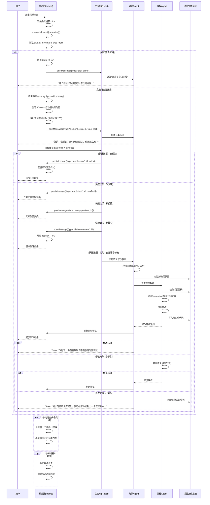

# 点选纠错（Click-to-Fix）技术实现路径分析

> 任务包 B4 | 日期：2026-06-06 | 版本：v1.0
>
> 依赖资源：interaction-spec.md v0.3、wireframes/*.prototype.html v0.3、design-system.md v0.3、user-stories-v0.6.md、PRD v0.2

---

## 核心问题

**"用户点击了预览里的按钮，系统怎么知道点的是哪个、要怎么改？"**

---

## 1. 方案对比矩阵

### 1.1 评估维度定义

| 维度 | 含义 | 评分标准 |
|------|------|---------|
| 定位准确率 | 元素定位的精确性和稳定性 | 1-5，5=100%精确且抗DOM变动 |
| 实现复杂度 | 前端+后端+Agent三端实现难度 | 1-5，1=最复杂，5=最简单 |
| 对原型生成的影响 | 是否需要在原型生成环节做额外标注 | 1-5，1=最大负担，5=零负担 |
| 用户项目兼容性 | 对非平台生成的用户自有HTML的兼容能力 | 1-5，5=完全兼容任意HTML |
| Agent理解难度 | 定位信息被Agent理解和转化为修改规约的难易度 | 1-5，5=Agent可直接理解无需翻译 |

### 1.2 方案对比矩阵

| 维度 | 方案A：data-ai-id 标注 | 方案B：DOM路径 | 方案C：截图+视觉模型 | 方案D：混合方案 |
|------|----------------------|---------------|---------------------|---------------|
| **定位准确率** | ⭐⭐⭐⭐⭐ (5) | ⭐⭐ (2) | ⭐⭐⭐ (3) | ⭐⭐⭐⭐⭐ (5) |
| **实现复杂度** | ⭐⭐⭐⭐ (4) | ⭐⭐⭐ (3) | ⭐⭐ (2) | ⭐⭐⭐ (3) |
| **对原型生成的影响** | ⭐⭐ (2) | ⭐⭐⭐⭐⭐ (5) | ⭐⭐⭐⭐⭐ (5) | ⭐⭐ (2) |
| **用户项目兼容性** | ⭐⭐ (2) | ⭐⭐⭐⭐ (4) | ⭐⭐⭐⭐⭐ (5) | ⭐⭐⭐⭐ (4) |
| **Agent理解难度** | ⭐⭐⭐⭐⭐ (5) | ⭐⭐ (2) | ⭐⭐⭐ (3) | ⭐⭐⭐⭐ (4) |
| **综合加权** | **3.6** | **3.2** | **3.6** | **3.6** |

> 加权公式：准确率×0.3 + 复杂度×0.2 + 生成影响×0.15 + 兼容性×0.15 + Agent理解×0.2

### 1.3 逐项分析

#### 方案A：data-ai-id 标注

**定位准确率（5/5）**
- 通过 JS `e.target.closest('[data-ai-id]')` 精准定位，不受元素在DOM树中的层级变化影响
- 已在 2 个工作区原型中验证可行：快消型用 `data-ai-id` + `data-ai-type`（`page-quick-workspace.prototype.html:493`），长期迭代型用 `data-el` + `onPreviewClick()`（`page-long-workspace.prototype.html:260-293`）
- 另外 4 个原型页面上存在 `data-ai-id` 属性标记但无 click-to-fix 事件监听，这些属性可被 click-to-fix 机制复用
- 即使元素被挪动、父容器改变，只要 `data-ai-id` 不变就能定位

**实现复杂度（4/5）**
- 前端：事件委托 + `getBoundingClientRect()` 定位高亮层 + 快速选项面板定位 — 原型已实现完整 DOM 内交互链路（`page-quick-workspace.prototype.html:486-534`）
- 跨iframe通信：需通过 `postMessage` 传递点击信息。**注意：原型中预览区为内联 div 而非 iframe，postMessage 通信路径为设计推演，待集成阶段实现。** 技术基座 R7 已判定此方案可行
- 后端侧（编程Agent路径）：原型中直接操作 DOM（如 `applyColor()`:607-619 行），不涉及 Agent 通信。完整 Agent 执行链路（自然语言→修改规约→编程Agent→代码修改→刷新）为架构设计阶段定义的目标路径，第5章给出了接口格式草案

**对原型生成的影响（2/5）**
- 原型生成Agent必须在生成时给每个可交互元素注入唯一 `data-ai-id` 和可选的 `data-ai-type`
- 需要与编程Agent约定ID命名规范（见§4），否则Agent无法将ID映射到代码元素
- 快消型原型只需核心页面（3-5个），标注量可控；长期迭代型页面多，需系统化标注

**用户项目兼容性（2/5）**
- 仅适用于平台自己生成的原型，用户从外部导入的HTML没有这些标注
- 对于截图标注场景完全不可用

**Agent理解难度（5/5）**
- `data-ai-id="btn-save"` + `data-ai-type="按钮"` 直接告知Agent"用户点了保存按钮"
- 无需解析DOM路径、无需视觉推理
- Agent可直接将这个ID映射到代码中的对应组件定义

---

#### 方案B：DOM路径（XPath/CSS Selector）

**定位准确率（2/5）**
- CSS Selector 路径（如 `html > body > div:nth-child(3) > button:nth-child(2)`）在DOM结构任何变化后立即失效
- iframe 内部的DOM路径在外部无法直接访问（跨域限制）
- 原型刷新后路径大概率已变

**实现复杂度（3/5）**
- 前端实现简单（`document.elementsFromPoint` 或遍历 `e.path` 生成 selector）
- 难点在于：iframe跨域访问、Agent理解路径语义、路径变更后的容错

**对原型生成的影响（5/5）**
- 零负担，不需要任何标注。任意HTML都可以工作。

**用户项目兼容性（4/5）**
- 对任意HTML都适用
- 但路径在不同浏览器中的表现可能有差异

**Agent理解难度（2/5）**
- XPath `//div[2]/div[1]/button[3]` 对Agent没有语义价值——Agent不知道这是"保存按钮"还是"取消按钮"
- 需要额外步骤：将路径映射回代码，推断语义，再生成修改规约
- 路径冗长，增加LLM推理成本

---

#### 方案C：截图+视觉模型定位

**定位准确率（3/5）**
- 当前多模态视觉模型在识别具体UI元素上有一定准确率，但不稳定
- 小元素（图标按钮、颜色色块）容易漏识别
- 密集排列的元素（表格行、列表项）难以区分
- 受截图质量、缩放比例影响

**实现复杂度（2/5）**
- 需要：截图→编码→视觉模型推理→文本解析→坐标映射→DOM元素查找—链路长
- 每次点击都涉及一次视觉模型调用，延迟和成本双高
- 跨iframe截图也存在技术挑战

**对原型生成的影响（5/5）**
- 零负担

**用户项目兼容性（5/5）**
- 最通用的方案。截图标注场景（US-U05 Sc.7）本身就是这个路径。

**Agent理解难度（3/5）**
- 视觉模型输出的是自然语言描述（如"页面右上角的蓝色按钮"），Agent需要将自然语言映射到代码中的具体元素
- 映射过程可能出错，需要二次确认

---

#### 方案D：混合方案

**定位准确率（5/5）**
- 主路径（data-ai-id）精确稳定
- 兜底路径（截图+视觉）覆盖兼容性场景

**实现复杂度（3/5）**
- 需要同时实现两套机制
- 但data-ai-id路径在原型阶段已基本完成
- 截图+视觉作为独立模块，可Phase 2再集成

**对原型生成的影响（2/5）**
- 主路径仍需标注，但兜底路径能覆盖用户截图标注的场景

**用户项目兼容性（4/5）**
- 主路径覆盖平台生成原型（约80%的场景）
- 兜底路径覆盖截图标注和外部HTML场景

**Agent理解难度（4/5）**
- 主路径Agent理解容易
- 兜底路径需要视觉模型输出+Agent解析，但场景少

---

## 2. 推荐方案

### Phase 1（MVP 快消型闭环）：方案A — data-ai-id 标注为主

**理由**：
1. **原型已实现（快速选项路径）**：快消型工作区原型中，从点击→高亮→快速选项面板→DOM直接修改的链路已用 `data-ai-id` 方案完整实现（`page-quick-workspace.prototype.html:486-667`）。此路径覆盖了 5 个快速选项中的 4 个（颜色/文字/位置/删除），无需调用 Agent。**自然语言修改路径（"其他"选项→编程Agent执行→代码修改→预览刷新）为设计目标，第5章给出了接口格式草案，尚未在原型中实现。**
2. **Agent理解直达**：`data-ai-id="btn-save"` 天然语义化，编程Agent可直接在代码中搜索对应组件进行修改
3. **3秒响应约束可达成**：无视觉模型调用延迟，纯前端事件+Agent推理即可在3秒内完成
4. **快消型原型数量少**（核心3-5个页面），标注负担可控

**实现优先级**：
- P0：快消型工作区 data-ai-id 标注 + 完整 click-to-fix 流程
- P1：长期迭代型工作区 data-el 标注（已有原型基础）

### Phase 2（长期迭代型 + 用户项目兼容）：方案D — 混合方案

**演进路径**：
```
Phase 1: data-ai-id 主路径
    ↓
Phase 2: + 截图标注兜底（US-U05 Sc.7 截图标注反馈）
    ↓
Phase 3: + 框选多元素协同修改（US-U05 Sc.6）
```

**截图兜底路径**在以下场景自动触发：
- 用户直接上传截图（而非点击预览元素）
- 用户在截图上画圈/箭头标注
- 预览中的元素没有 `data-ai-id` 或 `data-el` 属性

### Phase 3 场景：框选多元素（US-U05 Sc.6）—— 可行性分析

**需求**：用户在预览页面上拖拽框选一个包含多个相邻元素的区域，对这些元素进行批量操作（统一颜色、统一字号、对齐调整、整体移动）。

**方案A（data-ai-id）对框选的支持**：
- 框选区域内的元素如果各自有 `data-ai-id`，可以通过 `getBoundingClientRect()` 与框选区域的坐标交集运算，找出区域内所有元素
- 实现方式：监听 `mousedown` → `mousemove` 绘制选框（rubber-band selection）→ `mouseup` 时计算选框 rect → 遍历所有 `[data-ai-id]` 元素，筛选出与选框有交集的元素 → 返回元素 ID 列表
- 批量操作的修改规约需扩展：`target.aiIds: ["btn-save", "input-search", ...]` 替代单个 `aiId`
- 高亮方式需调整：从单元素独立 overlay 变为多元素的分组高亮（每个命中元素叠加 overlay）

**方案C（截图+视觉模型）对框选的支持**：
- 截图中自带框选标注（用户拖拽的选框可见），视觉模型可识别选框范围
- 但视觉模型对"框选范围内有哪些具体元素"的识别准确率低于 data-ai-id 坐标计算

**建议**：框选功能优先使用 data-ai-id + 坐标交集方案（Phase 3 实现），截图路径中如用户做了框选标注则视觉模型辅助判定选框范围。

**截图标注端到端流程（设计目标·Phase 2）**：

```
[用户] 截取预览页面 → 在截图上画圈/箭头标注
  → [系统] 截图 + 标注图形 → 视觉模型分析
  → [视觉模型] 输出：标注位置描述 + 标注意图推断
     例："用户在页面右上角的蓝色按钮上画了圈，可能想修改这个按钮"
  → [向导Agent] 将视觉模型输出转为修改规约：
     标注清晰 → 转换为目标CSS选择器或区域描述的修改规约
     标注模糊 → 追加澄清："我看到你的标注——你是想改[区域A]还是[区域B]？"
  → [编程Agent] 基于区域描述定位代码元素 → 执行修改
  → [预览] 刷新展示结果
```

| 截图标注关键环节 | 技术依赖 | 实现挑战 |
|------|---------|---------|
| 标注符号识别（圈/箭头/划线/文字）| 多模态视觉模型（GPT-4o / Gemini / Qwen-VL） | 不同标注风格（粗圈 vs 细圈，箭头方向）的识别鲁棒性 |
| 标注位置→代码元素映射 | 视觉模型输出坐标 → 与原型元素 rect 交集比对 | 截图分辨率与原型实际像素的缩放比例需校准 |
| 标注意图理解 | LLM 推理标注上下文（"为什么在这里画圈？"） | 标注意图可能模糊，需二次确认 |
| 延迟控制 | 截图编码 + 视觉模型 API 调用 | 预估 2-5 秒，需进度提示 |

**Phase 2 验收标准**：
1. 视觉模型对圈/箭头/划线三种标注符号的识别准确率 ≥ 90%
2. 标注→代码元素的定位准确率 ≥ 80%（以用户确认修改为正确计）
3. 端到端延迟（截图→视觉模型输出→修改规约生成）≤ 5 秒

### 不推荐的方案

- **方案B（DOM路径）**：DOM变动后路径立即失效，Agent理解困难。即使作为兜底也不如方案C。
- **方案C（纯视觉）**：作为主路径准确率不足、延迟大，仅适合作为兜底。

---

## 3. 完整交互链路

### 3.1 端到端流程（data-ai-id 主路径）

> **图例**：标记为 `[已验证]` 的步骤在快消型工作区原型（`page-quick-workspace.prototype.html`）中有完整代码实现。标记为 `[设计]` 的步骤为架构设计阶段定义的目标路径，将在集成阶段实现。



### 3.2 关键步骤详解

**步骤 0：初始化（页面加载时）**

快消型工作区通过事件委托在预览面板上注册 click 监听：
```js
previewPanel.addEventListener('click', function(e) {
  // 忽略快速选项面板上的点击
  if (e.target.closest('#quickOptions')) return;

  // 用 closest 向上查找最近的有 data-ai-id 的祖先
  var target = e.target.closest('[data-ai-id]');
  if (!target) { /* 点空白 → 提示用户 */ return; }

  var id = target.getAttribute('data-ai-id');
  var type = target.getAttribute('data-ai-type') || '元素';
  // → 进入步骤1
});
```

**步骤 1：元素定位与标识提取**

| 属性 | 来源 | 作用 |
|------|------|------|
| `data-ai-id` | 原型生成时注入 | 元素的唯一标识，Agent 用来定位代码 |
| `data-ai-type` | 原型生成时注入 | 元素的人类可读类型（按钮/输入框/卡片/标题） |
| `rect` | JS 实时计算 `getBoundingClientRect()` | 用于定位高亮覆盖层和快速选项面板 |

**重要区分**：前端的"快速选项"操作（换颜色/改文字/换位置/删掉它）在原型中通过直接 DOM 操作完成，不涉及 Agent 通信或快照创建。涉及编程Agent的自然语言修改路径（"其他"选项）、跨iframe postMessage通信、修改前自动快照的创建——这些属于架构设计阶段定义的集成目标，将在 Phase 1 实现阶段完成代码实现。

**步骤 2：高亮视觉效果**

快消型：独立叠加 div (`#clickHighlight`)，2px `--color-primary` 实线边框 + `rgba(79,70,229,0.08)` 背景。

通过绝对定位精确覆盖被点击元素：
```js
highlight.style.top    = (rect.top - panelRect.top) + 'px';
highlight.style.left   = (rect.left - panelRect.left) + 'px';
highlight.style.width  = rect.width + 'px';
highlight.style.height = rect.height + 'px';
```

3秒后自动消失（`setTimeout 3000ms`），或在用户做出选择后提前消失。

**步骤 3：快速选项面板**

弹出位置：高亮元素下方 8px。空间不足时自动调整至上方或左移。

内容（快消型）：
- 标题："对此[元素类型]的操作："
- 选项：🎨换个颜色 / 🖊改文字 / 📐换个位置 / 🗑删掉它 / 💬其他
- 关闭：✕ 按钮

**步骤 4：修改意图 → 编程Agent执行**

对于"换个颜色/改文字/换个位置/删掉它"四个预定义操作，可在预览iframe内直接完成（修改HTML/DOM），无需调用Agent。

对于"其他"（自然语言描述），完整链路为：
1. 向导Agent 将 自然语言 + data-ai-id + data-ai-type 转换为修改规约
2. 创建修改前快照
3. 编程Agent 读取源码 → 定位元素 → 执行修改 → 写入文件
4. 预览区刷新
5. Toast通知结果

**步骤 5：跨iframe通信（设计目标）**

> **注意**：当前原型中预览区为内联 `<div class="preview-mock">` 而非 `<iframe>`，因此以下 postMessage 通信代码为集成阶段设计，尚未在原型中运行验证。技术基座 R7 已判定同源 iframe + postMessage 方案可行。

原型在 `<iframe>` 中渲染时，点击事件通过 `postMessage` 传递到主应用：

```js
// iframe 内部 → 主应用
window.parent.postMessage({
  type: 'click-to-fix',
  payload: {
    aiId: 'btn-save',
    aiType: '按钮',
    action: 'color-change',
    params: { color: '#DC2626' }
  }
}, '*');

// 主应用监听
window.addEventListener('message', (event) => {
  if (event.data.type === 'click-to-fix') {
    handleClickToFix(event.data.payload);
  }
});
```

### 3.3 工作区差异对照

| 步骤 | 快消型 | 长期迭代型 |
|------|--------|-----------|
| 元素选择器 | `[data-ai-id]` | `[data-el]` |
| 类型属性 | `data-ai-type` | `onPreviewClick(this, type)` 参数 |
| 高亮方式 | 独立div覆盖层，2px边框 + 半透明背景 | CSS class `preview-el-highlight`，3px outline |
| 选项面板 | 含元素类型标题，✕关闭 | 通用标题"你想怎么改？"，底部取消按钮 |
| 取消方式 | 点击空白 + 面板✕ | 点击空白 + 取消按钮 + document级监听 |
| 颜色子选项 | 嵌入展开式色板，4色：红#DC2626 / 蓝#4F46E5 / 绿#059669 / 靛蓝#6366F1，点击后立即应用 | 直接应用随机主色 |
| Agent回复 | "好的，我看到了这个[元素类型]。你想怎么改？" | 同左 |

---

## 4. data-ai-id 命名规范草案

### 4.1 命名原则

1. **语义化**：ID应直接反映元素的功能含义（`btn-submit` 而非 `el-001`）
2. **可搜索**：编程Agent可通过ID在代码中搜索定位（如搜索 `btn-submit` 找到对应的 `<button>` 组件）
3. **含类型前缀**：前缀表明元素类型，帮助Agent理解元素性质
4. **kebab-case**：统一使用小写连字符命名
5. **唯一性**：同一页面内每个 `data-ai-id` 必须唯一
6. **稳定性**：元素功能不变则ID不变，即使位置/样式改变

> **当前状态**：原型中 `data-ai-id` 和 `data-ai-type` 为手动写入的硬编码值，命名尚未严格遵循以下规范（如原型中使用 `title` 而非 `title-main`，`card-0` 而非 `card-note-0`）。以下规范为架构设计草案，Phase 1 实现时需：① 将规范纳入原型生成Agent的 System Prompt，由 Agent 在生成原型时自动注入符合规范的 ID；② 对已有原型按此规范重新标注。

### 4.2 类型前缀体系

| 前缀 | 含义 | 使用场景 | 示例 |
|------|------|---------|------|
| `btn-` | 按钮 | 提交、取消、删除、导航按钮 | `btn-submit`, `btn-delete`, `btn-nav-home` |
| `input-` | 输入框 | 文本、搜索、密码、数字输入 | `input-search`, `input-title`, `input-password` |
| `card-` | 卡片 | 列表项卡片、内容卡片、统计卡片 | `card-note-0`, `card-project`, `card-stat-total` |
| `nav-` | 导航项 | 导航栏菜单项、Tab标签 | `nav-home`, `nav-settings`, `tab-data` |
| `title-` | 标题 | 页面标题、区块标题 | `title-main`, `title-section-features` |
| `list-` | 列表 | 列表容器、可滚动列表 | `list-notes`, `list-members` |
| `icon-` | 图标 | 功能图标按钮 | `icon-edit`, `icon-delete`, `icon-close` |
| `link-` | 链接 | 超链接 | `link-readmore`, `link-external` |
| `modal-` | 弹窗/对话框 | 模态窗口 | `modal-confirm`, `modal-detail` |
| `table-` | 表格/数据行 | 数据表格行 | `table-header`, `table-row-0` |
| `img-` | 图片 | 图片元素 | `img-avatar`, `img-banner` |
| `badge-` | 标签/标记 | 状态标签、计数标记 | `badge-status`, `badge-count` |
| `container-` | 容器/布局块 | 布局容器 | `container-sidebar`, `container-content` |
| `form-` | 表单 | 表单容器 | `form-login`, `form-register` |
| `dropdown-` | 下拉菜单 | 选择器、下拉 | `dropdown-category`, `dropdown-sort` |
| `toggle-` | 开关 | 开关切换 | `toggle-darkmode`, `toggle-notification` |

### 4.3 data-ai-type 取值规范

`data-ai-type` 用于向导Agent生成用户可理解的自然语言描述，取值为中文：

| 值 | 对应前缀 | Agent文案生成 |
|------|---------|-------------|
| `按钮` | `btn-` | "我看到了这个按钮" |
| `输入框` | `input-` | "我看到了这个输入框" |
| `卡片` | `card-` | "我看到了这个卡片" |
| `导航` | `nav-` | "我看到了这个导航项" |
| `标题` | `title-` | "我看到了这个标题" |
| `列表` | `list-` | "我看到了这个列表" |
| `图标` | `icon-` | "我看到了这个图标" |
| `链接` | `link-` | "我看到了这个链接" |
| `弹窗` | `modal-` | "我看到了这个弹窗" |
| `表格行` | `table-` | "我看到了这个表格行" |
| `图片` | `img-` | "我看到了这张图片" |
| `标签` | `badge-` | "我看到了这个标签" |
| `开关` | `toggle-` | "我看到了这个开关" |

### 4.4 编号约定

对于同类重复元素（列表项、卡片组），使用数字后缀：

```
data-ai-id="card-note-0"    // 第1条笔记卡片
data-ai-id="card-note-1"    // 第2条笔记卡片
data-ai-id="table-row-0"    // 第1行数据
data-ai-id="table-row-1"    // 第2行数据
```

### 4.5 完整示例

```html
<!-- 页面主标题 -->
<h1 data-ai-id="title-main" data-ai-type="标题">我的读书笔记</h1>

<!-- 搜索框 + 提交按钮 -->
<div class="input-row">
  <input type="text" data-ai-id="input-search" data-ai-type="输入框" placeholder="搜索笔记...">
  <button data-ai-id="btn-search" data-ai-type="按钮">搜索</button>
</div>

<!-- 笔记列表 -->
<div class="note-list" data-ai-id="list-notes" data-ai-type="列表">
  <div class="note-card" data-ai-id="card-note-0" data-ai-type="卡片">
    <h3 data-ai-id="title-note-0" data-ai-type="标题">百年孤独</h3>
    <p data-ai-id="content-note-0" data-ai-type="文本">精彩的开篇...</p>
    <button data-ai-id="btn-delete-0" data-ai-type="按钮">删除</button>
  </div>
</div>

<!-- 导航栏 -->
<nav data-ai-id="nav-main" data-ai-type="导航">
  <a data-ai-id="nav-home" data-ai-type="导航项">首页</a>
  <a data-ai-id="nav-settings" data-ai-type="导航项">设置</a>
</nav>
```

---

## 5. 与编程Agent的接口（设计草案）

> **状态：设计草案**。本章定义的 JSON Schema、修改动作枚举、请求/响应格式为架构设计阶段的接口契约草案，尚未在原型中实现。原型中的快速选项通过直接 DOM 操作完成修改，不经过此 JSON 规约路径。以下格式将作为 Phase 1 集成实现时的接口基准。

### 5.1 修改规约数据格式

从用户点击到编程Agent执行修改，中间需要一份结构化的修改规约。该规约由向导Agent生成，编程Agent直接解析执行。

#### 基础格式

```json
{
  "$schema": "https://proma.dev/schemas/click-to-fix/v1",
  "version": "1.0",
  "timestamp": "2026-06-06T09:15:00+08:00",
  "context": {
    "projectId": "proj-abc123",
    "workspaceType": "quick",
    "pageFile": "page-main.prototype.html"
  },
  "target": {
    "aiId": "btn-save",
    "aiType": "按钮",
    "aiIdPath": ["container-main", "form-note", "btn-save"],
    "currentState": {
      "visibleText": "添加笔记",
      "backgroundColor": "#4F46E5",
      "position": { "x": 450, "y": 120, "width": 120, "height": 40 }
    }
  },
  "modification": {
    "action": "change-color",
    "params": {
      "property": "background-color",
      "newValue": "#DC2626"
    }
  },
  "userIntent": {
    "rawInput": "把这个按钮换成红色",
    "quickOption": "换个颜色",
    "confidence": 1.0
  }
}
```

#### 修改动作枚举

| action | 含义 | params结构 |
|--------|------|-----------|
| `change-color` | 修改元素颜色 | `{ property: "background-color"|"color"|"border-color", newValue: "#hex" }` |
| `change-text` | 修改文字内容 | `{ newText: "string", targetAttribute: "textContent"|"placeholder"|"value" }` |
| `change-position` | 修改布局位置 | `{ action: "swap-with"|"move-to", target?: "ai-id", direction?: "up"|"down"|"left"|"right" }` |
| `delete` | 删除元素 | `{ method: "remove"|"hide" }` |
| `change-style` | 通用样式修改 | `{ property: "css-property-name", newValue: "css-value" }` |
| `change-size` | 修改尺寸 | `{ dimension: "width"|"height"|"font-size", newValue: "css-value" }` |
| `add-element` | 添加新元素 | `{ type: "button"|"input"|..., aiId: "new-element-id", parent: "parent-ai-id", position: "before"|"after"|"append", props: {...} }` |
| `natural-language` | 自然语言修改 | `{ description: "把标题改大一点，挪到中间，用深蓝色" }` |

#### 5.2 完整修改示例

**示例1：快速选项 - 改颜色**

```json
{
  "target": { "aiId": "btn-save", "aiType": "按钮" },
  "modification": {
    "action": "change-color",
    "params": {
      "property": "background-color",
      "newValue": "#DC2626"
    }
  }
}
```

**示例2：自然语言修改**

用户说："把这个按钮挪到右边，并改成圆角"

```json
{
  "target": { "aiId": "btn-save", "aiType": "按钮" },
  "modification": {
    "action": "natural-language",
    "params": {
      "description": "把按钮移到页面右侧，并添加圆角样式"
    }
  },
  "userIntent": {
    "rawInput": "把这个按钮挪到右边，并改成圆角",
    "parsedIntent": {
      "operations": [
        { "type": "change-position", "target": "right-align" },
        { "type": "change-style", "property": "border-radius", "value": "8px" }
      ]
    },
    "confidence": 0.85
  }
}
```

**示例3：复杂修改 - 删除元素并调整布局**

```json
{
  "target": { "aiId": "card-note-2", "aiType": "卡片" },
  "modification": {
    "action": "delete",
    "params": {
      "method": "remove",
      "adjustLayout": true
    }
  }
}
```

#### 5.3 编程Agent的接收与执行流程

```
收到修改规约(JSON)
    │
    ▼
解析 target.aiId → 在项目源码中搜索 data-ai-id="btn-save"
    │
    ├── 找到 → 定位到具体组件/元素
    │     │
    │     ├── 解析 modification.action
    │     │
    │     ├── change-color / change-text / change-style
    │     │   → 直接修改对应CSS属性或文本内容
    │     │
    │     ├── delete
    │     │   → 移除元素并调整周围布局
    │     │
    │     └── natural-language
    │         → 将 description 转换为具体代码修改
    │
    └── 未找到 → 向向导Agent报告：
        "未找到 aiId=btn-save 对应的代码元素。
         可能原因：AI ID已变更 / 元素已被删除 / 页面文件已更新。
         建议：让用户重新点击目标元素。"
```

#### 5.4 响应格式

编程Agent执行完毕后返回：

```json
{
  "status": "success",
  "modificationId": "mod-abc123",
  "appliedChanges": [
    {
      "file": "page-main.prototype.html",
      "line": 225,
      "changeType": "style-modification",
      "before": "background: #4F46E5",
      "after": "background: #DC2626"
    }
  ],
  "snapshotId": "snap-xyz789",
  "previewRefreshRequired": true
}
```

失败时：

```json
{
  "status": "failed",
  "modificationId": "mod-abc123",
  "error": {
    "code": "ELEMENT_NOT_FOUND",
    "message": "data-ai-id 'btn-save' not found in current source",
    "suggestion": "ask_user_to_reclick"
  },
  "autoFixed": false,
  "retriesUsed": 3
}
```

---

## 6. 风险点与边界处理

### 6.1 风险矩阵

| 风险 | 严重度 | 概率 | 影响 | 缓解措施 |
|------|--------|------|------|---------|
| data-ai-id 在代码中找不到 | 高 | 中 | 修改失败，用户感到困惑 | 原型刷新后重新点击；Agent搜索容错；降级为自然语言描述 |
| 元素在iframe中跨域限制 | 高 | 低 | 无法获取元素信息 | 同源iframe + postMessage通信（技术基座R7已验证可行，**原型中预览区为内联div而非iframe，iframe通信待集成阶段实现**） |
| 原型生成Agent和编程Agent ID命名不一致 | 高 | 中 | 修改应用到错误元素 | 统一命名规范（§4）；裁判Agent校验ID一致性 |
| 连续快速点击导致状态混乱 | 中 | 高 | 多次修改同时执行，可能冲突 | 以最后一次点击为准，重置高亮计时器（原型已验证） |
| 修改中iframe刷新导致选中状态丢失 | 中 | 中 | 用户选择被丢弃 | 刷新前检查是否有未完成的修改操作 |
| 视觉模型兜底路径准确率不足 | 中 | 中 | 定位错误元素 | 兜底路径要求Agent二次确认后才执行修改 |
| 3秒内Agent未响应 | 中 | 低 | 高亮消失但修改未完成 | 超5秒显示进度Toast；修改完成后刷新高亮状态 |
| 修改操作不可逆（无快照时） | 低 | 低 | 用户不满意无法撤销 | 每次修改前自动创建快照（**原型中时间轴功能已验证自动快照机制，但 click-to-fix 流程中尚未集成快照触发——此为集成阶段目标**） |

### 6.2 边界Case处理

#### Case 1：点击空白背景

```
条件：e.target.closest('[data-ai-id]') === null
处理：显示提示"这个位置好像没有可以修改的组件。你想在页面上的哪个具体元素？可以试试点按钮、文字或图片。"
不产生错误提示，不弹出快速选项面板。
```

**实现**（原型已验证）：
```js
var target = e.target.closest('[data-ai-id]');
if (!target) {
  addMessage('agent', '这个位置好像没有可以修改的组件...');
  hideQuickOptions();
  if (clickHighlightTimer) clearTimeout(clickHighlightTimer);
  highlight.style.display = 'none';
  return;
}
```

#### Case 2：2秒内连击多个元素

> **精度说明**：交互规范定义"2秒内连击≥2个元素→以最后一次点击为准"。原型中通过 `clearTimeout` + 重置计时器实现了"以最后点击为准"的功能行为，但未显式判断2秒时间阈值——任何时间间隔内的连击均以最后一次为准，功能上涵盖并超越交互规范的"2秒内"约束。

```
条件：clickHighlightTimer 仍在计时中，用户又点击了另一个元素
处理：clearTimeout 前一个计时器，以最后一次点击为准
效果：只有最后一个元素被高亮 + 弹出选项
```

**实现**（原型已验证）：
```js
if (clickHighlightTimer) clearTimeout(clickHighlightTimer);
lastClickTarget = target;
clickHighlightTimer = setTimeout(function() {
  highlight.style.display = 'none';
}, 3000);
```

#### Case 3：修改中iframe刷新（设计目标）

> **注意**：原型中预览区为内联 div 无 iframe 刷新场景，以下处理逻辑为设计推演，将在集成阶段实现。

```
条件：编程Agent正在修改代码，预览iframe收到刷新指令
处理：
  1. 隐藏当前高亮和快速选项面板
  2. 记录当前 data-ai-id 和修改上下文
  3. 刷新完成后，通过 postMessage 通知"修改已完成，可重新查看"
  4. 不尝试自动恢复点击状态（DOM可能已变）
```

#### Case 4：快速选项面板空间不足

```
条件：高亮元素位于页面底部，下方空间 < 260px
处理：
  1. 优先放在下方
  2. 下方不够 → 放在元素上方
  3. 右侧超出 → 左移确保不溢出

代码逻辑（原型已验证）：
if (top + 260 > panelRect.height && top > 200) {
  top = rect.top - panelRect.top - 260;
}
if (left + 260 > panelRect.width) {
  left = Math.max(0, panelRect.width - 280);
}
```

#### Case 5：data-ai-id 在代码中找不到（设计目标）

> **注意**：此 Case 涉及编程Agent侧的错误处理逻辑，原型中未实现。以下为设计推演。

```
条件：编程Agent搜索源码，找不到 data-ai-id 对应的元素
原因可能：
  - 用户点击的是历史版本原型，源码已更新
  - AI ID 命名不一致
  - 页面文件已被外部修改

处理：
  1. 编程Agent返回 ELEMENT_NOT_FOUND 错误码
  2. 向导Agent向用户说明：
     "这个元素在最新的代码里好像已经变了。你能再点一下那个元素吗？我重新看看。"
  3. 用户重新点击 → 获取最新的 data-ai-id → 重新定位
  4. 如果仍然找不到 → 建议用户用自然语言描述修改意图
```

#### Case 6：iframe 跨域限制（设计目标）

> **注意**：原型中预览区为内联 div，不存在 iframe 跨域场景。以下方案基于技术基座 R7 判定结论，将在集成阶段实现。

```
条件：原型渲染在跨域 iframe 中
处理（技术基座 R7 已判定此方案可行）：
  - 统一使用同源 iframe 渲染原型
  - 通过 postMessage 在主应用和iframe之间通信
  - 沙箱属性 sandbox 设置为 "allow-scripts allow-same-origin"
```

#### Case 7：Click-to-Fix 面板上自身的点击

```
条件：用户点击了快速选项面板上的元素（如色块选择器）
处理：忽略对该面板内部的点击
```

**实现**（原型已验证）：
```js
if (e.target.closest('#quickOptions')) return;
if (e.target.closest('.quick-options')) return;
```

### 6.3 心理防御文案映射

| 场景 | 文案 | 触发条件 |
|------|------|---------|
| 点击空白 | "这个位置好像没有可以修改的组件。你想在页面上的哪个具体元素？可以试试点按钮、文字或图片。" | `data-ai-id` 未命中 |
| 修改成功 | "改好了，你看看效果？不满意随时告诉我。" | 编程Agent执行成功 |
| 修改失败+回滚 | "刚才的修改没有成功，我已经帮你回到上一个正常版本，你的内容没有丢失。我们换个思路试试？" | 3次自修复失败→熔断回滚 |
| 等待超时 | "这次操作花了比预期更长的时间，我还在处理中。如果等太久，你可以催我。" | 修改超过30秒无响应 |
| 元素已变更 | "这个元素在最新的代码里好像已经变了。你能再点一下那个元素吗？我重新看看。" | ELEMENT_NOT_FOUND |

---

## 7. 总结

### 7.1 推荐决策

| 决策 | 结论 |
|------|------|
| Phase 1 方案 | **方案A（data-ai-id 标注）** |
| Phase 2 演进 | **方案D（混合方案）** |
| 不推荐 | 方案B（DOM路径）作为主路径不稳定 |
| 快消型实现 | `data-ai-id` + `data-ai-type`（原型已完成） |
| 长期迭代型实现 | `data-el`（原型已完成，需统一为 `data-ai-id`） |
| 兜底路径 | 截图+视觉模型（截图标注场景 US-U05 Sc.7） |

### 7.2 Phase 1 实施建议

1. **统一标注属性**：将长期迭代型的 `data-el` 统一为 `data-ai-id` + `data-ai-type` 双属性方案
2. **原型生成Agent模板**：将 §4 的命名规范纳入原型生成Agent的 System Prompt
3. **修改规约协议**：双方 Agent 以 §5.1 的 JSON Schema 作为接口契约
4. **利用已有原型代码**：快消型 workrspace 的 `initClickToFix()` 已经是可直接参考的完整实现

### 7.3 关键约束满足情况

| 约束 | 满足方式 |
|------|---------|
| 修改规约 → 编程Agent可直接执行 | JSON 结构化规约，含精确的 aiId + action + params |
| 零基础用户无感 | data-ai-id 完全不可见，用户只点、只说、只看 |
| 3秒内完成 | 快速选项直接操作DOM（<100ms）；自然语言修改异步完成但高亮3秒内 |
| 安全保证 | 每次修改前自动快照，3次失败熔断回滚 |

---

> 文档结束。
