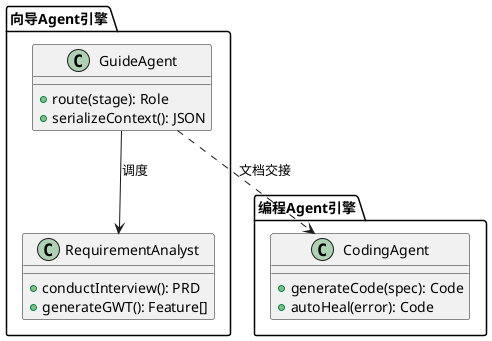

# 任务说明书：PlantUML 类图

> 文档ID：DOC-3.2 | 任务包：PKG-D2
> 产出文件：`03_ARCHITECTURE/class-diagram.puml`
> 依赖：PKG-D1（architecture.md 已确认）

---

## 一、任务目标

产出PlantUML类图，定义平台4个核心域的类结构。这是编程Agent的强约束——代码中的自定义类必须与类图一致。

## 二、前置阅读

| # | 文件 | 作用 |
|---|------|------|
| 1 | `03_ARCHITECTURE/architecture.md` | **必须已确认**，获取模块划分和依赖关系 |
| 2 | `01_PRD/prd.md` §4、§8.4 | 理解Agent架构和PlantUML约束规范 |
| 3 | `03_ARCHITECTURE/exploration/task-pkg-a1-proma-source/proma-source-analysis.md` | Proma源码结构，指导类设计 |

## 三、产出内容

### 必须覆盖的4个核心域

#### 域1：向导Agent引擎
- `GuideAgent`（路由层）：阶段判定、角色调度、上下文序列化
- `RequirementAnalyst`（需求分析师）：对话管理、PRD生成
- `UIUXAdvisor`（UI/UX顾问）：原型生成、视觉审查
- `ArchitectDesigner`（架构设计师）：PlantUML生成、技术选型
- `EngineeringManager`（工程经理）：模板匹配、Sprint规划
- 各类之间的调度和依赖关系

#### 域2：编程Agent引擎
- `CodingAgent`（全栈开发/前端/后端）：代码生成、自修复
- `TestAgent`（测试工程师）：GWT解析执行、报告生成
- `ReviewerAgent`（代码审查员，可选）
- `ProjectManager`（项目经理，可选）
- 自修复循环的类关系

#### 域3：裁判Agent引擎
- `JudgeAgent`：硬约束执行器、软约束评估器
- `HardConstraintChecker`：文档必填项、PlantUML语法、GWT存在性
- `SoftConstraintEvaluator`：逻辑一致性、可测试性、完整性

#### 域4：基础设施
- `SnapshotManager`：快照创建、列表、回滚
- `TelemetryCollector`：13事件采集、JSONL写入
- `ProjectDocumentSystem`：7目录结构管理
- `SandboxManager`：L0文件隔离、L1进程限制
- `SessionRouter`：角色切换、Context Backfill

### PlantUML规范

- 每个类标注属性和方法（核心的3-5个）
- 关系标注：继承(`<|--`)、组合(`*--`)、依赖(`..>`)、关联(`-->`)
- 使用package对4个域分组
- 语法必须可被PlantUML解析器正确渲染
- 文件头部注释标注文档ID和版本

### 示例格式

## 四、产出要求

- 格式：PlantUML `.puml` 文件
- 元信息：文件头部注释含文档ID、版本、依赖
- 覆盖：4个域每个至少1个package，核心类总数 ≥ 15
- 每个类含3-5个核心属性/方法
- 关系线清晰，无所指不明连线

## 五、完工标准

- [ ] 4个域全部有package和类定义
- [ ] 核心类 ≥ 15个
- [ ] 每个类有属性+方法
- [ ] 关系标注完整
- [ ] PlantUML语法有效（可被渲染）
- [ ] 与architecture.md模块划分一致
