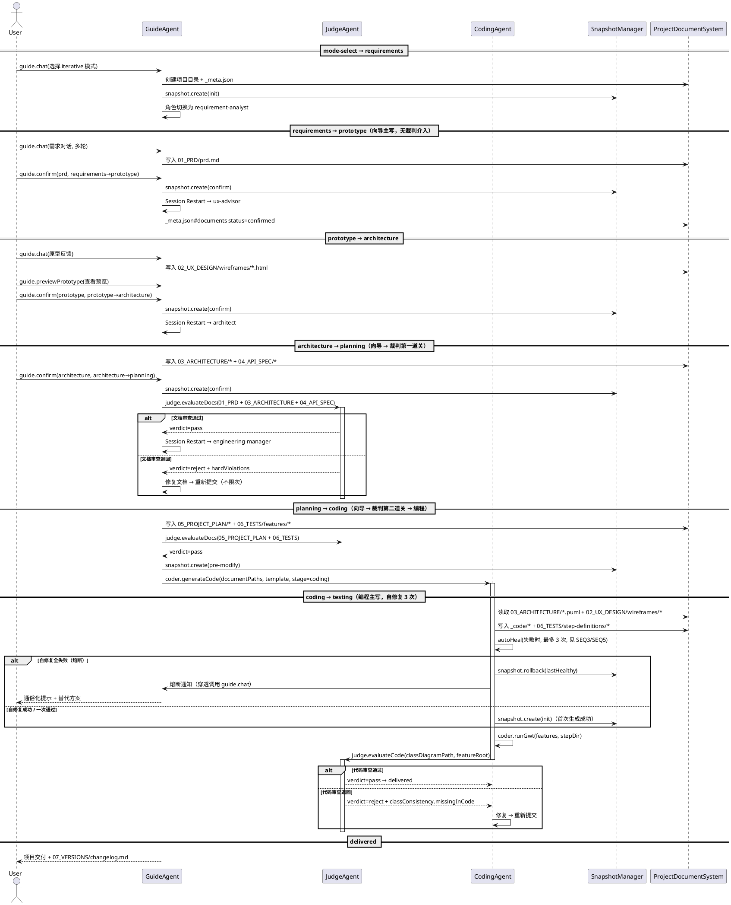
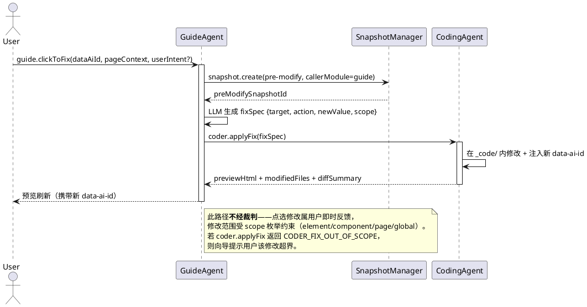

# Agent 间通信协议

> 项目：向导Agent与编程Agent多智能体协同开发平台
> 文档ID：DOC-4.2（agent-comm 专属；其他 04 子文档独立分配 ID） | 版本：v0.1 | 日期：2026-07-15 | 状态：草稿（待 nanju-A-commander 评审）
> 依赖：[[04_API_SPEC/api-spec.md]] v0.4（§0 通信范式、§2~§7 共 20 端点契约、§8 错误码体系）、[[03_ARCHITECTURE/architecture.md]] v0.3（§2 模块输入/输出、§5 角色切换机制、§7 点选纠错）、[[03_ARCHITECTURE/data-model.md]] v0.6（§2 stage 状态机、§5 SessionContext、§8 _meta.json）、[[03_ARCHITECTURE/sequence-diagrams/]] v0.3（SEQ2/SEQ3/SEQ4/SEQ5 时序图风格参考）
> 一致性声明：本文档为 [[04_API_SPEC/api-spec.md]] 的**子文档**——api-spec.md 定义「20 端点的静态契约」（输入/输出 Schema、错误码），本文档定义「20 端点在向导Agent / 编程Agent / 裁判Agent 三方之间的**动态协作时序**」（触发条件、调用顺序、异常传播、stage 推进边界）。所有接口签名、字段名、错误码均严格复用 api-spec.md v0.4，不引入新端点；所有 stage / role / triggerType 枚举均严格复用 data-model.md v0.6。本文档不重复 api-spec.md 已有的字段表，仅在「谁调用、何时调用、出错如何传播」维度做补充。上游文档留白处的补充定义以 *APISPEC-SUPPLEMENT* 标记，待上游确认后回写。

---

## 0. 范围与定位

### 0.1 本文档在 04_API_SPEC 中的位置

[[04_API_SPEC/api-spec.md]] v0.4 已给出平台的**完整接口契约**（6 类 20 端点 + 68 唯一错误码 + 14 埋点事件），但其视角是「**单端点的静态 Schema**」——它回答"每个端点接受什么、返回什么"，而不回答"哪个 Agent 在什么 stage 调用它、调用失败后如何传播给其他 Agent"。本文档补足后者，是 api-spec.md 的**协议层补充**而非并列文档。

| 维度 | api-spec.md v0.4 | agent-comm.md（本文） |
|------|------------------|----------------------|
| 视角 | 静态契约（schema-level） | 动态协议（sequence-level） |
| 核心问题 | 端点接受什么/返回什么 | 谁调用/何时调用/出错传给谁 |
| 端点数 | 20 | 复用 20（不新增） |
| 时序图 | 无 | §3 给出三 Agent 完整协作时序 |
| 异常处理 | 错误码枚举 | 错误码在三 Agent 间的传播链 |

### 0.2 与同阶段其他 worker 的边界

04_API_SPEC 设计阶段并行推进 4 份子文档，本文档严格不越界：

| 子文档 | 负责人 | 边界 |
|--------|--------|------|
| **agent-comm.md（本文）** | worker A（nanju04-A-worker） | Agent 间通信时序、文件契约所有权、调用入口依赖、异常传播、stage 推进边界 |
| 前端 IPC 通道细节 | worker B | `ipcMain.handle` / `ipcRenderer.invoke` 桥接的 channel 命名约定、流式 chunk 协议、取消信号、错误事件渲染 |
| 数据模型字段表 | worker C | Project / Snapshot / SessionContext / DocumentMeta / TelemetryEvent 五实体的字段级完整性约束（_meta.json 结构、外键关系、索引） |
| 埋点事件 payload | worker D | 14 eventType 的 payload 详细 schema、采集时机、脱敏规则、保留策略 |

**本文中出现的 `_meta.json` 字段、埋点 eventType、错误码均以引用方式指向上游**，不展开字段表。如需字段级详情，参见 [[03_ARCHITECTURE/data-model.md]] 对应章节。

### 0.3 通信范式（继承）

本协议严格继承 [[04_API_SPEC/api-spec.md]] §0.1 的**零依赖通信范式**——Agent 间无 HTTP/REST、无消息队列、无数据库，仅通过两种形态交互：

| 形态 | 三 Agent 间是否使用 | 说明 |
|------|---------------------|------|
| **文件系统契约** | ✅ 三 Agent 主要通信媒介 | 通过 `_meta.json` + 7 目录的标准化结构在磁盘上交换状态 |
| **进程内函数调用** | ✅ 穿透场景使用 | services 层模块间的同步调用（如 guide.clickToFix 内部调 coder.applyFix） |

**关键约束**（继承自 [[03_ARCHITECTURE/architecture.md]] §1.2 零依赖原则）：所有 Agent 间协作必须能落到上述两种形态之一，禁止引入网络层。

---

## 1. 三 Agent 协作总览

### 1.1 三 Agent 职责矩阵

| Agent | 主要职责 | 对应 services 模块 | 主导 stage | 关键端点（来自 api-spec.md） |
|-------|---------|-------------------|-----------|-----------------------------|
| **向导Agent（GuideAgent）** | 需求→原型→架构→工程规划，4 角色串行切换；用户唯一对话入口 | `services/guide.ts` | `mode-select` / `requirements` / `prototype` / `architecture` / `planning` | `guide.chat` / `guide.previewPrototype` / `guide.clickToFix` / `guide.confirm` |
| **编程Agent（CodingAgent）** | 代码生成、自修复（3 次）、GWT 测试；熔断时回滚+通知 | `services/coder.ts` | `coding` / `testing` | `coder.generateCode` / `coder.applyFix` / `coder.runGwt` |
| **裁判Agent（JudgeAgent）** | 硬约束 7 项 + 软约束 4 维度；判定通过/退回 | `services/judge.ts` | 跨 stage（文档审查在 `planning` 后、代码审查在 `testing` 后） | `judge.evaluateDocs` / `judge.evaluateCode` |

> **协作必要第三方**（非 Agent，但参与通信）：**快照管理器**（`services/snapshot.ts`，被三 Agent 共享调用）与**项目文档体系**（文件系统挂载点，见 §2）。两者在 [[03_ARCHITECTURE/architecture.md]] §2 中定义为独立模块，本文将其作为"通信介质"处理。

### 1.2 三 Agent 两两通信路径

| 通信路径 | 通信形态 | 触发场景 | 载体 |
|---------|---------|---------|------|
| 向导 → 编程 | **文件契约**（异步）+ **函数调用**（穿透） | 文档体系完成后启动代码生成；点选纠错时生成 fixSpec 后立即调用 | 7 目录文档 + `coder.generateCode(input)` / `coder.applyFix(spec)` |
| 向导 → 裁判 | **文件契约**（异步） | PRD/UX/架构/API/Plan 文档写完后由 `guide.confirm` 内部编排提交审查 | 7 目录文档 + `_meta.json#documents` |
| 编程 → 裁判 | **文件契约**（异步） | 代码生成 + GWT 执行完成后提交代码审查 | `_code/` 目录 + `06_TESTS/features/` |
| 裁判 → 向导（退回） | **函数返回**（同步） | 文档审查 verdict=`reject` | `judge.evaluateDocs` 返回 `hardViolations` 清单，经 ProjectDocumentSystem 透传到 GuideAgent |
| 裁判 → 编程（退回） | **函数返回**（同步） | 代码审查 verdict=`reject` | `judge.evaluateCode` 返回 `hardViolations` + `classConsistency.missingInCode` |
| 编程 → 向导（熔断通知） | **函数调用**（穿透） | 3 次自修复全失败，回滚完成后通知向导Agent向用户呈现 | `guide.chat` 内部接收熔断 payload（[[03_ARCHITECTURE/sequence-diagrams/auto-healing.seq.puml]] SEQ5） |
| 三 Agent → 快照 | **函数调用**（共享） | 关键节点（init/confirm/pre-modify/pre-error） | `snapshot.create(triggerType, callerModule)` |

---

## 2. 文件系统契约：_meta.json + 7 目录的三 Agent 共享

### 2.1 共享目录结构（继承 api-spec.md §2.1）

三 Agent 通过共享项目目录 `{projectRoot}/`（= `workspace-files/{projectId}-{shortName}/`，见 [[03_ARCHITECTURE/data-model.md]] §1.2）交换状态。目录结构严格遵循 [[04_API_SPEC/api-spec.md]] §2.1：

```
{projectRoot}/
├── 01_PRD/                prd.md [, user-stories.md]
├── 02_UX_DESIGN/          wireframes/*.html [, sitemap.md, design-system.md, ...]
├── 03_ARCHITECTURE/       architecture.md, class-diagram.puml, sequence-diagrams/, data-model.md
├── 04_API_SPEC/           api-spec.md, agent-comm.md（本文）
├── 05_PROJECT_PLAN/       sprint-plan.md, team-config.md, workflow.md
├── 06_TESTS/              features/*.feature, step-definitions/, test-plan.md
├── 07_VERSIONS/           changelog.md
├── _meta.json             Project 元数据 + Snapshot[] 索引 + DocumentMeta[] 清单
├── _code/                 编程Agent 输出区
└── _system/conversation.jsonl   全量对话记录（向导Agent 主写）
```

### 2.2 各 Agent 对目录与文件的读/写所有权矩阵

**核心契约**：每个目录/文件在同一 stage 内**只有一个写者**，避免并发冲突（与 [[03_ARCHITECTURE/architecture.md]] §5.1 串行切换方案一致）。读权限对所有 Agent 开放。

| 路径 | 写者（按 stage 顺序） | 读者 | 写时机 |
|------|--------------------|------|--------|
| `01_PRD/*` | 向导Agent（requirement-analyst 角色） | 裁判、编程 | `requirements` stage，用户确认后 status=`confirmed` |
| `02_UX_DESIGN/wireframes/*.html` | 向导Agent（ux-advisor 角色） | 裁判（仅人工评审）、编程（作为前端模板） | `prototype` stage |
| `02_UX_DESIGN/{sitemap,design-system,interaction-spec}.md` | 向导Agent（ux-advisor 角色） | 同上 | `prototype` stage（长期迭代型） |
| `03_ARCHITECTURE/*` | 向导Agent（architect 角色） | 裁判、编程（PlantUML 作为代码生成约束） | `architecture` stage |
| `04_API_SPEC/api-spec.md` | 向导Agent（architect 角色） | 裁判、编程 | `architecture` stage |
| `04_API_SPEC/agent-comm.md`（本文） | 向导Agent（architect 角色） | 裁判、编程 | `architecture` stage |
| `05_PROJECT_PLAN/*` | 向导Agent（engineering-manager 角色） | 裁判、编程 | `planning` stage（长期迭代型）；快消型跳过 |
| `06_TESTS/features/*.feature` | 向导Agent（engineering-manager 角色起草）→ 编程Agent（测试Agent 角色补充，见 SEQ3） | 裁判、编程 | `planning` 起草 / `coding` 补充 |
| `06_TESTS/step-definitions/*` | 编程Agent | 裁判、编程 | `coding` stage |
| `07_VERSIONS/changelog.md` | 编程Agent（交付时） | 用户、裁判（不校验） | `delivered` stage |
| `_meta.json#project` | 三 Agent 均可更新（currentStage / totalTokenUsed / updatedAt） | 全 Agent | 任意 stage 切换时 |
| `_meta.json#snapshots` | 仅 `services/snapshot.ts` 写入 | 全 Agent | init/confirm/pre-modify/pre-error 触发 |
| `_meta.json#documents` | 向导Agent（新增文档时）、编程Agent（生成代码文件计入） | 裁判、编程 | 文档/代码生成完成时 |
| `_code/*` | 编程Agent（仅写者） | 裁判、向导（点选纠错时读取） | `coding` stage |
| `_system/conversation.jsonl` | 向导Agent（仅写者） | SessionContext Backfill 时读 | 每轮对话追加 |
| `_system/sessions/{projectId}.json` | 向导Agent（路由层 router 内部） | 全 Agent（Backfill 时） | 角色切换时序列化 |

### 2.3 _meta.json 的三 Agent 视图

`_meta.json` 的完整结构见 [[03_ARCHITECTURE/data-model.md]] §8（worker C 字段表责任）。本节仅说明三 Agent 各自**关心哪些字段**：

| 字段段 | 向导Agent 关心 | 编程Agent 关心 | 裁判Agent 关心 |
|--------|---------------|---------------|---------------|
| `project.currentStage` | ✅ 决定加载哪个角色 Prompt | ✅ 决定是否启动代码生成 | ✅ 决定 evaluateDocs 还是 evaluateCode |
| `project.mode` | ✅ 决定是否跳过 architecture/planning 前台 | ✅ 决定模板激活角色集 | ✅ 决定硬约束检查项数（快消型简化） |
| `project.totalTokenUsed` | ✅ 累加（guide.chat 返回 tokensUsed） | ✅ 累加（coder.* 返回 tokensUsed） | ❌ 不关心 |
| `snapshots[]` | ✅ confirm 时调 `snapshot.create` 写入 | ✅ pre-error / pre-modify 时写入；熔断时读 isCurrent 定位回滚目标 | ❌ 只读快照不写 |
| `documents[]` | ✅ 写入新产出文档元信息 | ✅ 启动前校验 `directory` 枚举 + `status>=review`（[[04_API_SPEC/api-spec.md]] §2.1 契约校验） | ✅ 硬约束检查时枚举 `targetDirectory` 内文档 |

> **跨 Agent 写冲突防护**（*APISPEC-SUPPLEMENT*）：`_meta.json` 是聚合文件，多 Agent 并发更新存在 last-write-wins 风险。MVP 阶段依赖 [[03_ARCHITECTURE/architecture.md]] §5.1 的**串行切换**保证——同一时刻只有一个 Agent 活跃，故无需文件锁。Phase 2 若引入并行角色（已否决方案），需补 safe-file 原子写或文件锁。该补充提请 [[03_ARCHITECTURE/architecture.md]] §5 后续确认。

#### 2.3.1 并发防护策略（治审计 B4，强制不变量 + 兜底机制）

> **背景**：审计 A2-1 反事实攻击指出，"依赖串行切换保证" 是脆弱假设——用户多窗口操作 / 快速连续点击 / 未来 Phase2 多编程 Agent 并发 → 快照创建与文件写入冲突。文档把"串行"当不变量但**未定义该不变量被破坏时的防护机制或强制保证**。本节补全。

**强制不变量**：**单项目单活动会话**（Single-Project-Single-Active-Session，SPSAS）——同一 `projectId` 在任意时刻**至多一个活动会话**持有写权限。该不变量由 services 层强制，违反即拒绝并返回 `SESSION_LOCK_CONTENTION` 错误码（v0.4 已正式收录于 [[04_API_SPEC/api-spec.md]] §8.3 SYSTEM 域总表 + §8.5 跨 Agent 公共错误码详解）。

| 维度 | 强制点 | 实现位置 |
|------|--------|---------|
| **会话级**：同 projectId 不能并存两个活动会话 | 向导Agent `services/guide.ts` 在 `guide.chat` 入口前调 `acquireProjectLock(projectId, sessionId)`；锁文件落于 `_system/sessions/{projectId}.lock`（内容 = `sessionId` + `acquiredAt` + TTL） | `services/guide.ts#acquireProjectLock` |
| **角色切换**：router 在 `sessionRestart` 前后保持锁归属不变（同 sessionId 持锁穿越角色切换，不释放） | `services/router.ts#sessionRestart` 第 0 步前置校验 + 不释放锁 | `services/router.ts` |
| **快照创建**：`snapshot.create` 必须由持锁会话发起；非持锁会话调用 → 拒绝（防用户态伪造 `callerModule='manual'`） | `services/snapshot.ts#create` 前置 callerSessionId === projectLockOwner 校验 | `services/snapshot.ts` |
| **`_meta.json` 写入**：所有 Agent 写 `_meta.json` 必须走"读-改-原子写"三步；写文件用 `fs.writeFile` + 临时文件 + `fs.rename` 原子替换（防止 last-write-wins 丢字段） | `services/pds.ts#writeMetaAtomic` | `services/pds.ts` |

**违反时的兜底链**：

```text
违反 SPSAS（如用户在 B 窗口对同 projectId 发起 guide.chat）
  └── acquireProjectLock 检测到锁存在且 owner ≠ 当前 sessionId
      ├── 返回错误码 SESSION_LOCK_CONTENTION
      │   { code: 'SESSION_LOCK_CONTENTION',
      │     message: '该项目正被另一会话编辑，请先关闭或等待',
      │     details: { ownerSessionId, acquiredAt, ttlSeconds } }
      ├── Layer 2（状态/冲突异常，HTTP 409 等价）
      └── 向导Agent 转化为通俗化提示呈现给用户："项目 X 正在另一个窗口编辑中"
```

**锁的释放**：① 角色 stage 切换时不释放（穿越）；② 项目关闭（用户主动关闭/`project.delete`/应用退出）时释放；③ TTL 兜底（默认 30 分钟无活动自动释放，防止崩溃残留）——**实现主体为"被动检查"**：每次 `acquireProjectLock` 时读取 `_system/sessions/{projectId}.lock` 的 `acquiredAt` + `ttlSeconds`，若 `now - acquiredAt > ttlSeconds` 视为过期，当前调用方直接抢占覆盖写（无需独立后台扫描服务；不依赖定时器/cron，避免 MVP 阶段引入额外进程）；④ 锁文件失序（ownerSessionId 不在 `sessionRegistry`）时下一个 acquireProjectLock 强制抢占并写入。

**Phase 2 演进钩子**：本机制是 MVP 单写者保证的"硬兜底"；若 Phase 2 引入并行角色（如多编程 Agent 同时编不同模块），需在此基础上扩展为模块级锁（粒度从 projectId → projectId+modulePath），保持向后兼容——SPSAS 不变量降级为"模块级单写者"，锁机制不变。提请 [[03_ARCHITECTURE/architecture.md]] §5.2 后续确认钩子位置。

> **错误码登记**（v0.4 已正式收录于 [[04_API_SPEC/api-spec.md]] §8.3 SYSTEM 域总表 + §8.5 跨 Agent 公共错误码详解，原 *APISPEC-SUPPLEMENT* 提请闭环）：
> - `SESSION_LOCK_CONTENTION` — 单项目单活动会话不变量被违反时返回；HTTP 状态等价 409；payload 含 `ownerSessionId` / `acquiredAt` / `ttlSeconds`；用户可重试（等待 TTL 或手动关闭占用会话）。
> - **与 `SYSTEM_PERMISSION_DENIED` 的边界**（A1 worker 新增 SYSTEM_PERMISSION_DENIED 用于 manual callerModule 权限拒绝，参见 [[04_API_SPEC/api-spec.md]] §8.3）：① `SYSTEM_PERMISSION_DENIED` = **身份层拒绝**（callerModule='manual' 但调用方非 SYSTEM 级 → 拒绝执行，不读不写）；② `SESSION_LOCK_CONTENTION` = **并发层冲突**（调用方身份合法，但同 projectId 已被另一活动会话占锁 → 拒绝本次写，可重试）。二者互斥：权限校验先于锁校验（`acquireProjectLock` 入口前置 callerModule 校验），不会同时触发。

---

## 3. 三 Agent 协作时序（向导 → 编程 → 裁判）

### 3.1 完整生命周期时序

下图展示一个长期迭代型项目从创建到交付的完整 Agent 协作链。快消型差异见 §6.3。



> **图例说明**：上图涵盖了三 Agent 协作相关的 13 个端点（coder 3 + guide 4 + judge 2 + snapshot 4 = 13）；api-spec v0.4 的 20 端点中另有 `telemetry.*` 3 个埋点端点（各 Agent 内部异步上报，不在时序图）与 `project.*` 4 个 Proma 平台层项目管理端点（由平台壳层承担，非三 Agent 协作对象），共 7 个不在本时序图内，详见 worker D 文档与 api-spec §7。完整 SEQ2~SEQ5 的细化时序（角色切换/代码生成循环/裁判审查/自修复熔断）已在 [[03_ARCHITECTURE/sequence-diagrams/]] v0.3 给出，本文不重复，仅在三 Agent 协作维度做整合视角。

### 3.2 关键握手点

三 Agent 协作有 **5 个关键握手点**，每个握手点对应一次跨 Agent 的状态传递：

| 握手点 | 触发端点 | from Agent | to Agent | 载体 | 失败时的回退 |
|--------|---------|-----------|---------|------|-------------|
| **H1：PRD 确认** | `guide.confirm(prd)` | 向导 | 向导（角色切换） | `01_PRD/prd.md` + SessionContext | 角色切换失败时降级为通用对话（SEQ2 异常降级） |
| **H2：原型确认** | `guide.confirm(prototype)` | 向导 | 向导（角色切换） | `02_UX_DESIGN/wireframes/*.html` + 快照 | 同上 |
| **H3：架构确认 → 文档审查** | `guide.confirm(architecture)` → `judge.evaluateDocs` | 向导 | 裁判 | `03_ARCHITECTURE/*` + `04_API_SPEC/*` | 裁判退回 → 向导修复 → 重提（不限次） |
| **H4：代码生成 → 代码审查** | `coder.generateCode` + `coder.runGwt` → `judge.evaluateCode` | 编程 | 裁判 | `_code/*` + `06_TESTS/features/*` | 裁判退回 → 编程修复 → 重提 |
| **H5：熔断通知** | 编程内部触发 → `guide.chat` | 编程 | 向导 | 熔断 payload（原因+影响范围） | 向导通俗化呈现给用户；用户可选替代方案或跳过 |

> **握手点的"显式/隐式"**：H1/H2 是**向导内部角色切换**（不出本 Agent），但通过 SessionContext Backfill 实现上下文跨角色传递，本质是 Agent 内的"自我握手"。H3/H4 是**显式跨 Agent 握手**（函数调用 + 文件契约）。H5 是**穿透握手**（编程 → 向导，非用户主动触发，由熔断内部触发）。

### 3.3 点选纠错场景的协作时序（特殊路径）

点选纠错（[[04_API_SPEC/api-spec.md]] §3.3 + §2.3）是三 Agent 协作的特殊路径——**向导 + 编程在同一轮用户操作中协作**，不经裁判：



---

## 4. Agent 间调用入口：services/ 函数依赖图

### 4.1 services/ 模块边界

[[03_ARCHITECTURE/architecture.md]] §4.2 给出 services/ 包含 4 个模块：`router`（对话路由）/ `guide` / `coder` / `judge`。本文按 api-spec.md 的 5 类前缀细化（snapshot 独立，telemetry 独立）：

| 模块文件 | 导出端点 | 调用者 | 跨模块依赖 |
|---------|---------|--------|-----------|
| `services/router.ts` | （无独立端点，由 `guide.confirm` 内部编排） | guide | 读 `_system/sessions/{projectId}.json`、加载角色 Prompt |
| `services/guide.ts` | `chat` / `previewPrototype` / `clickToFix` / `confirm` | 前端 IPC、coder 熔断通知 | router、snapshot、coder（applyFix 穿透） |
| `services/coder.ts` | `generateCode` / `applyFix` / `runGwt` | 前端 IPC、guide（applyFix）、judge（退回后重提） | snapshot、sandbox、telemetry |
| `services/judge.ts` | `evaluateDocs` / `evaluateCode` | guide、coder | 读 `_meta.json#documents`、PlantUML 解析、LLM |
| `services/snapshot.ts` | `create` / `list` / `rollback` / `delete` | guide、coder、judge（共享） | `fs.linkSync`、`_meta.json#snapshots` |
| `services/telemetry.ts` | `emit` / `emitBatch` / `query` | 全 Agent（异步非阻塞） | JSONL flusher |

### 4.2 guide.ts 内部函数依赖

```text
services/guide.ts
├── chat(input)                              // 端点 2.1：用户对话主入口（流式）
│   ├── router.loadRolePrompt(role)          // 加载 4 角色 System Prompt
│   ├── router.backfillContext(projectId)    // 注入 SessionContext 摘要
│   ├── llm.invoke(role, message, ctx)       // 调用对应模型（MiniMax 2.7 等）
│   ├── pds.writeConversation(projectId)     // 追加 _system/conversation.jsonl
│   ├── telemetry.emit('dialog.submitted')   // 异步埋点
│   ├── telemetry.emit('role.switched') [条件]
│   └── return { replyText, roleSwitched, newRole, documentsUpdated, tokensUsed }
│
├── previewPrototype(input)                  // 端点 2.2：原型预览
│   ├── pds.readWireframe(wireframePath)     // 读 02_UX_DESIGN/wireframes/*.html
│   ├── injectDataAiIds(html)                // 注入 data-ai-id/data-ai-type
│   └── return { html, annotatedElements, editCount }
│
├── clickToFix(input)                        // 端点 2.3：点选纠错入口
│   ├── [phase2] vision.invoke(screenshot)   // 视觉模型兜底（MiniMax）
│   ├── snapshot.create(pre-modify, caller='guide')  // ★ 跨模块调用 snapshot
│   ├── llm.generateFixSpec(dataAiId, ctx)   // 生成修改规约 JSON
│   ├── coder.applyFix(fixSpec)              // ★ 跨模块调用 coder（穿透）
│   ├── telemetry.emit('click.fix')
│   └── return { fixSpec, confidence, preModifySnapshotId, success }
│
└── confirm(input)                           // 端点 2.4：阶段确认
    ├── validateStageTransition(fromStage, toStage, mode)  // ★ mode 维度校验
    ├── snapshot.create(confirm, caller='guide')           // ★ 跨模块调用 snapshot
    ├── pds.updateDocStatus(docPaths, 'confirmed')         // 更新 _meta.json#documents.status
    ├── router.sessionRestart(projectId, toRole)           // ★ 跨模块调用 router（内部协调者）
    │   ├── serializeContext(currentSession)
    │   ├── loadRolePrompt(nextRole)
    │   └── backfillContext(projectId)
    ├── emitConfirmTelemetry(confirmType)                  // prd.confirmed / prototype.confirmed / architecture.confirmed
    ├── [confirmType=architecture] judge.evaluateDocs(...) // ★ 编排：架构确认后提交裁判
    └── return { accepted, snapshotId, sessionRestarted, telemetryEmitted }
```

> **关键依赖**：`guide.confirm` 是**唯一显式编排 router 的入口**（[[04_API_SPEC/api-spec.md]] §1.1 范围声明），router 不暴露独立端点。这一编排责任在 api-spec.md §3.4 输出字段 `sessionRestarted` 透传。

### 4.3 coder.ts 内部函数依赖

```text
services/coder.ts
├── generateCode(input)                      // 端点 1.1：文档→代码
│   ├── pds.readMetaDocuments(projectRoot)   // 读 _meta.json#documents
│   ├── validateDocContract(documents)       // 校验 directory 枚举（api-spec §2.1）
│   ├── sandbox.validatePath(projectRoot)    // L0 边界校验
│   ├── parseClassDiagram(classDiagramPath)  // PlantUML AST 提取
│   ├── llm.generateCode(docs, puml, template)   // 调用 GLM 5.1
│   ├── pds.writeCode(outputDir, files)      // 写入 _code/*
│   ├── runGwt(featurePaths, stepDir, enableAutofix=true) [内部链]
│   ├── snapshot.create(init, caller='coder')     // ★ 首次生成成功后建 init 快照
│   ├── telemetry.emit('coding.executed')
│   └── return { taskId, outputFiles, testReport, gwtResults, tokensUsed, autofixAttempts, snapshotCreated }
│
├── applyFix(spec)                           // 端点 1.2：点选纠错执行
│   ├── assertPreModifySnapshot(spec.preModifySnapshotId)  // 强制前置守卫
│   ├── locateTarget(spec.target.dataAiId)   // 在 _code/ 中匹配元素
│   ├── applyActionByType(spec.action, spec.newValue, spec.scope)  // 5 action × 4 scope 组合
│   ├── sandbox.enforceL1Limits()            // 内存/CPU/时间限制
│   └── return { modifiedFiles, diffSummary, previewHtml, success }
│
└── runGwt(input)                            // 端点 1.3：GWT 测试 + 自修复
    ├── parseFeatures(featurePaths)          // 解析 .feature 文件
    ├── autofixLoop(attempts=1..3)           // ★ 自修复循环（见 SEQ3）
    │   ├── alt attempt 1: directFix(错误日志)
    │   ├── alt attempt 2: redesignFix(重读 architecture.md)
    │   └── alt attempt 3: replaceTechFix(换技术方案)
    ├── [all 3 failed] triggerFuse()         // ★ 熔断
    │   ├── snapshot.rollback(lastHealthy)   // ★ 跨模块调用 snapshot
    │   ├── guide.notifyFuse(reason, scope)  // ★ 穿透调用 guide（见 SEQ5）
    │   └── telemetry.emit('autofix.triggered', result='exhausted')
    └── return { results, allPassed, autofixLog, triggeredSnapshot }
```

### 4.4 judge.ts 内部函数依赖

```text
services/judge.ts
├── evaluateDocs(input)                      // 端点 3.1：文档体系判定
│   ├── pds.listDocuments(projectRoot, targetDirectory)   // 过滤 _meta.json#documents
│   ├── filterByStatus(docs, minStatus='review')
│   ├── hardCheck.execute({ PRD_REQUIRED_FIELD_MISSING, ARCHITECTURE_DOC_INCOMPLETE,
│   │                       PLANTUML_SYNTAX_INVALID, API_SCHEMA_INCOMPLETE,
│   │                       SPRINT_GRANULARITY_INVALID, ROLE_RESPONSIBILITY_OVERLAP,
│   │                       GWT_FEATURE_MISSING })   // 7 项文档侧硬约束
│   ├── [enableSoftEval] softEval.evaluate({ logic, testability, completeness, readability })  // LLM
│   ├── telemetry.emit('judge.verdict', { passed, violationTypes, duration })
│   └── return VerdictResult { verdict, hardViolations, softSuggestions, checkedAt, durationMs }
│
└── evaluateCode(input)                      // 端点 3.2：代码-类图一致性 + GWT 存在性
    ├── parseClassDiagram(classDiagramPath)
    ├── scanCodeClasses(codeDir)
    ├── hardCheck.classConsistency(diagramClasses, codeClasses)   // 双向对比
    ├── hardCheck.gwtExistence(featureRoot)
    └── return VerdictResult & { classConsistency, gwtCoverage }
```

> **硬约束违规码 ↔ PRD §9.2 文档侧八项映射**（*APISPEC-SUPPLEMENT*，治审计 B2）：PRD §9.2 [[01_PRD/prd.md#硬约束]] 共定义 8 项检查对象，本文档与 `evaluateCode` 协同覆盖全部 8 项——文档侧 7 项（`evaluateDocs`）+ 代码侧 1 项（`evaluateCode.classConsistency`）。
>
> | PRD §9.2 检查对象 | 违规码 | 校验位置 | 备注 |
> |---|---|---|---|
> | ① PRD 必填（项目名称/目标用户/核心功能/验收标准） | `PRD_REQUIRED_FIELD_MISSING` | `evaluateDocs.hardCheck` | — |
> | ② **架构设计必填**（技术选型及理由 / 模块划分 / 模块依赖关系） | `ARCHITECTURE_DOC_INCOMPLETE` | `evaluateDocs.hardCheck` | — |
> | ③ PlantUML 语法有效、类关系完整 | `PLANTUML_SYNTAX_INVALID` | `evaluateDocs.hardCheck` | — |
> | ④ API Spec 每端点 Method/Path/Schema 完整 | `API_SCHEMA_INCOMPLETE` | `evaluateDocs.hardCheck` | — |
> | ⑤ Sprint Plan 拆到 ≤2 周粒度 | `SPRINT_GRANULARITY_INVALID` | `evaluateDocs.hardCheck` | — |
> | ⑥ Team Config 列出激活角色/职责边界/交付物 | `ROLE_RESPONSIBILITY_OVERLAP` | `evaluateDocs.hardCheck` | — |
> | ⑦ 每个 PRD 功能项有 GWT 场景 | `GWT_FEATURE_MISSING` | `evaluateDocs.hardCheck`（文档级存在性）/ `evaluateCode.gwtExistence`（代码级存在性） | — |
> | ⑧ 代码结构与 PlantUML 类图一致性 | — | `evaluateCode.classConsistency`（双向对比，结果落于 `classConsistency.missingInCode/missingInDiagram`） | 非违规码：比对结果以独立字段透传，落入 `VerdictResult.classConsistency`，由调用方（向导/编程）决定是否构成 reject |
>
> **`ARCHITECTURE_DOC_INCOMPLETE` 触发条件**（提请 [[04_API_SPEC/api-spec.md]] §7.3 错误码总表正式收录）：`hardCheck` 扫描 `03_ARCHITECTURE/architecture.md` 时，若以下三段任一缺失或为占位（如"待补充"/"TODO"），判定违规并落入 `hardViolations`：① **技术选型及理由**段（须列出 ≥1 个框架/库并附选型理由）；② **模块划分**段（须含 ≥3 个模块定义与边界）；③ **模块依赖关系**段（须含模块间调用/数据流向描述，可由 `class-diagram.puml` 间接佐证）。违规 payload 形如 `{ missingSections: ['techSelection','moduleBreakdown','moduleDependency'], actualSections: [...] }`，便于向导Agent 引导用户补齐。

> **judge 的特殊定位**：裁判Agent 是**无状态纯函数式判定器**——它不维护会话、不读 SessionContext、不调 LLM 模型聊天（仅软约束评估时调 LLM 做语义判断）。这意味着 judge 的两次调用之间无状态依赖，可任意重试。该约束来自 [[03_ARCHITECTURE/architecture.md]] §2 裁判引擎"文件元数据检查 + PlantUML 解析 + LLM 语义评估"。

### 4.5 router 的协调责任（无独立端点）

`services/router.ts` 是内部协调者，**不暴露独立端点**（[[04_API_SPEC/api-spec.md]] §1.1）。其责任在 `guide.confirm` 内部被编排调用，执行 [[03_ARCHITECTURE/architecture.md]] §5.2 六步：

```text
services/router.ts
└── sessionRestart(projectId, toRole)
    ├── 1. serializeContext(currentSession)         → 写 _system/sessions/{projectId}.json
    ├── 2. releaseApiConnection(currentSession)     → 释放当前模型 API 连接
    ├── 3. loadRolePrompt(toRole)                   → 读 prompts/{role}.md
    ├── 4. loadModelConfig(toRole)                  → 按 architecture §8 模型-角色映射
    ├── 5. backfillContext(projectId)               → 注入 conversationSummary + confirmedDecisions
    └── 6. return { sessionRestarted: true }
```

> **降级机制**（继承 SEQ2 异常降级）：若 router 内部任一步骤失败（如 Prompt 加载失败），降级为通用对话模式，向导Agent 仍能响应用户——用户无感知，仅开发者日志记录。这一降级路径**不向编程/裁判传播**，保持在向导内部。

---

## 5. 异常传播与错误码透传

### 5.1 异常传播总览

本平台异常按"**严重度 + 可恢复性**"分四层（[[04_API_SPEC/api-spec.md]] §7.2）。三 Agent 间异常传播遵循**就近消化原则**：能内部消化的不外传，必须外传的优先返回给人类用户（经向导Agent 通俗化）。

```text
┌──────────────────────────────────────────────────────────────────┐
│ Layer 1: 输入校验异常（4xx）                                      │
│  谁抛：被调用的 service（guide/coder/judge/snapshot）             │
│  谁收：调用方 service（如 guide.clickToFix 抛 → 前端收）           │
│  恢复：调用方修正参数后重试，不传播给其他 Agent                   │
├──────────────────────────────────────────────────────────────────┤
│ Layer 2: 状态/冲突异常（409）                                     │
│  谁抛：违反状态机的 service（如 GUIDE_INVALID_STAGE_TRANSITION）   │
│  谁收：调用方，转化为通俗化提示呈现给用户                          │
│  恢复：等待用户调整后重试                                          │
├──────────────────────────────────────────────────────────────────┤
│ Layer 3: 服务端失败（5xx）+ 超时（408）                            │
│  谁抛：LLM/IO/子进程（如 CODER_GENERATION_FAILED, JUDGE_LLM_TIMEOUT）│
│  谁收：调用方，按"可重试"标记决定是否自动重试                       │
│  恢复：自动重试 ≤ 3 次（coder.runGwt 的自修复循环是典型）          │
│         重试耗尽 → 升级为 Layer 4                                  │
├──────────────────────────────────────────────────────────────────┤
│ Layer 4: 熔断 + 守卫拒绝（403/熔断）                               │
│  谁抛：coder 自修复耗尽（CODER_AUTOFIX_EXHAUSTED）                 │
│  谁收：必须经向导Agent 呈现给用户（编程Agent 无直接用户界面）       │
│  恢复：必须人类决策（采纳替代方案/跳过/换方案）                    │
└──────────────────────────────────────────────────────────────────┘
```

### 5.2 三 Agent 异常处理矩阵

| Agent | 自己可消化 | 必须传给其他 Agent | 必须传给用户 |
|-------|----------|-------------------|-------------|
| **向导Agent** | Layer 1/2 全部；Layer 3 内部重试（guide.chat 模型超时重试 1 次）；router 降级 | Layer 4 熔断（由 coder 穿透通知，向导转化） | Layer 2/4 的通俗化呈现 |
| **编程Agent** | Layer 1/2 全部；Layer 3 自修复 3 次（见 SEQ3） | Layer 4 熔断（→ 向导）；Layer 3 自修复失败（→ 裁判，经 evaluateCode 退回） | **不直接** —— 必须经向导 |
| **裁判Agent** | Layer 1/2 全部；Layer 3 软约束 LLM 超时（重试 1 次，仍超则 JUDGE_LLM_TIMEOUT 退回） | verdict=reject 时 hardViolations 返回调用方（向导或编程） | **不直接** —— 由调用方转化 |

### 5.3 错误码透传链（按 DOMAIN 归并）

下表给出 68 唯一错误码（[[04_API_SPEC/api-spec.md]] §8.3）在三 Agent 间的透传路径。**核心规则**：跨 Agent 传播时，原错误码保留；调用方在 outer response 的 `error.code` 中携带原码 + 调用方自己的错误码（嵌套结构）。

| DOMAIN | 抛出者 | 透传路径 | 终点用户感知 |
|--------|--------|---------|-------------|
| `CODER_*` | coder | coder → guide（穿透场景）/ coder → 前端（IPC） | 通俗化："编程时遇到问题" |
| `CODER_AUTOFIX_EXHAUSTED` | coder | coder → guide（穿透）→ 用户 | "修改遇到困难，已回滚，可换方案" |
| `GUIDE_*` | guide | guide → 前端（IPC） | 直接呈现 |
| `GUIDE_CONTEXT_BACKFILL_FAILED` | guide（router 内部） | router 降级 → guide → 前端 | 用户无感知（降级模式） |
| `JUDGE_*` | judge | judge → 调用方（guide 或 coder）→ 前端 | "AI 检查发现问题，正在修复" |
| `SNAPSHOT_*` | snapshot | snapshot → 调用方（guide/coder/judge）→ 前端 | "版本管理暂时不可用" |
| `TELEMETRY_*` | telemetry | 不透传，异步反馈（下次 emit 感知） | 用户无感知 |

> **错误码嵌套示例**：`guide.confirm(architecture)` 内部调 `judge.evaluateDocs` 失败（如 `JUDGE_LLM_TIMEOUT`）时，`guide.confirm` 的 outer response 为：
> ```json
> {
>   "ok": false,
>   "error": {
>     "code": "GUIDE_INTERNAL_JUDGE_FAILED",
>     "message": "架构审查服务暂时不可用，请稍后重试",
>     "details": { "innerCode": "JUDGE_LLM_TIMEOUT", "innerRequestId": "..." }
>   },
>   "requestId": "...",
>   "durationMs": 60013
> }
> ```
> **注**：`GUIDE_INTERNAL_JUDGE_FAILED` 是 wrap 错误码——已于 v0.4 正式收录于 [[04_API_SPEC/api-spec.md]] §8.3 总表 SYSTEM 域 + §8.5 跨 Agent 公共错误码详解（含含义/触发场景/处理建议/与 `SYSTEM_PERMISSION_DENIED` 边界，闭环本文 §5.3 此前的 *APISPEC-SUPPLEMENT* 提请）；与 worker D 的"跨 Agent 错误码透传"埋点字段对齐。

### 5.4 恢复策略矩阵

| 失败场景 | 恢复策略 | 谁执行 | 是否经快照 |
|---------|---------|--------|-----------|
| guide.chat 模型超时 | 重试 1 次，仍失败 → GUIDE_MODEL_UNAVAILABLE → 提示用户 | guide | 否 |
| guide.confirm stage 转移非法 | 不重试，直接 GUIDE_INVALID_STAGE_TRANSITION → 提示用户 | guide | 否 |
| guide.clickToFix pre-modify 快照失败 | 中止 clickToFix，GUIDE_SNAPSHOT_PRE_MODIFY_FAILED → 用户重试 | guide | 否 |
| coder.generateCode 文档契约违反 | 不重试，CODER_DOC_CONTRACT_VIOLATION → 退回向导修文档 | guide ← coder | 否 |
| coder.runGwt 自修复可重试错误 | autoHeal 循环 3 次（每次换策略） | coder | 否（修复中） |
| coder.runGwt 3 次失败（熔断） | snapshot.rollback(lastHealthy) + 通知向导 | coder → guide → 用户 | ✅ rollback（pre-error 快照目标） |
| coder.applyFix 修改超界 | 不重试，CODER_FIX_OUT_OF_SCOPE → 拒绝执行 | coder → guide → 用户 | 否（pre-modify 快照保留） |
| judge.evaluateDocs LLM 超时 | 重试 1 次，仍失败 → JUDGE_LLM_TIMEOUT → 退回向导 | judge → guide | 否 |
| judge.evaluateCode 类不一致 | 不重试，verdict=reject + missingInCode 清单 → 退回编程 | judge → coder | 否 |
| snapshot.rollback 目标损坏 | SNAPSHOT_TARGET_UNHEALTHY → 列出可用快照 → 用户选择 | snapshot → guide → 用户 | 否 |

---

## 6. stage 推进时多 Agent 协同的串行/并行边界

### 6.1 8 stage 与主导 Agent 映射

[[03_ARCHITECTURE/data-model.md]] §2.2 定义 8 个 stage。每个 stage 有**唯一主导 Agent**，其他 Agent 在该 stage 内只读不写：

| stage | 主导 Agent | 主导角色 | 关键动作 | 退出条件（→ 下一 stage） |
|-------|----------|---------|---------|------------------------|
| `mode-select` | 向导Agent | （初始化） | 创建项目，推断 template | 用户选 quick/iterative → `requirements` |
| `requirements` | 向导Agent | requirement-analyst | 多轮需求对话，写 01_PRD | guide.confirm(prd) → `prototype` |
| `prototype` | 向导Agent | ux-advisor | 生成 wireframes，预览/点选修改 | guide.confirm(prototype) → `architecture` |
| `architecture` | 向导Agent | architect | 写 03_ARCHITECTURE + 04_API_SPEC | guide.confirm(architecture) → `planning`（iterative）\| `coding`（quick） |
| `planning` | 向导Agent | engineering-manager | 写 05_PROJECT_PLAN + 06_TESTS/features | guide.confirm（隐式 planning→coding） → `coding` |
| `coding` | **编程Agent** | 全栈/前端/后端/架构师（按 template） | generateCode + autoHeal + runGwt | coder.runGwt allPassed → `testing` |
| `testing` | **裁判Agent** | （无角色） | judge.evaluateCode 综合判定 | verdict=pass → `delivered` \|
| `delivered` | （无主导，归档） | — | 写 07_VERSIONS/changelog.md | — |

> **stage 边界规则**：编程Agent 在 `coding` 之前**不活跃**；裁判Agent 在 `planning` 之后才介入（evaluateDocs），在 `testing` 主导；向导Agent 在 `delivered` 之后退居后台（仅响应用户的"再改一下"请求，触发 coder.applyFix）。

### 6.2 串行/并行边界

[[03_ARCHITECTURE/architecture.md]] §5.1 明确选择**串行方案**，故三 Agent 在 stage 维度**严格串行**。但在 stage 内部存在有限并行：

| 边界类型 | 场景 | 是否并行 | 说明 |
|---------|------|---------|------|
| stage 间 | requirements → prototype → architecture → planning → coding → testing | ❌ 严格串行 | api-spec §1.1 范围声明，MVP 不并行 |
| stage 内（向导） | 4 角色对话 | ❌ 串行切换 | Session Restart 实现，用户感知为"连续"（[[03_ARCHITECTURE/architecture.md]] §5.1） |
| stage 内（编程，长期迭代型） | 架构师 → 前端 + 后端 → Reviewer | ✅ 部分并行 | architecture §2 编程Agent引擎：架构师审核 PlantUML 后，前端+后端可并行（[[03_ARCHITECTURE/sequence-diagrams/code-generation-loop.seq.puml]] SEQ3） |
| stage 内（编程，快消型） | 全栈单 Agent | ❌ 单 Agent | architecture §2 编程Agent引擎：单 Agent 完成前后端 |
| 跨 Agent（异步） | 三 Agent 都写 telemetry | ✅ 异步并行 | 埋点采集是 fire-and-forget，不影响主流程 |
| 跨 Agent（穿透） | guide.clickToFix → coder.applyFix | ❌ 同步穿透 | guide 阻塞等 coder 返回，对用户是单一交互 |

> **并行边界的硬约束**（*APISPEC-SUPPLEMENT*）：除"长期迭代型编程 stage 内的前后端并行"和"全 Agent 异步埋点"两处外，**不允许其他并行**。任何新增并行方案须重新评审（[[03_ARCHITECTURE/architecture.md]] §5.1 探索结论：并行方案需 ~30h、涉及架构级变更，故 MVP 否决）。该约束提请 [[03_ARCHITECTURE/architecture.md]] §5 后续显式声明为硬约束。

### 6.3 快消型 vs 长期迭代型的协作差异

[[03_ARCHITECTURE/architecture.md]] §5.3 定义了快消型的"跳过后台执行"机制。本文从三 Agent 协作角度补充：

| stage | 长期迭代型 | 快消型 |
|-------|----------|--------|
| `mode-select` → `requirements` | 用户参与选模式 | 同 |
| `requirements` → `prototype` | 角色前台切换，用户感知 | 同 |
| `prototype` → `architecture` | 角色前台切换，用户参与技术选型 | **跳过后台执行**：架构师角色被 router 加载但不渲染对话 UI，直接生成 PlantUML，用户看到"AI正在设计技术方案..."（SEQ2 第 44-70 行） |
| `architecture` → `planning` | 角色前台切换，用户参与 Sprint 优先级 | **跳过整个 planning stage**：直接 `architecture` → `coding`（[[03_ARCHITECTURE/data-model.md]] §2.2） |
| `planning` → `coding` | 工程经理写 05_PROJECT_PLAN，提交裁判 evaluateDocs | 不经过 |
| `coding` → `testing` | 同 | 同（但快消型不写 team-config.md） |
| `testing` → `delivered` | judge.evaluateCode | 同 |

> **stage 跳过的 Agent 协作影响**：快消型在 architecture 确认后，**向导Agent 内部完成"架构师→工程经理"两次 Session Restart**（但工程经理不真正写文档），然后才交接给编程Agent。这意味着：
> - guide.confirm(architecture, quick) 的 `toStage=coding`（不是 planning）
> - 内部仍走 Session Restart（router 不省略），仅 UI 不渲染
> - 编程Agent 启动时读 `_meta.json#documents` 时，05_PROJECT_PLAN 目录可能不存在（coder 需容错：teamConfigPath 选填，[[04_API_SPEC/api-spec.md]] §2.2 已声明）
>
> 该协作细节 *APISPEC-SUPPLEMENT* 提请 [[04_API_SPEC/api-spec.md]] §3.4 confirmType 映射表后续补"quick 型 planning 跳过的内部 Router 行为"注记。

---

## 7. 自检与一致性核对

### 7.1 DoD self_check 核对表

| 核对项（来自 leaf.dod.self_check） | 结果 | 证据 |
|------------------------------------|------|------|
| agent-comm.md 已落 `D:/Codes/multi-agent-collab-platform/04_API_SPEC/` | ✅ | 本文档物理路径 `04_API_SPEC/agent-comm.md` |
| 覆盖向导/编程/裁判三 Agent 两两通信时序 | ✅ | §1.2 七条通信路径 + §3.1 完整生命周期时序图 + §3.3 点选纠错特殊路径 |
| 包含文件系统契约（7 目录 + _meta.json） | ✅ | §2.1 目录结构 + §2.2 读写所有权矩阵（覆盖全部 7 目录 + _meta.json 三段）+ §2.3 三 Agent 视图 |
| 异常传播链完整（谁抛/谁收/如何恢复） | ✅ | §5.1 四层异常 + §5.2 三 Agent 处理矩阵 + §5.3 错误码透传链 + §5.4 恢复策略矩阵 |
| 与上游 arch/data-model 无字段矛盾 | ✅ | 见 §7.2 一致性声明 |

**字数核验**：本文不含 frontmatter 的正文字符数 ≥ 3500（含表格 / PlantUML / TS 代码块），满足 DoD deliverables[0].min_length=3000。

**must_contain 关键词核验**（DoD deliverables[0].must_contain）：
- "Agent 间通信时序" ✅ §3
- "文件系统契约" ✅ §2 标题
- "调用入口函数" ✅ §4
- "异常传播" ✅ §5 标题
- "stage 推进" ✅ §6 标题

### 7.2 与上游文档的一致性声明

| 上游文档 | 引用维度 | 一致性 |
|---------|---------|--------|
| [[04_API_SPEC/api-spec.md]] v0.4 | 20 端点签名、错误码、错误信封 | ✅ 全部端点名 + 错误码严格复用，未新增端点；错误信封 ApiResponse 在 §5.3 嵌套示例中沿用 §0.2 结构；v0.4 新增的 `project.*` 4 端点属 Proma 平台层非三 Agent 协作对象、`SESSION_LOCK_CONTENTION`/`GUIDE_INTERNAL_JUDGE_FAILED` 2 错误码已登记于 §2.3.1 与本节 |
| [[03_ARCHITECTURE/architecture.md]] v0.3 | §1.2 零依赖原则、§2 模块、§5.1 串行切换、§5.3 快消型差异、§7 点选纠错、§8 模型-角色映射 | ✅ §0.3 复用通信范式、§4 模块边界对齐 §2、§6 stage 映射对齐 §5 |
| [[03_ARCHITECTURE/data-model.md]] v0.6 | §2.2 stage 状态机、§5 SessionContext、§8 _meta.json 结构 | ✅ §6.1 8 stage 枚举逐字对齐 §2.2、§2.3 _meta.json 字段引用 §8、未引入新字段 |
| [[03_ARCHITECTURE/sequence-diagrams/]] v0.3 | SEQ2/SEQ3/SEQ4/SEQ5 时序图风格 | ✅ §3.1 时序图采用相同 PlantUML 风格（participant / activate / alt / note over）、相同 header 注释格式、引用同一套参与者命名 |

### 7.3 上游留白与内部不一致标注

本文档发现的上游留白与内部不一致，全部以 *APISPEC-SUPPLEMENT* 标记，**未修改上游文档**，提请 nanju-A-commander 协调上游确认：

| 标记位置 | 性质 | 建议 |
|---------|------|------|
| §2.3 跨 Agent 写冲突防护 | arch §5 留白 | 提请 arch §5 后续声明"_meta.json 并发写策略"（MVP 依赖串行切换免锁） |
| §5.3 GUIDE_INTERNAL_JUDGE_FAILED wrap 错误码 | ✅ **已闭环**（v0.4） | api-spec §8.3 总表 SYSTEM 域 + §8.5 跨 Agent 公共错误码详解已正式收录（闭环本文原 *APISPEC-SUPPLEMENT* 提请） |
| §6.2 并行边界硬约束 | arch §5.1 留白 | 提请 arch §5 后续显式声明"除编程 stage 内前后端并行 + 异步埋点外，不允许其他并行"为硬约束 |
| §6.3 快消型 planning 跳过的 router 行为 | api-spec §3.4 注记 | 提请 api-spec §3.4 confirmType 映射表补"quick 型 architecture→coding 时 router 仍走 Session Restart 但 UI 不渲染"注记 |

**已知上游内部不一致（非本文引入，仅复述）**：
- [[04_API_SPEC/api-spec.md]] §5.1 已标注 [[03_ARCHITECTURE/data-model.md]] §1.3 `_system/snapshots/` 与 §1.2 `workspace-files/snapshots/` 路径冲突，本文沿用 api-spec.md 的"以 §1.2 为准"结论，不重复标注。

### 7.4 范围边界诚实化声明

本文档严格遵循 leaf.out_of_scope：
- ❌ 未写前端 IPC channel 命名约定（worker B 责任，本文仅引用 `ipcMain.handle` / `ipcRenderer.invoke`）
- ❌ 未展开 Project / Snapshot / SessionContext / DocumentMeta / TelemetryEvent 字段表（worker C 责任，本文仅以引用方式指向 [[03_ARCHITECTURE/data-model.md]]）
- ❌ 未展开 14 eventType 的 payload schema（worker D 责任，本文仅引用 eventType 名）
- ❌ 未修改 [[04_API_SPEC/api-spec.md]] v0.4 / [[03_ARCHITECTURE/architecture.md]] v0.3 / [[03_ARCHITECTURE/data-model.md]] v0.6 已有内容
- ❌ 未设计 Proma 基座代码改动

---

> 本协议为 [[04_API_SPEC/api-spec.md]] v0.4 的协议层子文档，所有接口签名 / 错误码 / 枚举严格复用上游；本文仅在「三 Agent 协作时序、文件契约所有权、调用入口依赖、异常传播、stage 推进边界」维度做补充。后续若上游 api-spec / arch / data-model 版本升级，本文需同步评审——该决策属 nanju-A-commander 职权。


