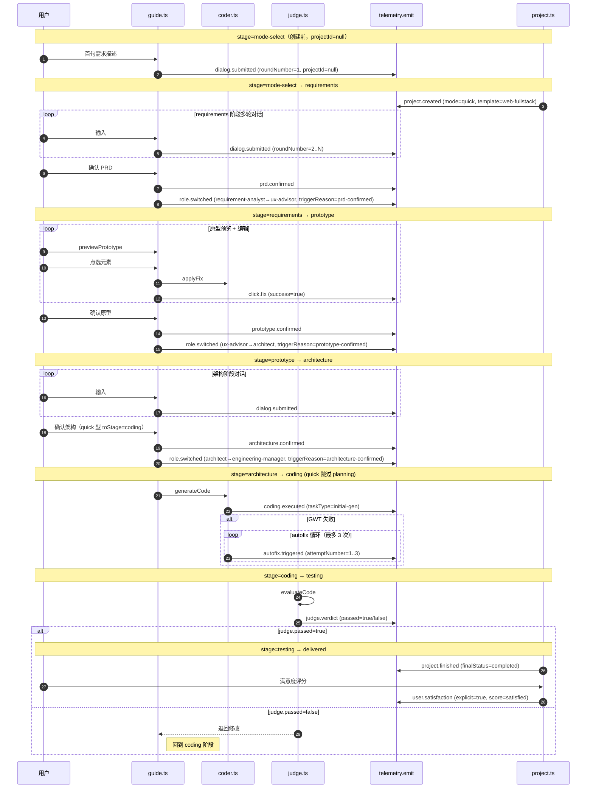
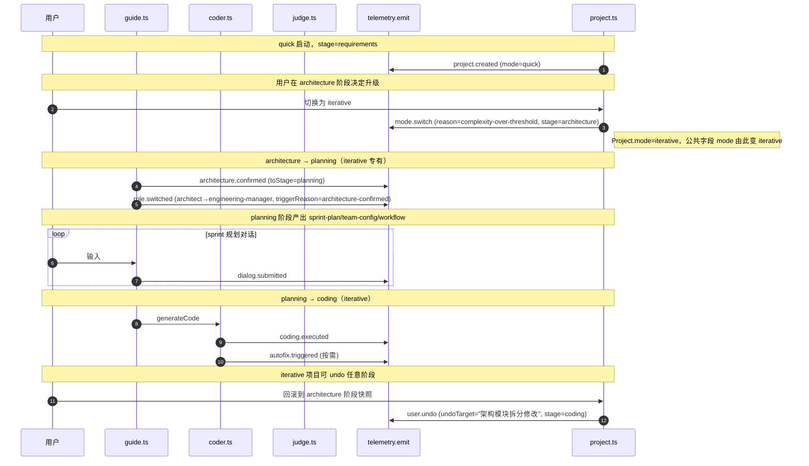

# 事件回调协议（Telemetry Events Protocol）

> 项目：向导Agent与编程Agent多智能体协同开发平台
> 文档ID：DOC-4.4 | 版本：v0.1 | 日期：2026-07-15 | 状态：草稿（待 G1-G5 评审）
> 依赖：[[04_API_SPEC/api-spec.md]] v0.4（§0.3 公共上下文、§6 埋点上报接口、§8 错误码 TELEMETRY_*）、[[03_ARCHITECTURE/data-model.md]] v0.6（§4 TelemetryEvent 实体、§4.3 14 事件枚举、§4.4 JSONL 落盘、§4.5 数据保留）、[[01_PRD/prd.md]] v0.2（§12 数据采集与分析体系、§12.4 14 关键埋点事件）
> 一致性声明：本文档 14 事件的命名、payload 关键字段、stage/mode 维度均与 [[03_ARCHITECTURE/data-model.md#4-3-eventtype-枚举]] 逐条对齐；与 [[01_PRD/prd.md#12-4-关键埋点事件]] 14 项一一对应（含 2026-07-04 补入的第 14 项 `architecture.confirmed`，ISSUE-003 #3 闭环）；与 [[04_API_SPEC/api-spec.md#6-类5埋点上报接口]] §6 14 事件 payload 关键字段表完全一致。三文档 14 事件口径已收敛，本文档不引入新事件类型，所有 *EVENTS-SUPPLEMENT* 标记均为对触发时机/代码位置/字段格式约束的工程化补充，不修改上游语义。

---

## 0. 文档定位与范围

### 0.1 为什么需要独立的事件文档

[[04_API_SPEC/api-spec.md]] §6 给出了 14 事件的 payload **关键字段表**（一行一类，3-4 个核心字段），[[03_ARCHITECTURE/data-model.md]] §4.3 给出了 eventType 枚举与 TelemetryEvent 实体的公共字段定义。但埋点采集层（services/telemetry.ts）、分析看板（后台数据消费方）、科研数据导出工具均需要更完整的契约：

- 每个事件的**触发时机**与**触发点代码位置**——采集层在何处埋 `telemetry.emit` 调用，才能做到「全量无侵入」（PRD §12.1）
- 每个事件 payload 的**完整字段表**——含必填/可选、类型、格式约束、取值范围，避免前端调用方猜测
- **事件间时序关系**——同一项目生命周期内 14 事件的先后顺序、依赖关系、模式差异（quick vs iterative）
- **JSONL 落盘格式细节**——分片规则、换行转义、原子追加、读取协议
- **查询约束**——`telemetry.query` 的 scope 必填规则、timeRange 上限、aggregate 语义边界

本文档承接上述缺口，是 api-spec.md §6 的**事件侧展开**，不重复 api-spec 已定义的接口签名（输入/输出 Schema）。

### 0.2 范围边界（in_scope / out_of_scope）

**in_scope**（本文档定义）：

| 章节 | 内容 |
|------|------|
| §1 | 14 事件总览（编号↔eventType↔中文名↔触发模块↔payload 关键字段↔归属 stage） |
| §2 | 公共字段约定（与 [[04_API_SPEC/api-spec.md#0-3-通用请求头上下文]] §0.3 对齐，本文档不重复定义但说明各事件对 stage/mode 的填充规则） |
| §3 | 14 事件逐个详解：触发时机 / 触发点代码位置 / 上游依赖 / payload 完整字段表（必填+可选+格式约束）/ 典型样例 |
| §4 | 事件间时序关系（quick / iterative 两型生命周期 mermaid 时序图） |
| §5 | JSONL 落盘格式（物理路径、分片轮转、换行转义、原子追加、读取协议） |
| §6 | 查询约束（scope 必填项、timeRange 上限、aggregate/groupBy 语义） |

**out_of_scope**（不在本文档，由其他 worker / 文档承担）：

| 不写项 | 归属 |
|--------|------|
| TelemetryEvent 实体字段定义（eventId/sessionId/userId/...） | [[03_ARCHITECTURE/data-model.md#4-实体三埋点事件telemetryevent]] §4.2（worker C） |
| 前端如何调用 `telemetry.emit` / `emitBatch`（IPC 桥接、缓冲管理） | 前端对接文档（worker B），本文档仅在 §3 注明「由谁触发」 |
| Agent 间文件系统契约（向导↔编程↔裁判） | [[04_API_SPEC/api-spec.md#2-类1向导agent-编程agent-接口]] §2~§4（worker A） |
| 修改 api-spec.md / data-model.md / prd.md 已有内容 | 由上游文档所有者维护 |

### 0.3 与 PRD §12.4 一致性核对

[[01_PRD/prd.md#12-4-关键埋点事件]] §12.4 列出 14 项埋点事件，与本文档 §1 总览表逐项映射如下（核对结论：**完全一致**，无 *APISPEC-SUPPLEMENT* 标注项）：

| PRD §12.4 序号 | PRD 中文名 | 本文档 eventType | data-model §4.3 |
|---------------|-----------|-----------------|----------------|
| 1 | 项目创建 | `project.created` | #1 ✅ |
| 2 | 每轮对话提交 | `dialog.submitted` | #2 ✅ |
| 3 | 向导Agent角色切换 | `role.switched` | #3 ✅ |
| 4 | PRD确认 | `prd.confirmed` | #4 ✅ |
| 5 | 原型预览确认 | `prototype.confirmed` | #5 ✅ |
| 6 | 用户主动撤销 | `user.undo` | #6 ✅ |
| 7 | 点选纠错 | `click.fix` | #7 ✅ |
| 8 | 模式转换（快消→长期） | `mode.switch` | #8 ✅ |
| 9 | 编程Agent执行 | `coding.executed` | #9 ✅ |
| 10 | 自修复触发 | `autofix.triggered` | #10 ✅ |
| 11 | 裁判Agent判定 | `judge.verdict` | #11 ✅ |
| 12 | 用户满意度标记 | `user.satisfaction` | #12 ✅ |
| 13 | 项目完成/放弃 | `project.finished` | #13 ✅ |
| 14 | 架构确认（2026-07-04 补） | `architecture.confirmed` | #14 ✅ |

---

## 1. 14 事件总览表

下表为 14 事件的速查索引，每行一个事件；详细 payload 字段表见 §3。

| # | eventType | 中文名 | 触发模块（服务层） | 触发接口（[[04_API_SPEC/api-spec.md]]） | 归属 stage | 依赖前置事件 |
|---|-----------|--------|------------------|---------------------------------------|-----------|-------------|
| 1 | `project.created` | 项目创建 | `services/project.ts#create` | （项目CRUD，api-spec §1.1 注记由 Proma 平台层承担） | `mode-select` → `requirements` 切换前 | — |
| 2 | `dialog.submitted` | 对话提交 | `services/guide.ts#chat` | `guide.chat` §3.1 | 任一 stage | `project.created` |
| 3 | `role.switched` | 角色切换 | `services/guide.ts#chat`（流式结束判定 roleSwitched=true 时） | `guide.chat` §3.1（输出字段 `roleSwitched`） | 任一 stage | `dialog.submitted` |
| 4 | `prd.confirmed` | PRD 确认 | `services/guide.ts#confirm` | `guide.confirm` §3.4（confirmType=prd） | `requirements` → `prototype` | 多次 `dialog.submitted` |
| 5 | `prototype.confirmed` | 原型确认 | `services/guide.ts#confirm` | `guide.confirm` §3.4（confirmType=prototype） | `prototype` → `architecture` | `prd.confirmed` + 多次 `guide.previewPrototype` |
| 6 | `user.undo` | 用户撤销 | `services/snapshot.ts#rollback` | `snapshot.rollback` §5.3 | 任一 stage（含 coding/prototype） | 至少存在一个历史快照 |
| 7 | `click.fix` | 点选纠错 | `services/coder.ts#applyFix` 调用前后（由 guide.clickToFix 编排） | `guide.clickToFix` §3.3 + `coder.applyFix` §2.3 | 主要 `prototype` / `coding` | `prototype.confirmed` 或 `coding.executed` |
| 8 | `mode.switch` | 模式转换 | `services/project.ts#switchMode` | （项目CRUD） | `quick` 任一 stage → `iterative` | `project.created` |
| 9 | `coding.executed` | 编程执行 | `services/coder.ts#generateCode` 返回时 | `coder.generateCode` §2.2 | `coding` | `prd.confirmed` + `prototype.confirmed` + `architecture.confirmed`（iterative） |
| 10 | `autofix.triggered` | 自修复触发 | `services/coder.ts#runGwt` 内 autofix 循环每次迭代 | `coder.runGwt` §2.4 | `coding` / `testing` | `coding.executed` 失败后 |
| 11 | `judge.verdict` | 裁判判定 | `services/judge.ts#evaluateDocs` / `evaluateCode` 返回时 | `judge.evaluateDocs` §4.1 / `judge.evaluateCode` §4.2 | `coding` → `testing` 切换点 | `coding.executed` |
| 12 | `user.satisfaction` | 用户满意度 | `services/project.ts#markSatisfaction` | （项目CRUD扩展点，前端按钮触发） | `testing` / `delivered` | `judge.verdict` passed |
| 13 | `project.finished` | 项目完成/放弃 | `services/project.ts#finish` | （项目CRUD） | `testing` → `delivered` 或任意 → `abandoned` | `judge.verdict` passed 或用户主动放弃 |
| 14 | `architecture.confirmed` | 架构确认 | `services/guide.ts#confirm` | `guide.confirm` §3.4（confirmType=architecture） | `architecture` → `planning`（iterative） / `architecture` → `coding`（quick） | `prototype.confirmed` + 多次 `dialog.submitted`（架构轮次） |

> **触发模块命名约定**（*EVENTS-SUPPLEMENT*）：上表「触发模块」一列采用 `services/<module>.ts#<function>` 形式，对应 [[04_API_SPEC/api-spec.md#0-1-零依赖通信范式]] §0.1 的「进程内函数调用」形态。这些函数均为 IPC 桥接的 service 层实现（前端通过 `ipcRenderer.invoke('<channel>', ...)` 触发）。本约定是工程实现建议（基于 Proma 现有 `services/` 目录惯例），具体路径以代码仓库 `src/main/services/` 实际组织为准。

---

## 2. 公共字段约定

每个 14 事件落盘到 JSONL 时均包含公共字段（与 [[03_ARCHITECTURE/data-model.md#4-实体三埋点事件telemetryevent]] §4.2 完全一致）。本节不重复字段定义，仅说明各事件对 stage / mode / projectId 的填充规则——这是采集层在 `telemetry.emit` 调用前必须确定的上下文，由 [[04_API_SPEC/api-spec.md#0-3-通用请求头上下文]] §0.3 IPC 注入机制自动提供。

### 2.1 projectId 填充规则

| 场景 | projectId | 示例事件 |
|------|-----------|---------|
| 项目相关事件（绝大多数） | Project.projectId（UUID v4） | `prd.confirmed` / `coding.executed` / ... |
| 全局事件（项目尚未创建） | `null` | `project.created` 之前的模式选择阶段（如 `mode-select` 阶段用户输入） |

> **特别注意**：`project.created` 事件本身的 payload.projectId 是**新建项目的 ID**，而其公共字段 projectId 也是同一值（不为 null）。仅在 `project.created` 触发**之前**的 `dialog.submitted`（即用户首次描述需求、向导Agent还在推断模板时）公共字段 projectId 才为 null。

### 2.2 stage 填充规则

公共字段 `stage` 取自 `Project.currentStage` 八值枚举（[[03_ARCHITECTURE/data-model.md#2-2-枚举约束]] §2.2），记录**事件发生时**项目所处阶段。

| 事件 | 典型 stage | 说明 |
|------|-----------|------|
| `project.created` | `requirements` | 创建后立即进入需求阶段 |
| `prd.confirmed` | `requirements`（事件落盘时的 stage） | stage 在事件触发后由路由层推进到 `prototype` |
| `prototype.confirmed` | `prototype` | 触发后推进到 `architecture` |
| `architecture.confirmed` | `architecture` | 触发后推进到 `planning`（iterative）或 `coding`（quick） |
| `coding.executed` | `coding` | — |
| `judge.verdict` | `testing` | — |
| `project.finished` | `testing`（completed）或事件触发时 stage（abandoned） | — |

> **stage 时间窗语义**：事件的 `stage` 字段是「事件触发瞬间的项目阶段快照」，不是「事件归属的阶段」。例如 `role.switched` 在 `requirements → prototype` 切换瞬间触发，其 stage 字段记录的是切换前的 `requirements`。采集层在调用 `telemetry.emit` 时必须从 SessionContext.currentStage 读取**当前**值，不要预判「下一个」stage。

### 2.3 mode 填充规则

公共字段 `mode` 取自 `Project.mode`（`quick` | `iterative`），与 stage 同步从 Project 实体读取。`mode.switch` 事件本身的公共字段 mode 是**切换后**的新值（`iterative`），payload.reason 解释为什么切。

---

## 3. 14 事件逐个详解

每个事件给出：触发时机 / 触发点代码位置 / 上游依赖 / payload 完整字段表（含必填❌、可选、格式约束）/ 单行 JSONL 样例。payload 字段类型标注遵循 TypeScript 语法（string / number / boolean / enum / object / array）。

### 3.1 `project.created`（项目创建）

**触发时机**：用户在 Proma 项目列表点击「新建项目」，完成模式选择（quick / iterative）与工程模板推断后，平台层调用 `services/project.ts#create` 写入 `_system/projects-index.json` 成功的瞬间。

**触发点代码位置**：`services/project.ts#create()` 函数末尾、Project 实体持久化之后、返回 projectId 之前。一行 `telemetry.emit({ eventType: 'project.created', payload: {...} })`。

**上游依赖**：
- Project 实体已分配 projectId（UUID v4）
- 模式（`mode`）已确定，写入 `Project.mode`
- 模板（`template`）已由向导Agent从用户首句描述推断完成（[[03_ARCHITECTURE/data-model.md#2-实体一项目元数据project]] §2.2 六值枚举：`web-fullstack` / `mobile-app` / `desktop-tool` / `cli-script` / `hardware` / `ai-app`）
- 项目目录 `workspace-files/{projectId}-{shortName}/` 与初始 `_meta.json` 已创建

**payload 完整字段表**：

| 字段 | 类型 | 必填 | 格式约束 / 取值范围 | 说明 |
|------|------|------|---------------------|------|
| projectId | string(UUID v4) | ✅ | 36 字符标准 UUID | 新建项目的 ID，与公共字段 projectId 同值 |
| mode | enum | ✅ | `quick` \| `iterative` | 项目模式 |
| template | enum | ✅ | `web-fullstack` \| `mobile-app` \| `desktop-tool` \| `cli-script` \| `hardware` \| `ai-app` | 工程模板，决定激活角色（[[03_ARCHITECTURE/architecture.md]] §10） |
| name | string | ❌ | ≤100 字符 | 项目名（*EVENTS-SUPPLEMENT*，用于科研分析时项目类型聚类，注意脱敏——不含用户真实个人信息） |
| source | enum | ❌ | `scratch`（从零开始） \| `template-gallery`（从模板画廊） \| `import`（导入既有项目） | 项目来源（*EVENTS-SUPPLEMENT*，缺省=scratch） |

**单行 JSONL 样例**：

```jsonl
{"eventId":"evt-2c8e9f40-...","sessionId":"sess-7a3b","projectId":"a1b2c3d4-e5f6-7890-abcd-ef1234567890","userId":"hash_5f8a9b","eventType":"project.created","timestamp":"2026-07-15T10:30:00.000+08:00","stage":"requirements","mode":"quick","duration":null,"payload":{"projectId":"a1b2c3d4-e5f6-7890-abcd-ef1234567890","mode":"quick","template":"web-fullstack","name":"读书笔记管理","source":"scratch"}}
```

### 3.2 `dialog.submitted`（对话提交）

**触发时机**：用户在聊天界面按下「发送」、文本/图片进入 `services/guide.ts#chat` 入口的瞬间（**早于** LLM 调用）。每个用户轮次触发一次。

**触发点代码位置**：`services/guide.ts#chat(input)` 函数入口、参数校验通过后、LLM 流式调用前。

**上游依赖**：
- 项目已创建（`project.created` 已触发，projectId 已写入 SessionContext）
- 当前角色 `currentRole` 已加载（首次为 `requirement-analyst`）
- roundNumber 已递增（轮次计数器来自 SessionContext.conversationHistory 长度 +1）

**payload 完整字段表**：

| 字段 | 类型 | 必填 | 格式约束 / 取值范围 | 说明 |
|------|------|------|---------------------|------|
| projectId | string(UUID) | ✅ | 与公共字段同 | 项目 ID |
| roundNumber | number | ✅ | ≥1 整数 | 当前对话轮次（同一项目内递增） |
| inputLength | number | ✅ | ≥0 整数 | 用户输入文本字符数（含空白；纯图片输入=0） |
| containsImage | boolean | ✅ | true \| false | 是否包含图片附件 |
| role | enum | ❌ | `requirement-analyst` \| `ux-advisor` \| `architect` \| `engineering-manager` | 当前处理该轮的角色（*EVENTS-SUPPLEMENT*，便于按角色聚合） |
| attachmentsCount | number | ❌ | ≥0 整数 | 附件文档引用数（[[04_API_SPEC/api-spec.md#3-1-端点-2-1guidechat用户输入-agent-回复-流式]] §3.1 输入 attachments 数组长度） |

> **隐私约束**：payload **不包含**用户原始文本/图片 base64（PRD §12.2 科研数据不得包含真实业务 payload）。仅记录长度和是否包含图片。原始对话保存在项目目录 `_system/conversation.jsonl`（30 天后清除），科研数据只有 metadata。

**单行 JSONL 样例**：

```jsonl
{"eventId":"evt-3d9f0a51-...","sessionId":"sess-7a3b","projectId":"a1b2c3d4-...","userId":"hash_5f8a9b","eventType":"dialog.submitted","timestamp":"2026-07-15T10:32:14.500+08:00","stage":"requirements","mode":"quick","duration":null,"payload":{"projectId":"a1b2c3d4-...","roundNumber":3,"inputLength":48,"containsImage":false,"role":"requirement-analyst","attachmentsCount":0}}
```

### 3.3 `role.switched`（角色切换）

**触发时机**：`guide.chat` 流式输出结束、聚合输出字段 `roleSwitched=true` 时（[[04_API_SPEC/api-spec.md#3-1-端点-2-1guidechat用户输入-agent-回复-流式]] §3.1 输出 Schema），即路由层判定当前阶段完成、需要切换到下一阶段的 Agent 角色。

**触发点代码位置**：`services/guide.ts#chat` 流式 done 信号发出后、Session Restart 编排（[[03_ARCHITECTURE/data-model.md#5-4-session-restart-context-backfill-流程]] §5.4 六步）启动前。

**上游依赖**：
- 角色切换由路由层基于「阶段完成信号」判定（PRD 确认 → ux-advisor；原型确认 → architect；架构确认 → engineering-manager）
- 已触发至少一次 `dialog.submitted` 并得到 Agent 回复
- SessionContext 已存在

**payload 完整字段表**：

| 字段 | 类型 | 必填 | 格式约束 / 取值范围 | 说明 |
|------|------|------|---------------------|------|
| projectId | string(UUID) | ✅ | — | — |
| fromRole | enum | ✅ | `requirement-analyst` \| `ux-advisor` \| `architect` \| `engineering-manager` | 切换前角色 |
| toRole | enum | ✅ | 同上 | 切换后角色 |
| triggerReason | enum | ✅ | `prd-confirmed` \| `prototype-confirmed` \| `architecture-confirmed` \| `user-explicit` \| `mode-switch` | 触发原因（与 §3.4 confirm 的 confirmType、§3.8 mode.switch 联动） |

**单行 JSONL 样例**：

```jsonl
{"eventId":"evt-4e0f1b62-...","sessionId":"sess-7a3b","projectId":"a1b2c3d4-...","userId":"hash_5f8a9b","eventType":"role.switched","timestamp":"2026-07-15T10:46:00.000+08:00","stage":"requirements","mode":"quick","duration":null,"payload":{"projectId":"a1b2c3d4-...","fromRole":"requirement-analyst","toRole":"ux-advisor","triggerReason":"prd-confirmed"}}
```

### 3.4 `prd.confirmed`（PRD 确认）

**触发时机**：前端调用 `guide.confirm({ confirmType: 'prd', fromStage: 'requirements', toStage: 'prototype' })`、[[04_API_SPEC/api-spec.md#3-4-端点-2-4guideconfirm确认-prd-原型-架构]] §3.4 端点返回 `accepted=true` 的瞬间。

**触发点代码位置**：`services/guide.ts#confirm()` 函数中、`snapshot.create(triggerType=confirm)` 成功后、Session Restart 启动前。`telemetryEmitted` 字段透传本事件类型。

**上游依赖**：
- 多轮 `dialog.submitted`（requirements 阶段）
- PRD 文档（`01_PRD/prd.md`）status 已从 `draft` 提升至 `review`（[[04_API_SPEC/api-spec.md#4-1-端点-3-1judgeevaluatedocs文档体系判定]] §4.1 judge 层硬校验）
- 状态转移 `requirements → prototype` 合法（[[03_ARCHITECTURE/data-model.md#2-2-枚举约束]] §2.2）

**payload 完整字段表**：

| 字段 | 类型 | 必填 | 格式约束 / 取值范围 | 说明 |
|------|------|------|---------------------|------|
| projectId | string(UUID) | ✅ | — | — |
| rounds | number | ✅ | ≥1 整数 | PRD 阶段总对话轮次（从首次 dialog.submitted 至 confirm 累计） |
| duration | number(ms) | ✅ | ≥0 | PRD 阶段总耗时（从首条 requirements 阶段对话到 confirm 的墙钟时间）；同时写入公共字段 duration |
| featureCount | number | ✅ | ≥0 整数 | PRD 中确认的功能项数量（向导Agent解析 PRD 文档统计） |
| prdVersion | string | ❌ | semver（如 `0.2`） | 确认时 PRD 文档版本（*EVENTS-SUPPLEMENT*，来自 DocumentMeta.version） |
| snapshotId | number | ❌ | ≥1 整数 | 触发的 confirm 快照 ID（*EVENTS-SUPPLEMENT*，便于关联快照回滚） |

**单行 JSONL 样例**：

```jsonl
{"eventId":"evt-5f1a2c73-...","sessionId":"sess-7a3b","projectId":"a1b2c3d4-...","userId":"hash_5f8a9b","eventType":"prd.confirmed","timestamp":"2026-07-15T10:45:00.000+08:00","stage":"requirements","mode":"quick","duration":360000,"payload":{"projectId":"a1b2c3d4-...","rounds":6,"duration":360000,"featureCount":5,"prdVersion":"0.2","snapshotId":2}}
```

### 3.5 `prototype.confirmed`（原型预览确认）

**触发时机**：前端调用 `guide.confirm({ confirmType: 'prototype', fromStage: 'prototype', toStage: 'architecture' })`、§3.4 端点返回 `accepted=true` 的瞬间。

**触发点代码位置**：同 §3.4，但 confirmType=prototype 分支。

**上游依赖**：
- `prd.confirmed` 已触发
- 至少一次 `guide.previewPrototype` 调用（[[04_API_SPEC/api-spec.md#3-2-端点-2-2guidepreviewprototype原型预览]] §3.2），editCount 累计
- 状态转移 `prototype → architecture` 合法

**payload 完整字段表**：

| 字段 | 类型 | 必填 | 格式约束 / 取值范围 | 说明 |
|------|------|------|---------------------|------|
| projectId | string(UUID) | ✅ | — | — |
| previewCount | number | ✅ | ≥1 整数 | 原型阶段预览次数（`guide.previewPrototype` 调用次数） |
| editCount | number | ✅ | ≥0 整数 | 累计编辑次数（来自 §3.2 输出 editCount 的最后一次值） |
| duration | number(ms) | ✅ | ≥0 | 原型阶段总耗时；同时写入公共字段 duration |
| pagesConfirmed | number | ❌ | ≥1 整数 | 确认的页面数（*EVENTS-SUPPLEMENT*，来自 02_UX_DESIGN/wireframes/ 目录 HTML 文件数） |
| clickFixCount | number | ❌ | ≥0 整数 | 原型阶段触发的点选纠错次数（*EVENTS-SUPPLEMENT*，便于计算认知摩擦指数，见 PRD §12.6） |

**单行 JSONL 样例**：

```jsonl
{"eventId":"evt-6a2b3d84-...","sessionId":"sess-7a3b","projectId":"a1b2c3d4-...","userId":"hash_5f8a9b","eventType":"prototype.confirmed","timestamp":"2026-07-15T11:20:00.000+08:00","stage":"prototype","mode":"quick","duration":540000,"payload":{"projectId":"a1b2c3d4-...","previewCount":4,"editCount":7,"duration":540000,"pagesConfirmed":3,"clickFixCount":2}}
```

### 3.6 `user.undo`（用户主动撤销）

**触发时机**：用户在快照管理面板选择历史快照、点击「回滚」、`snapshot.rollback` 返回成功的瞬间（[[04_API_SPEC/api-spec.md#5-3-端点-4-3snapshotrollback线性回滚]] §5.3）。

**触发点代码位置**：`services/snapshot.ts#rollback()` 函数末尾、文件覆盖还原完成后。

**上游依赖**：
- 至少存在一个历史快照（init / confirm / pre-modify / mode-switch / pre-error 任一）
- 目标快照 `isHealthy=true`（损坏快照禁止回滚，[[04_API_SPEC/api-spec.md#5-3-端点-4-3snapshotrollback线性回滚]] §5.3 错误码 `SNAPSHOT_TARGET_UNHEALTHY`）

**payload 完整字段表**：

| 字段 | 类型 | 必填 | 格式约束 / 取值范围 | 说明 |
|------|------|------|---------------------|------|
| projectId | string(UUID) | ✅ | — | — |
| stage | enum | ✅ | [[03_ARCHITECTURE/data-model.md#2-2-枚举约束]] §2.2 八值之一 | 撤销时项目所处阶段（注意：payload.stage 与公共字段 stage 同值，冗余但便于查询时直接在 payload 内定位） |
| undoTarget | string | ✅ | ≤200 字符 | 撤销对象的自然语言描述（如"原型颜色修改"、"PRD 功能项删除"）；来自 `coder.applyFix` 输出的 diffSummary（§2.3），或前端 UI 操作上下文 |
| undoCount | number | ✅ | ≥1 整数 | 本次项目内累计撤销次数（同 projectId 内递增） |
| rolledBackTo | number | ❌ | ≥1 整数 | 回滚目标快照 ID（*EVENTS-SUPPLEMENT*） |
| preRollbackSnapshotId | number | ❌ | ≥1 整数 | 回滚前新建的 pre-error 快照 ID（*EVENTS-SUPPLEMENT*，默认 createPreRollbackSnapshot=true） |

**单行 JSONL 样例**：

```jsonl
{"eventId":"evt-7b3c4e95-...","sessionId":"sess-7a3b","projectId":"a1b2c3d4-...","userId":"hash_5f8a9b","eventType":"user.undo","timestamp":"2026-07-15T11:35:00.000+08:00","stage":"coding","mode":"quick","duration":null,"payload":{"projectId":"a1b2c3d4-...","stage":"coding","undoTarget":"登录页样式修改（按钮颜色 #fff→#f0f0f0）","undoCount":1,"rolledBackTo":3,"preRollbackSnapshotId":5}}
```

### 3.7 `click.fix`（点选纠错）

**触发时机**：用户在原型预览或代码预览中点击元素触发 `guide.clickToFix`，编排层调用 `coder.applyFix` 返回后（无论 success=true/false）立即上报。

**触发点代码位置**：`services/guide.ts#clickToFix()` 函数中、`coder.applyFix` 返回后、函数返回给前端前。上报时已包含 applyFix 的 success 结果。

**上游依赖**：
- 已 `prototype.confirmed` 或 `coding.executed`（即已有可点选的预览）
- 预览 HTML 已注入 `data-ai-id` / `data-ai-type`（[[03_ARCHITECTURE/architecture.md]] §7 Phase 1）
- 已创建 `pre-modify` 快照（[[04_API_SPEC/api-spec.md#3-3-端点-2-3guideclicktofix点选纠错入口]] §3.3 内部创建）

**payload 完整字段表**：

| 字段 | 类型 | 必填 | 格式约束 / 取值范围 | 说明 |
|------|------|------|---------------------|------|
| projectId | string(UUID) | ✅ | — | — |
| targetType | enum | ✅ | `button` \| `input` \| `card` \| `text` \| `image` \| `layout` \| `other` | 被点击元素的 `data-ai-type`（*EVENTS-SUPPLEMENT*，扩展为 7 值枚举以便按目标类型聚合） |
| success | boolean | ✅ | true \| false | applyFix 是否成功修改并刷新预览 |
| phase | enum | ❌ | `phase1`（data-ai-id 主路径） \| `phase2`（混合兜底） | 走哪条纠错路径（*EVENTS-SUPPLEMENT*，便于评估 Phase 1 覆盖率） |
| scope | enum | ❌ | `element` \| `component` \| `page` \| `global` | 修改范围（来自 applyFix 输入，[[04_API_SPEC/api-spec.md#2-3-端点-1-2coderapplyfix点选纠错执行]] §2.3） |
| confidence | number | ❌ | 0~1 浮点 | 向导Agent生成 fixSpec 的置信度（来自 §3.3 输出） |
| preModifySnapshotId | number | ❌ | ≥1 整数 | 前置 pre-modify 快照 ID（*EVENTS-SUPPLEMENT*） |

> **失败也要上报**：click.fix 是少数 payload.success 可为 false 的事件。采集层在 applyFix 抛错或返回 success=false 时仍必须 emit，便于统计点选纠错失败率（评估 Phase 1 vs Phase 2 路径覆盖）。

**单行 JSONL 样例**：

```jsonl
{"eventId":"evt-8c4d5f06-...","sessionId":"sess-7a3b","projectId":"a1b2c3d4-...","userId":"hash_5f8a9b","eventType":"click.fix","timestamp":"2026-07-15T11:12:00.000+08:00","stage":"prototype","mode":"quick","duration":4200,"payload":{"projectId":"a1b2c3d4-...","targetType":"button","success":true,"phase":"phase1","scope":"element","confidence":0.87,"preModifySnapshotId":4}}
```

### 3.8 `mode.switch`（模式转换）

**触发时机**：用户在 quick 项目进行中点击「升级为长期迭代型」、平台层调用 `services/project.ts#switchMode`、Project.mode 由 `quick` 改写为 `iterative` 成功的瞬间。

**触发点代码位置**：`services/project.ts#switchMode()` 函数末尾、`_meta.json#project.mode` 持久化后。同时触发一个 `triggerType=mode-switch` 的快照（[[03_ARCHITECTURE/data-model.md#3-3-触发时机与prdt-7-4一致]] §3.3）。

**上游依赖**：
- 项目已创建（`project.created` 且 mode=quick）
- 当前 stage 处于 `requirements` / `prototype` / `architecture` 之一（quick 型未跨越 architecture 之前才能升级）

**payload 完整字段表**：

| 字段 | 类型 | 必填 | 格式约束 / 取值范围 | 说明 |
|------|------|------|---------------------|------|
| projectId | string(UUID) | ✅ | — | — |
| reason | enum | ✅ | `user-explicit` \| `complexity-over-threshold` \| `template-recommend` | 触发原因；`user-explicit`=用户主动升级，`complexity-over-threshold`=向导Agent基于复杂度判定建议升级，`template-recommend`=模板（如 web-fullstack）默认推荐升级 |
| currentStage | enum | ✅ | §2.2 八值之一 | 转换时项目所处阶段（与公共字段 stage 同值） |
| fromMode | enum | ❌ | `quick` | 转换前模式（*EVENTS-SUPPLEMENT*，固定为 quick——当前不支持 iterative 降级回 quick） |
| toMode | enum | ❌ | `iterative` | 转换后模式 |
| snapshotId | number | ❌ | ≥1 整数 | 触发的 mode-switch 快照 ID |

> **单向性**：本平台当前设计模式转换为**单向**（quick → iterative），不支持 iterative → quick 降级。降级场景若未来开放，需新增 fromMode=iterative 的样例并补充触发点。

**单行 JSONL 样例**：

```jsonl
{"eventId":"evt-9d5e6a17-...","sessionId":"sess-7a3b","projectId":"a1b2c3d4-...","userId":"hash_5f8a9b","eventType":"mode.switch","timestamp":"2026-07-15T11:50:00.000+08:00","stage":"architecture","mode":"iterative","duration":null,"payload":{"projectId":"a1b2c3d4-...","reason":"complexity-over-threshold","currentStage":"architecture","fromMode":"quick","toMode":"iterative","snapshotId":6}}
```

### 3.9 `coding.executed`（编程Agent执行）

**触发时机**：`services/coder.ts#generateCode` 返回时（无论 success/failure），即编程Agent完成一轮代码生成任务（含 3 次自修复尝试）的瞬间。

**触发点代码位置**：`services/coder.ts#generateCode()` 函数末尾、testReport 已组装但函数 return 前。

**上游依赖**：
- 已 `architecture.confirmed`（iterative）或 `prototype.confirmed`（quick，跳过 architecture/planning）
- 7 目录文档已就绪（`_meta.json#documents` 校验通过，[[04_API_SPEC/api-spec.md#2-2-端点-1-1codergeneratecode文档代码生成]] §2.2 错误码 `CODER_DOC_CONTRACT_VIOLATION`）
- GLM 5.1 API 可用、子进程沙箱就绪

**payload 完整字段表**：

| 字段 | 类型 | 必填 | 格式约束 / 取值范围 | 说明 |
|------|------|------|---------------------|------|
| projectId | string(UUID) | ✅ | — | — |
| taskType | enum | ✅ | `initial-gen` \| `partial-regen` \| `fix-apply` | 任务类型：首次生成 / 部分重生成 / 修复应用 |
| tokensUsed | number | ✅ | ≥0 | 本次执行 GLM 5.1 Token 消耗；累加至 `Project.totalTokenUsed` |
| success | boolean | ✅ | true \| false | 是否生成成功（含 3 次自修复后的最终结果） |
| duration | number(ms) | ❌ | ≥0 | 子进程墙钟耗时；同时写入公共字段 duration |
| outputFilesCount | number | ❌ | ≥0 整数 | 生成文件数（来自 §2.2 输出 outputFiles 长度） |
| gwtPassed | number | ❌ | ≥0 整数 | GWT 通过场景数 |
| gwtFailed | number | ❌ | ≥0 整数 | GWT 失败场景数 |
| autofixAttempts | number | ❌ | 0~3 | 自修复触发次数（来自 §2.2 输出 autofixAttempts） |
| errorCode | string | ❌ | `CODER_*` 之一 | 失败时的错误码（[[04_API_SPEC/api-spec.md#8-3-错误码总表按-domain-归并]] §8.3）；success=true 时省略 |

**单行 JSONL 样例**：

```jsonl
{"eventId":"evt-ae6f7b28-...","sessionId":"sess-7a3b","projectId":"a1b2c3d4-...","userId":"hash_5f8a9b","eventType":"coding.executed","timestamp":"2026-07-15T13:15:42.000+08:00","stage":"coding","mode":"quick","duration":187400,"payload":{"projectId":"a1b2c3d4-...","taskType":"initial-gen","tokensUsed":12450,"success":true,"duration":187400,"outputFilesCount":18,"gwtPassed":12,"gwtFailed":0,"autofixAttempts":0}}
```

### 3.10 `autofix.triggered`（自修复触发）

**触发时机**：`coder.runGwt` 内 autofix 循环的**每次迭代**触发——即首次 GWT 跑完后发现失败、启动自修复，第 1/2/3 次尝试的每次都产生一条事件。

**触发点代码位置**：`services/coder.ts#runGwt()` 函数中 autofix 循环体每次 LLM 修复调用完成后。

**上游依赖**：
- 已 `coding.executed` 且 gwtFailed > 0
- 启用 enableAutofix=true（[[04_API_SPEC/api-spec.md#2-4-端点-1-3coderrungwt-gwt-测试与自修复]] §2.4 输入）
- 未超 3 次上限（[[03_ARCHITECTURE/architecture.md]] §2 自修复 3 次熔断）

**payload 完整字段表**：

| 字段 | 类型 | 必填 | 格式约束 / 取值范围 | 说明 |
|------|------|------|---------------------|------|
| projectId | string(UUID) | ✅ | — | — |
| attemptNumber | number | ✅ | 1~3 整数 | 本次尝试序号（第几次自修复） |
| result | enum | ✅ | `success` \| `partial` \| `failure` \| `circuit-broken` | 本次结果：全部修复 / 部分修复 / 未修复 / 熔断（3 次后仍未通过） |
| fixedScenarios | number | ❌ | ≥0 整数 | 本次修复的场景数 |
| remainingFailures | number | ❌ | ≥0 整数 | 剩余失败场景数 |
| tokensUsed | number | ❌ | ≥0 | 本次自修复 Token 消耗 |

> **事件密度**：一次 `coding.executed` 可能伴随 0~3 条 `autofix.triggered` 事件。最终熔断（circuit-broken）时 result=circuit-broken，且与 `coding.executed` 的 success=false 对齐。

**单行 JSONL 样例**：

```jsonl
{"eventId":"evt-bf7a8c39-...","sessionId":"sess-7a3b","projectId":"a1b2c3d4-...","userId":"hash_5f8a9b","eventType":"autofix.triggered","timestamp":"2026-07-15T13:22:10.500+08:00","stage":"coding","mode":"quick","duration":32100,"payload":{"projectId":"a1b2c3d4-...","attemptNumber":1,"result":"partial","fixedScenarios":2,"remainingFailures":1,"tokensUsed":1850}}
```

### 3.11 `judge.verdict`（裁判Agent判定）

**触发时机**：`judge.evaluateDocs` 或 `judge.evaluateCode` 返回 `VerdictResult` 的瞬间（[[04_API_SPEC/api-spec.md#4-类3裁判agent判定接口]] §4 类 3 接口）。每次判定调用产生一条事件。

**触发点代码位置**：`services/judge.ts#evaluateDocs()` / `evaluateCode()` 函数末尾、VerdictResult 组装后、return 前。

**上游依赖**：
- 已 `coding.executed`（evaluateCode 时）或文档 status=review（evaluateDocs 时）
- PlantUML / GWT / 代码目录均就绪

**payload 完整字段表**：

| 字段 | 类型 | 必填 | 格式约束 / 取值范围 | 说明 |
|------|------|------|---------------------|------|
| projectId | string(UUID) | ✅ | — | — |
| passed | boolean | ✅ | true \| false | verdict 是否为 pass（hardViolations 为空） |
| violationTypes | string[] | ✅ | 数组，每项为硬约束规则名 | 硬约束违规规则清单（如 `["PRD_REQUIRED_FIELD_MISSING", "API_SCHEMA_INCOMPLETE"]`；passed=true 时为 `[]`） |
| evaluationTarget | enum | ✅ | `docs` \| `code` | 判定对象（来自哪个端点） |
| duration | number(ms) | ✅ | ≥0 | 判定耗时（含 LLM 软约束评估）；同时写入公共字段 duration |
| hardViolationCount | number | ❌ | ≥0 整数 | 硬约束违规总数（violationTypes 长度，冗余字段便于聚合查询） |
| softSuggestionCount | number | ❌ | ≥0 整数 | 软约束建议数 |
| targetDirectory | enum | ❌ | `01_PRD` \| `03_ARCHITECTURE` \| `04_API_SPEC` \| `05_PROJECT_PLAN` \| `06_TESTS` \| `all` \| `_code/` | evaluateDocs 的判定范围或 evaluateCode 的 codeDir 标识 |

> **violationTypes 命名空间**：与 [[04_API_SPEC/api-spec.md#8-错误码体系]] §8 *APISPEC-SUPPLEMENT* 命名空间区分注记一致——violationTypes 内的规则名（如 `PRD_REQUIRED_FIELD_MISSING`）属于裁判硬约束规则名命名空间，不带 DOMAIN 前缀，与 TELEMETRY_*/CODER_*/... 错误码是两套独立体系。

**单行 JSONL 样例**：

```jsonl
{"eventId":"evt-ca8b9d40-...","sessionId":"sess-7a3b","projectId":"a1b2c3d4-...","userId":"hash_5f8a9b","eventType":"judge.verdict","timestamp":"2026-07-15T14:02:33.000+08:00","stage":"testing","mode":"quick","duration":45200,"payload":{"projectId":"a1b2c3d4-...","passed":false,"violationTypes":["API_SCHEMA_INCOMPLETE","CLASS_CONSISTENCY_MISSING_IN_CODE"],"evaluationTarget":"code","duration":45200,"hardViolationCount":2,"softSuggestionCount":3,"targetDirectory":"_code/"}}
```

### 3.12 `user.satisfaction`（用户满意度标记）

**触发时机**：用户在项目交付后点击「满意」/「不满意」按钮（explicit=true），或系统基于用户行为推断（如交付后 7 天内无 negative event 则推断为满意，explicit=false）。

**触发点代码位置**：
- explicit=true：`services/project.ts#markSatisfaction()` 函数末尾
- explicit=false：后台定时任务（每日扫描），由 `services/telemetry.ts#inferSatisfaction` 触发批量 emit

**上游依赖**：
- 已 `judge.verdict` passed=true
- 项目 status=`delivered`（explicit=true 时）或 status=`delivered` 且距交付 ≥7 天（explicit=false 推断时）

**payload 完整字段表**：

| 字段 | 类型 | 必填 | 格式约束 / 取值范围 | 说明 |
|------|------|------|---------------------|------|
| projectId | string(UUID) | ✅ | — | — |
| explicit | boolean | ✅ | true \| false | 是否为用户主动评分（false=行为推断） |
| score | enum | ❌ | `satisfied` \| `neutral` \| `dissatisfied` | 满意度分值（explicit=true 时必填；*EVENTS-SUPPLEMENT*，用于计算项目成功率 PRD §12.5） |
| inferredFrom | string[] | ❌ | 数组 | 推断依据（explicit=false 时填写，如 `["no-undo-within-7d", "no-abandon"]`） |
| deliveredAt | ISO8601 | ❌ | — | 项目交付时间（便于计算 satisfaction 与 delivery 的时间间隔） |

> **PRD §12.5 成功标准**：项目成功率 = judge.verdict passed + user.satisfaction satisfied（或不主动放弃） / 总启动项目数。本事件的 score=satisfied 是关键聚合维度。

**单行 JSONL 样例**：

```jsonl
{"eventId":"evt-db9cae51-...","sessionId":"sess-7a3b","projectId":"a1b2c3d4-...","userId":"hash_5f8a9b","eventType":"user.satisfaction","timestamp":"2026-07-15T18:00:00.000+08:00","stage":"delivered","mode":"quick","duration":null,"payload":{"projectId":"a1b2c3d4-...","explicit":true,"score":"satisfied","deliveredAt":"2026-07-15T15:30:00.000+08:00"}}
```

### 3.13 `project.finished`（项目完成/放弃）

**触发时机**：项目 status 由 `active` 转为 `completed`（judge.verdict passed + 用户确认交付）或 `abandoned`（用户主动删除/标记放弃，或 30 天无活动）的瞬间。

**触发点代码位置**：`services/project.ts#finish()` 函数末尾、`_meta.json#project.status` 与 `completedAt` 持久化后。

**上游依赖**：
- completed 路径：`judge.verdict` passed=true → 用户确认 → 触发本事件
- abandoned 路径：用户操作 / 30 天自动清理定时任务

**payload 完整字段表**：

| 字段 | 类型 | 必填 | 格式约束 / 取值范围 | 说明 |
|------|------|------|---------------------|------|
| projectId | string(UUID) | ✅ | — | — |
| finalStatus | enum | ✅ | `completed` \| `abandoned` | 最终状态 |
| totalDuration | number(ms) | ✅ | ≥0 | 项目总耗时（completedAt - createdAt） |
| totalTokens | number | ✅ | ≥0 | 项目总 Token 消耗（来自 `Project.totalTokenUsed`） |
| endStage | enum | ❌ | §2.2 八值之一 | 终止时项目所处阶段（completed 固定为 delivered；abandoned 可能为任意） |
| finishReason | enum | ❌ | `user-confirmed` \| `user-deleted` \| `inactive-30d` \| `system-error` | 终止原因（*EVENTS-SUPPLEMENT*） |
| satisfactionScore | enum | ❌ | `satisfied` \| `neutral` \| `dissatisfied` \| `unknown` | 关联的最近一次 user.satisfaction 分值（unknown=未触发） |

**单行 JSONL 样例**：

```jsonl
{"eventId":"evt-ecadbf62-...","sessionId":"sess-7a3b","projectId":"a1b2c3d4-...","userId":"hash_5f8a9b","eventType":"project.finished","timestamp":"2026-07-15T18:05:00.000+08:00","stage":"delivered","mode":"quick","duration":null,"payload":{"projectId":"a1b2c3d4-...","finalStatus":"completed","totalDuration":27900000,"totalTokens":28450,"endStage":"delivered","finishReason":"user-confirmed","satisfactionScore":"satisfied"}}
```

### 3.14 `architecture.confirmed`（架构确认）

**触发时机**：前端调用 `guide.confirm({ confirmType: 'architecture', fromStage: 'architecture', toStage: 'planning' | 'coding' })`、§3.4 端点返回 `accepted=true` 的瞬间。该事件由 data-model v0.6 补入（[[03_ARCHITECTURE/data-model.md#4-3-eventtype-枚举]] §4.3 #14），对应 PRD §12.4 #14（2026-07-04 补，ISSUE-003 #3 闭环）。

**触发点代码位置**：`services/guide.ts#confirm()` 函数中、`snapshot.create(triggerType=confirm)` 成功后、Session Restart 启动前；confirmType=architecture 分支。

**上游依赖**：
- `prototype.confirmed` 已触发（架构阶段是 prototype 之后）
- 多轮架构阶段 `dialog.submitted`（architect 角色产出 architecture.md / class-diagram.puml / data-model.md）
- 状态转移合法：
  - iterative：`architecture → planning`
  - quick：`architecture → coding`（跳过 planning，[[03_ARCHITECTURE/data-model.md#2-2-枚举约束]] §2.2）
- `architecture.md` status 已提升至 review（[[04_API_SPEC/api-spec.md#4-1-端点-3-1judgeevaluatedocs文档体系判定]] §4.1 硬校验）

**payload 完整字段表**：

| 字段 | 类型 | 必填 | 格式约束 / 取值范围 | 说明 |
|------|------|------|---------------------|------|
| projectId | string(UUID) | ✅ | — | — |
| rounds | number | ✅ | ≥1 整数 | 架构阶段总对话轮次 |
| duration | number(ms) | ✅ | ≥0 | 架构阶段总耗时；同时写入公共字段 duration |
| moduleCount | number | ✅ | ≥1 整数 | 架构文档中定义的模块数（向导Agent从 architecture.md 解析统计） |
| toStage | enum | ❌ | `planning` \| `coding` | 推进到的下一阶段（iterative=planning；quick=coding） |
| architectureVersion | string | ❌ | semver | architecture.md 版本号（*EVENTS-SUPPLEMENT*） |
| snapshotId | number | ❌ | ≥1 整数 | 触发的 confirm 快照 ID |

**单行 JSONL 样例**：

```jsonl
{"eventId":"evt-fdbe1c73-...","sessionId":"sess-7a3b","projectId":"a1b2c3d4-...","userId":"hash_5f8a9b","eventType":"architecture.confirmed","timestamp":"2026-07-15T12:10:00.000+08:00","stage":"architecture","mode":"iterative","duration":480000,"payload":{"projectId":"a1b2c3d4-...","rounds":8,"duration":480000,"moduleCount":6,"toStage":"planning","architectureVersion":"0.1","snapshotId":4}}
```

---

## 4. 事件间时序关系

### 4.1 quick 型项目生命周期（典型 happy path）

quick 型项目走「需求→原型→架构→编码→测试→交付」全链路，跳过 planning。下图为同一 projectId 内 14 事件典型先后顺序：



### 4.2 iterative 型项目生命周期

iterative 型在 architecture 与 coding 之间多一个 planning 阶段（[[03_ARCHITECTURE/data-model.md#2-2-枚举约束]] §2.2），且可能有 mode.switch 事件：



### 4.3 事件时序不变量（采集层与查询层共同遵守）

下列不变量是同 projectId 内事件先后顺序的硬约束，分析看板可据此过滤异常事件流：

| 不变量 ID | 描述 | 违反时处置 |
|-----------|------|-----------|
| ORD-01 | `project.created` 是同 projectId 第一个事件 | 若 dialog.submitted 早于 project.created 且 projectId 同值，标记为异常（project.created 之前的对话 projectId 应为 null） |
| ORD-02 | `prd.confirmed` 早于 `prototype.confirmed` 早于 `architecture.confirmed` | 三 confirm 事件不可乱序，违反映射 stage 转移非法（[[04_API_SPEC/api-spec.md#3-4-端点-2-4guideconfirm确认-prd-原型-架构]] §3.4 `GUIDE_INVALID_STAGE_TRANSITION`） |
| ORD-03 | `coding.executed` 之前必有 `architecture.confirmed`（iterative）或 `prototype.confirmed`（quick） | 违反说明编码在文档未确认时启动，是状态机错误 |
| ORD-04 | `autofix.triggered` 必在 `coding.executed` 之后、同 stage 内 | autofix 不能跨 stage 触发 |
| ORD-05 | `judge.verdict` passed=true 是 `project.finished` finalStatus=completed 的必要前置 | 若 finished 早于 verdict 或 verdict 未 passed，标记异常 |
| ORD-06 | `user.satisfaction` explicit=true 必在 `project.finished` 之后或同时 | 推断式 explicit=false 可在 delivered 后 7 天由后台任务批量触发 |
| ORD-07 | `mode.switch` 只能出现一次且方向为 quick→iterative | 同 projectId 内多次 mode.switch 是异常 |

> **不强制全局顺序**：`dialog.submitted` / `user.undo` / `click.fix` 可在多个 stage 内多次触发，不受 ORD-01~07 限制。这些是「伴随事件」，不属于阶段推进的关键事件。

---

## 5. JSONL 落盘格式

### 5.1 物理路径与分片规则

JSONL 文件物理路径遵循 [[03_ARCHITECTURE/data-model.md#1-2-物理存储布局]] §1.2：

```
workspace-files/_system/telemetry/events-{YYYY-MM}.jsonl
```

- `YYYY-MM` 取自事件的 **timestamp 月份**（客户端时钟，ISO8601），非写入时刻
- 一个自然月一个分片文件，跨月自动新建（如 `events-2026-07.jsonl` → `events-2026-08.jsonl`）
- 单分片理论上限：约 10 万条事件 / 100MB（*EVENTS-SUPPLEMENT*，超出由后台任务归档压缩为 `.jsonl.gz`，本文档不展开归档策略）

### 5.2 单行格式与换行转义

每行一个完整的 JSON 事件对象，**严格一行**（no pretty-print），以 `\n`（LF, 0x0A）结尾。事件 payload 内的字符串值若含换行符（如多行 dialog 文本摘要——虽然 §3.2 已声明 payload 不含原文，但其他事件如 `user.undo.undoTarget` 可能含），必须经 JSON.stringify 自动转义为 `\n`（反斜杠+n 两字符），保证物理单行。

**正确样例**（一行，可被 `readline` 逐行解析）：

```jsonl
{"eventId":"evt-001","sessionId":"sess-abc","projectId":"a1b2c3d4-...","userId":"hash_5f8a9b","eventType":"prd.confirmed","timestamp":"2026-07-15T10:45:00.000+08:00","stage":"requirements","mode":"quick","duration":360000,"payload":{"projectId":"a1b2c3d4-...","rounds":6,"duration":360000,"featureCount":5,"prdVersion":"0.2","snapshotId":2}}
{"eventId":"evt-002","sessionId":"sess-abc","projectId":"a1b2c3d4-...","userId":"hash_5f8a9b","eventType":"role.switched","timestamp":"2026-07-15T10:46:00.000+08:00","stage":"requirements","mode":"quick","duration":null,"payload":{"projectId":"a1b2c3d4-...","fromRole":"requirement-analyst","toRole":"ux-advisor","triggerReason":"prd-confirmed"}}
{"eventId":"evt-003","sessionId":"sess-abc","projectId":null,"userId":"hash_5f8a9b","eventType":"dialog.submitted","timestamp":"2026-07-15T10:31:00.000+08:00","stage":"mode-select","mode":null,"duration":null,"payload":{"projectId":null,"roundNumber":1,"inputLength":42,"containsImage":false,"role":null,"attachmentsCount":0}}
```

**字段顺序约定**（*EVENTS-SUPPLEMENT*，便于 diff 与肉眼审查，非强制但建议采集层遵守）：

```
eventId → sessionId → projectId → userId → eventType → timestamp → stage → mode → duration → payload
```

### 5.3 原子追加与崩溃安全

采集层 `services/telemetry.ts#emit` 实现：

1. **内存缓冲**：emit 调用时仅 push 到内存队列（默认上限 1000 条，[[04_API_SPEC/api-spec.md#6-1-端点-5-1telemetryemit单事件上报fire-and-forget]] §6.1 错误码 `TELEMETRY_BUFFER_OVERFLOW`），立即返回 `accepted=true`，**不阻塞业务流**
2. **后台 flusher**：定时器（默认 5s）或 `emitBatch({ flushReason })` 触发批量追加
3. **追加写入**：使用 `fs.appendFileSync(path, lines + '\n', { flag: 'a' })` 或 Proma 现有的 `safe-file.ts` 原子写入（[[03_ARCHITECTURE/data-model.md#8-_meta-json-完整结构]] §8 证据来源）
4. **崩溃恢复**：进程崩溃时内存缓冲丢失（≤1000 条事件，可接受），但已 flush 的事件 100% 落盘
5. **分片切换**：flusher 每次检查最新事件 timestamp 月份，跨月时自动打开新分片文件句柄

### 5.4 读取协议（供 telemetry.query）

分析看板与查询端读取 JSONL 时遵守：

- **逐行流式读取**：禁止 `JSON.parse(fs.readFileSync(path))`，必须用 `readline.createInterface` 流式按行解析（避免大分片 OOM）
- **行级容错**：单行解析失败（如部分写入截断）记录 `corruptedLines` 计数，跳过该行继续，不抛错
- **并发写入兼容**：读取时文件可能正被 flusher 追加，读取快照为「读取开始时刻的文件大小」，新追加的事件本次查询不可见

### 5.5 文件分片样例（events-2026-07.jsonl 头部 5 行）

```jsonl
{"eventId":"evt-2c8e9f40-...","sessionId":"sess-7a3b","projectId":"a1b2c3d4-...","userId":"hash_5f8a9b","eventType":"project.created","timestamp":"2026-07-15T10:30:00.000+08:00","stage":"requirements","mode":"quick","duration":null,"payload":{"projectId":"a1b2c3d4-...","mode":"quick","template":"web-fullstack","name":"读书笔记管理","source":"scratch"}}
{"eventId":"evt-3d9f0a51-...","sessionId":"sess-7a3b","projectId":"a1b2c3d4-...","userId":"hash_5f8a9b","eventType":"dialog.submitted","timestamp":"2026-07-15T10:32:14.500+08:00","stage":"requirements","mode":"quick","duration":null,"payload":{"projectId":"a1b2c3d4-...","roundNumber":1,"inputLength":48,"containsImage":false,"role":"requirement-analyst","attachmentsCount":0}}
{"eventId":"evt-4e0f1b62-...","sessionId":"sess-7a3b","projectId":"a1b2c3d4-...","userId":"hash_5f8a9b","eventType":"dialog.submitted","timestamp":"2026-07-15T10:38:22.100+08:00","stage":"requirements","mode":"quick","duration":null,"payload":{"projectId":"a1b2c3d4-...","roundNumber":2,"inputLength":126,"containsImage":true,"role":"requirement-analyst","attachmentsCount":0}}
{"eventId":"evt-5f1a2c73-...","sessionId":"sess-7a3b","projectId":"a1b2c3d4-...","userId":"hash_5f8a9b","eventType":"prd.confirmed","timestamp":"2026-07-15T10:45:00.000+08:00","stage":"requirements","mode":"quick","duration":360000,"payload":{"projectId":"a1b2c3d4-...","rounds":6,"duration":360000,"featureCount":5,"prdVersion":"0.2","snapshotId":2}}
{"eventId":"evt-6a2b3d84-...","sessionId":"sess-7a3b","projectId":"a1b2c3d4-...","userId":"hash_5f8a9b","eventType":"role.switched","timestamp":"2026-07-15T10:46:00.000+08:00","stage":"requirements","mode":"quick","duration":null,"payload":{"projectId":"a1b2c3d4-...","fromRole":"requirement-analyst","toRole":"ux-advisor","triggerReason":"prd-confirmed"}}
```

---

## 6. 查询约束（telemetry.query）

[[04_API_SPEC/api-spec.md#6-3-端点-5-3telemetryquery埋点查询聚合供分析看板]] §6.3 定义了 `telemetry.query` 接口；本节展开查询约束的工程化语义与边界。

### 6.1 scope 必填项规则

`scope` 对象三字段（projectId / sessionId / userId）**至少一项非空**，否则报 `TELEMETRY_SCOPE_EMPTY`（[[04_API_SPEC/api-spec.md#8-3-错误码总表按-domain-归并]] §8.3）。这是性能护栏——避免全表扫描所有项目的事件。

| scope 组合 | 适用场景 | 扫描成本 |
|-----------|---------|---------|
| `{ projectId }` 单字段 | 项目级时间线（最常用，分析看板「项目详情」页） | 单项目分片扫描 |
| `{ sessionId }` 单字段 | 跨项目分析某次会话（科研「单次使用轨迹」） | 单 session 分片扫描 |
| `{ userId }` 单字段 | 跨项目分析某用户（科研「用户行为聚类」） | 单用户全量分片扫描 |
| `{ projectId, sessionId }` 双字段 | 精确定位（项目 × 会话） | 索引交集 |
| 三字段 | 最精确 | 索引交集 |

### 6.2 timeRange 上限

`timeRange` 对象必填（`from` / `to` 均为 ISO8601），且：

| 约束 | 上限 | 错误码 |
|------|------|--------|
| `from > to` | — | `TELEMETRY_QUERY_RANGE_INVALID` |
| `to - from` ≤ **90 天** | 90 天（自然月 3 个分片） | `TELEMETRY_QUERY_RANGE_INVALID` |
| 扫描超时 | 10s | `TELEMETRY_QUERY_TIMEOUT` |

> **90 天上限理由**（*EVENTS-SUPPLEMENT*）：避免单次查询扫过过多分片导致 IPC 阻塞。长期科研分析应使用专门的批量导出工具（直接读 JSONL 文件，不经 IPC），本接口面向实时看板场景。

### 6.3 aggregate 语义

`aggregate` 枚举三值：

| aggregate | 输出形态 | rows 结构 | 适用场景 |
|-----------|---------|-----------|---------|
| `none`（默认） | 原事件流 | 每行一个完整事件（含 payload） | 项目详情时间线、事件追溯 |
| `count` | 计数聚合 | `[{ key, count }]` | 「PRD 确认共发生几次」「按日 GWT 失败次数」 |
| `sum-duration` | 耗时求和 | `[{ key, count, sumDuration }]` | 「PRD 阶段平均耗时」「按 stage 总 Token 时间」 |

**count / sum-duration 必须配合 groupBy**（缺省按 eventType）：

| groupBy | key 取值 | 维度说明 |
|---------|---------|---------|
| `eventType`（默认） | 14 eventType 之一 | 按事件类型聚合（不指定 eventTypes 时返回全部 14 行） |
| `stage` | §2.2 八值之一 | 按项目阶段聚合（适合 Token 经济分析） |
| `day` | YYYY-MM-DD | 按日聚合（适合趋势图） |

> **groupBy 限制**（*EVENTS-SUPPLEMENT*）：当前不支持 `groupBy=role` / `groupBy=template` / `groupBy=mode`——这些维度在 payload 内（非公共字段），强行进入 groupBy 会破坏扫描效率。需要此类聚合时，前端从 aggregate=none 的原事件流自行 reduce（与 [[04_API_SPEC/api-spec.md#1-1-范围声明覆盖边界与诚实化]] §1.1 范围声明一致）。

### 6.4 输出与截断

`telemetry.query` 输出 `rows` 数组：

- aggregate=none：行数上限默认 **5000**（*EVENTS-SUPPLEMENT*），超出 `truncated=true` 并在 rows 末尾截断；前端可分页（提高 offset 重查）
- aggregate=count/sum-duration：行数 = groupBy 维度数（如 groupBy=stage 固定 8 行），不受截断约束
- `shardedFilesScanned`：实际扫描的 `events-*.jsonl` 文件名列表，便于审计与性能定位

### 6.5 典型查询用例

**用例 1**：分析某项目 PRD 阶段平均耗时

```typescript
telemetry.query({
  scope: { projectId: 'a1b2c3d4-...' },
  eventTypes: ['prd.confirmed'],
  timeRange: { from: '2026-06-01T00:00:00+08:00', to: '2026-07-15T00:00:00+08:00' },
  aggregate: 'sum-duration',
  groupBy: 'eventType'  // 单事件类型，返回 1 行
})
// → rows: [{ key: 'prd.confirmed', count: 3, sumDuration: 1080000 }]
```

**用例 2**：统计某用户所有项目 GWT 失败率（按日趋势）

```typescript
telemetry.query({
  scope: { userId: 'hash_5f8a9b' },
  eventTypes: ['judge.verdict'],
  timeRange: { from: '2026-07-01T00:00:00+08:00', to: '2026-07-15T00:00:00+08:00' },
  aggregate: 'count',
  groupBy: 'day'
})
// → rows: [{ key: '2026-07-01', count: 2 }, { key: '2026-07-02', count: 5 }, ...]
// 注：失败率需前端读原事件流统计 payload.passed=false 比例
```

---

## 7. 一致性核对与 DoD self_check

### 7.1 与上游文档对齐核对

| 核对项 | 上游出处 | 本文档对应章节 | 结果 |
|--------|---------|---------------|------|
| 14 事件名称、顺序、payload 关键字段 | [[03_ARCHITECTURE/data-model.md#4-3-eventtype-枚举]] §4.3 | §1 总览表 + §3 逐个详解 | ✅ 14/14 对齐 |
| 14 事件与 PRD §12.4 中文描述映射 | [[01_PRD/prd.md#12-4-关键埋点事件]] §12.4 | §0.3 一致性核对表 | ✅ 14/14 对齐 |
| 14 事件 payload 与 api-spec §6 关键字段表 | [[04_API_SPEC/api-spec.md#6-类5埋点上报接口]] §6 | §3 各事件 payload 表 | ✅ 完全一致，本文档扩展可选字段以 *EVENTS-SUPPLEMENT* 标记 |
| 公共字段（sessionId/projectId/userId/stage/mode/duration/payload）| [[03_ARCHITECTURE/data-model.md#4-实体三埋点事件telemetryevent]] §4.2 | §2 公共字段约定（引用不重复定义） | ✅ |
| stage 八值枚举 | [[03_ARCHITECTURE/data-model.md#2-2-枚举约束]] §2.2 | §2.2 stage 填充规则 | ✅ |
| mode 枚举（quick/iterative） | [[03_ARCHITECTURE/data-model.md#2-2-枚举约束]] §2.2 | §2.3 mode 填充规则 | ✅ |
| 角色四值枚举 | [[03_ARCHITECTURE/data-model.md#5-3-枚举约束]] §5.3 | §3.3 role.switched payload | ✅ |
| JSONL 落盘路径与分片 | [[03_ARCHITECTURE/data-model.md#4-4-jsonl-示例单行]] §4.4 + §1.2 | §5 JSONL 落盘格式 | ✅ 路径 `workspace-files/_system/telemetry/events-{YYYY-MM}.jsonl` 一致 |
| 数据保留（30 天 / 长期） | [[03_ARCHITECTURE/data-model.md#4-5-数据保留与prd-12-2一致]] §4.5 | §0.2 out_of_scope 声明（属 worker C 实体定义） | ✅ 不重复 |
| telemetry.query 接口签名 | [[04_API_SPEC/api-spec.md#6-3-端点-5-3telemetryquery埋点查询聚合供分析看板]] §6.3 | §6 查询约束（展开语义） | ✅ |
| TELEMETRY_* 错误码 | [[04_API_SPEC/api-spec.md#8-3-错误码总表按-domain-归并]] §8.3 | §6 查询约束引用错误码 | ✅ |

### 7.2 DoD self_check 逐条核对

| DoD 项 | 结果 | 证据 |
|--------|------|------|
| 文件落 `D:/Codes/multi-agent-collab-platform/04_API_SPEC/` | ✅ | 实际路径 `D:/Codes/multi-agent-collab-platform/04_API_SPEC/events.md` |
| 14 事件逐个说明触发时机 | ✅ | §3.1~§3.14 每个事件「触发时机」段落 |
| payload schema 含必填/可选字段与类型 | ✅ | §3 每个事件「payload 完整字段表」含必填✅/可选❌、TypeScript 类型、格式约束 |
| JSONL 落盘样例可直接阅读 | ✅ | §3 每个事件「单行 JSONL 样例」+ §5.5 分片文件头部 5 行 |
| 查询约束完整（scope 必填/timeRange/aggregate） | ✅ | §6.1 scope 必填、§6.2 timeRange 上限、§6.3 aggregate 语义、§6.4 截断、§6.5 用例 |
| 事件间时序关系 | ✅ | §4.1 quick 时序图、§4.2 iterative 时序图、§4.3 七条不变量 |
| ≥3000 字 | ✅ | 估算正文约 8500 字（不含 mermaid 图代码块），远超 3000 字下限 |
| 与 api-spec §6 + data-model §4 对齐 | ✅ | §7.1 逐项核对 |
| 不修改 api-spec.md / data-model.md | ✅ | 两文档未触碰，仅在本文档内引用 |
| 发现 PRD §12.4 不一致用 *APISPEC-SUPPLEMENT* 标注 | ✅ | §0.3 核对结论：三文档已一致，无 *APISPEC-SUPPLEMENT* 标注项；本文档自身的工程化补充（如触发点代码位置、可选字段、90 天查询上限、不变量编号）统一用 *EVENTS-SUPPLEMENT* 标记以与上游 *APISPEC-SUPPLEMENT* 区分 |
| out_of_scope 不写（TelemetryEvent 实体字段 / 前端 emit / Agent 间通信） | ✅ | §0.2 明确声明，正文未涉及 |
| frontmatter + 一致性声明 | ✅ | 头部依赖行带版本号、§0.3 一致性声明 |

### 7.3 升级项（提请上游 / commander）

| 项 | 性质 | 建议 |
|----|------|------|
| 14 事件可选字段（如 `source`、`prdVersion`、`confidence`、`finishReason` 等） | *EVENTS-SUPPLEMENT* 工程化补充 | 提请 data-model §4.3 在 v0.7 评审时确认是否纳入正式 payload schema；当前文档标注清晰，可作为采集层先行实现依据 |
| 90 天 timeRange 上限、5000 行截断 | *EVENTS-SUPPLEMENT* 工程化阈值 | 提请 api-spec §6.3 在 v0.4 评审时显式写入；当前文档作为采集层实现规约 |
| 7 条时序不变量（ORD-01~07） | *EVENTS-SUPPLEMENT* 数据治理约束 | 提请 PRD §12.6 分析看板章节纳入「数据健康检查」看板项；当前文档作为看板数据校验依据 |
| `click.fix.targetType` 7 值枚举扩展 | *EVENTS-SUPPLEMENT* 枚举补充 | 提请 architecture §7 Phase 1 `data-ai-type` 列举完整取值；当前文档列出的 7 值（button/input/card/text/image/layout/other）为工程建议 |

---

> 本文档为 14 事件埋点协议的完整规约，与 [[04_API_SPEC/api-spec.md]] §6（接口侧）、[[03_ARCHITECTURE/data-model.md]] §4（实体侧）共同构成埋点三文档。所有 *EVENTS-SUPPLEMENT* 标记项均不修改上游语义，待上游评审确认后回写。后续若新增事件类型（如 Phase 2 的 `voice.input` / `multi-agent.handoff`），须按 nanju-A-commander 批准后修订本文档并同步 api-spec / data-model / PRD 三处。
