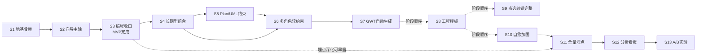

# Sprint 计划

> 项目：向导Agent与编程Agent多智能体协同开发平台
> 文档ID：05-SPRINT-PLAN
> 版本：v0.2 | 日期：2026-07-04 | 状态：已评审（G1-G5 收敛；iter2 编号映射 + 复审通过）
> 依赖：[[01_PRD/prd.md]]（PRD v0.2 §14 路线图）、[[01_PRD/user-stories.md]]、[[03_ARCHITECTURE/architecture.md]]、[[.context/设计阶段-文档产出清单与质量标准.md]]（DOC-5.1）

---

## 1. 文档目的与定位

本文档将 PRD §14 开发路线图细化为 Sprint 级别可执行计划，为 B 层 7 个模块（即 [[03_ARCHITECTURE/architecture.md]] §2 的 7 个开发模块：前端UI层 / 对话路由层 / 向导Agent引擎 / 编程Agent引擎 / 裁判引擎 / 快照管理器 / 埋点采集层）提供统一交付节奏。没有 Sprint 计划，B 层各模块将各自为政、缺乏统一交付节奏，大一学生团队（2-3 人）无法自组织。

**定位边界**（参见 DOC-5.1 §DOC-5.1）：

| 范围 | 内容 |
|------|------|
| ✅ 在范围内 | Phase 1（MVP）Sprint 1-3 详细规划（目标/用户故事/交付物/验收标准）；Phase 2-4 概要规划；Sprint 间依赖关系；每 Sprint ≤2 周 |
| ❌ 不在范围内 | 具体工时与人天（→ [[05_PROJECT_PLAN/team-config.md]]）；技术实现方案（→ [[03_ARCHITECTURE/architecture.md]]）；编码规范与代码审查流程（→ [[05_PROJECT_PLAN/workflow.md]]） |

**规划原则**：

1. **纵向切片**：每个 Sprint 产出端到端可运行增量，而非横向按模块切（避免"只有 UI 没有 Agent，跑不起来"）。这是大一团队保持节奏的关键。
2. **主轴优先**：Phase 1 聚焦快消型主轴跑通（PRD §14 Phase 1 交付物清单），长期迭代型留 Phase 2。
3. **7 模块全覆盖**：Phase 1 须覆盖 architecture.md §2 的 7 个开发模块（前端UI/对话路由/向导引擎/编程引擎/裁判引擎/快照管理器/埋点采集层），覆盖矩阵见 §6。
4. **大一团队可执行**：每 Sprint ≤2 周，2-3 人团队可承接；故事优先级与交付物粒度可在 Sprint 内自主调整（见 autonomy）。

---

## 2. 规划总览

### 2.1 Phase 概览

| Phase | 主题 | Sprint 数 | 周期 | 对应 PRD §14 |
|-------|------|-----------|------|--------------|
| Phase 1 | 核心主轴（MVP·快消型跑通） | 3 | ~6 周 | §14 Phase 1 |
| Phase 2 | 长期迭代型 | 4 | ~8 周 | §14 Phase 2 |
| Phase 3 | 体系完善 | 3 | ~6 周 | §14 Phase 3 |
| Phase 4 | 数据与科研 | 3 | ~6 周 | §14 Phase 4 |

### 2.2 Sprint 矩阵表

> 标记说明：`*` = 骨架/部分版（完整版在后续 Sprint）；`†` = 该故事在更早 Sprint 已有 MVP/部分版，本 Sprint 做完整版或能力扩展（含三类：**完整版**如 US-P04 S5 骨架→S6 完整；**能力扩展**如 US-U05 S3 MVP→S9 混合兜底+框选；**全量化/加固**如 US-R02 S1 骨架→S11 全量、US-P02 S3 完整→S10 加固）。同故事跨 Sprint 演进须显式标 `*`/`†`；未标 = 本 Sprint 首次且完整交付。
>
> 编号体系（v0.6，iter2 起启用）：用户故事编号形如 `US-Xnn`，前缀字母表示故事所属域——**U**=终端用户故事 / **G**=向导 Agent 内部角色（需求分析师/UI-UX/架构师/工程经理/路由/文档） / **P**=编程 Agent 内部角色（全栈/修复/测试/多角色） / **J**=裁判 Agent（硬约束/软约束） / **R**=研究者·埋点（看板/埋点/实验）。完整故事清单与 PRD 章节追溯见 [[01_PRD/user-stories-v0.6.md]] 追溯矩阵。

| Sprint | Phase | 主题 | 核心可运行增量 | 覆盖模块(新增/深化) | 主要用户故事 |
|--------|-------|------|----------------|---------------------|--------------|
| S1 | 1 | 地基与最窄骨架 | 模式选择→一轮需求对话→首快照 | UI/路由/向导/埋点/快照(基础) + 裁判/编程(桩) | US-U01, US-U02*, US-G01*, US-G06*, US-R02* |
| S2 | 1 | 向导主轴贯通 | 多轮对话→可预览HTML原型→文档交接 | 向导(完整4角色)/路由(完整)/UI(预览)/裁判(硬约束) | US-U02, US-U04, US-G02, US-G03, US-G04, US-G05, US-G07, US-J01* |
| S3 | 1 | 编程收口闭环 | 快消型端到端交付可运行软件 | 编程(完整)/裁判(完整)/快照(回滚)/埋点(完成) | US-U05, US-U06, US-U07, US-U08, US-P01, US-P02, US-P03, US-J01, US-J02* |
| S4 | 2 | 长期型前台流程 | 用户参与架构/Sprint确认 | 向导(前台)/路由(前台) | US-U03, US-G04†, US-G05† |
| S5 | 2 | PlantUML 约束体系 | 类图/时序图编程与校验 | 裁判(PlantUML校验)/编程(架构师角色) | US-P04* |
| S6 | 2 | 多角色 + 软约束 | 前后端分离 + 软约束AI评估 | 编程(前端/后端拆分·Reviewer 协作)/裁判(软约束全维) | US-P04†, US-J02† |
| S7 | 2 | GWT自动生成 + 版本管理 | Feature自动生成执行 + changelog | 编程(测试增强)/版本 | US-U09, US-G07† |
| S8 | 3 | 工程模板体系 | 6模板 + 自动推断 | 向导(工程经理模板推断) | PRD §11 |
| S9 | 3 | 点选纠错完整 | 混合兜底 + 框选 | UI(点选)/向导(规约) | US-U05† |
| S10 | 3 | 自愈加固 + 跨会话 | 熔断策略 + 上下文交接 | 编程(自愈)/路由(跨会话) | US-P02† |
| S11 | 4 | 全量埋点完善 | 13事件全覆盖 + 脱敏 | 埋点(完整) | US-R02† |
| S12 | 4 | 分析看板 | 5大看板上线 | UI(看板)/埋点(分析) | US-R01 |
| S13 | 4 | A/B实验 + 论文数据 | 实验配置 + 数据导出 | 埋点(实验)/UI(实验管理) | US-R03 |

---

## 3. Phase 1（MVP）详细规划

### 3.0 Phase 1 目标与边界

**Phase 1 总目标**（对齐 PRD §14 Phase 1 交付物）：跑通快消型完整流程——需求对话 → 精简PRD + 原型 → 代码 → GWT 测试收口，用户可拿到可运行软件。

**Phase 1 范围**：仅快消型（长期迭代型留 Phase 2）；仅核心 P0 用户故事；7 模块从骨架到可用。

**Phase 1 验收**：S3 结束时，一个零基础用户能通过自然语言对话做出一个可运行的小工具，并通过 GWT 测试收口——全程不接触代码、不接触技术术语。

---

### 3.1 Sprint 1：地基与最窄端到端骨架

**目标**：搭建 Proma fork 扩展地基，跑通"模式选择 → 一轮需求对话 → 首快照"最窄主轴，验证 7 模块骨架可串联、可埋点、可快照。

**周期**：2 周

**用户故事**（骨架/部分版标 `*`）：
- **US-U01** 选择项目模式（P0）— 完整
- **US-U02*** 通过对话描述需求（快消型）— 仅单轮引导
- **US-G01*** 需求分析师·引导式挖掘 — 骨架（单轮 3-5 问）
- **US-G06*** 角色切换·自动阶段路由 — 路由骨架（加载需求分析师角色）
- **US-R02*** 全量埋点 — 仅"项目创建"+"每轮对话"2 个事件

**交付物（可运行增量）**：
1. **Proma fork 扩展地基**：新增 atoms（项目模式/角色/快照列表/埋点缓冲/预览状态，~8 个）；扩展 `TabContent.tsx`（QUICK_WORKSPACE 等 4 个新 TabType，参见 architecture.md §4.2）
2. **模式选择页 + 快消型工作区骨架**：聊天区(左) + 预览区(右)双区布局，预览区暂占位
3. **对话路由层骨架**：能按阶段加载"需求分析师"System Prompt 与模型配置（architecture.md §5 Session Restart 机制的最简实现）
4. **向导引擎·需求分析师骨架**：单轮提出 3-5 个引导问题（生活化语言 + 卡片选项 + "你帮我决定"）
5. **埋点采集层基础**：JSONL 追加写入，覆盖"项目创建"+"每轮对话"（PRD §12.4 事件 1/2）
6. **快照管理器基础**：项目创建时自动产生首快照（`fs.linkSync` 硬链接，architecture.md §1.2）。**首快照对象** = 项目元数据（项目名/模式）+ 模式选择记录 + 初始目录骨架（`workspace-files/<项目名>/`），非空目录——为后续 PRD 确认 / 原型确认节点的增量快照提供基线
7. **裁判引擎/编程引擎**：占位桩（仅接口定义，不实现逻辑）

**验收标准**：
- ✅ 应用启动 → 无活跃项目 → 展示两道门（通俗说明 + 场景举例）
- ✅ 点击"快速做一个工具" → 进入快消型工作区
- ✅ 需求分析师角色加载，提出 ≥3 个引导问题（**无技术术语** = 不出现 PRD §7.5 心理防御黑名单词：API / PlantUML / Sprint / Agent / 类图 / Schema 等，用生活化语言 + 卡片选项）
- ✅ 用户回答后，对话被记录，埋点 JSONL 新增对应事件行
- ✅ 项目目录 `workspace-files/<项目名>/` 自动创建并产生首快照
- ✅ 路由层正确加载需求分析师 System Prompt（可通过日志/埋点验证角色切换事件）

**覆盖模块**：前端UI(模式+工作区骨架) / 对话路由(骨架) / 向导引擎(需求分析师骨架) / 埋点(基础) / 快照(基础) / 裁判(桩) / 编程(桩)

**工时估算**（响应 audit M1/C4-001，补人天依据；人员参照 [[05_PROJECT_PLAN/team-config.md]] §2.1 激活 3 角色：全栈开发 / 测试工程师 / 代码审查员，均绑定 GLM 5.1）：

| # | 任务（对应上文交付物 1-7） | 涉及人员 | 人天 |
|---|-------------------------|---------|------|
| T1 | Proma fork 扩展地基（atoms ~8 个 + TabContent 4 个 TabType 扩展） | 全栈开发 | 3.0 |
| T2 | 模式选择页 + 快消型工作区骨架（双区布局 + 预览区占位） | 全栈开发 | 2.0 |
| T3 | 对话路由层骨架（Session Restart 最简版 + 阶段加载需求分析师 System Prompt） | 全栈开发 | 2.5 |
| T4 | 向导引擎·需求分析师骨架（单轮 3-5 问 + 卡片选项 + "你帮我决定"心理防御） | 全栈开发 | 2.5 |
| T5 | 埋点采集层基础（JSONL 追加 + 项目创建 + 每轮对话 2 事件） | 全栈开发 | 1.5 |
| T6 | 快照管理器基础（fs.linkSync 硬链接 + 首快照含项目元数据+目录骨架） | 全栈开发 | 2.0 |
| T7 | 裁判引擎/编程引擎占位桩（仅接口定义，不实现逻辑） | 全栈开发 | 1.0 |
| T8 | S1 GWT 验收场景编写+执行（模式选择 / 对话记录 / 首快照 / 路由加载 4 项） | 测试工程师 | 2.5 |
| T9 | S1 交叉审查（沙箱逃逸 / prompt 注入 / 命名合规 / 心理防御黑名单词扫描） | 代码审查员 | 1.5 |
| T10 | 七模块联调 + 异常自愈占位 + buffer | 全栈开发 | 1.5 |

- **总人天**：20.0 pd（全栈 14.5 + 测试 2.5 + 审查 1.5 + buffer 1.5，四项分列）
- **按团队规模折算**：2 人团队 → 20/2 = 10 工作日 = **2 周** ✅；3 人团队 → 20/3 ≈ 6.7 工作日 ≈ 1.4 周（在 2 周内）
- **2 周合理性**：地基类任务（T1/T3/T4）单任务 2.5-3.0 pd 反映 Proma fork 扩展 + Session Restart 机制首落地的探索成本；其余任务 1.0-2.0 pd 为常规骨架实现。3 人团队下富余 ~3 pd 用于 S2 前置调研（路由完整 / 向导 4 角色）

---

### 3.2 Sprint 2：向导主轴贯通

**目标**：贯通向导域主轴——多轮需求对话 → UI/UX 可预览 HTML 原型 → 架构师/工程经理隐于后台 → 完整精简文档交接 → 裁判硬约束基础检查通过。

**周期**：2 周｜**依赖**：S1（地基 + 路由骨架 + 需求分析师骨架）

**用户故事**：
- **US-U02** 通过对话描述需求（快消型）— 完整多轮
- **US-U04** 预览HTML原型并确认（P0）— 完整
- **US-G02** UI/UX顾问·生成交互原型（P0）— 完整
- **US-G03** 需求分析师与UI/UX顾问并行协作（P0）— 串行快速交替实现（architecture.md §5.1）
- **US-G04** 架构设计师·技术方案（P0）— 快消型后台自动版
- **US-G05** 工程经理·团队配置与Sprint规划（P0）— 快消型后台自动版（激活全栈+测试）
- **US-G07** 文档生成与交接（P1，Phase1 前置）— 快消型精简文档
- **US-J01*** 硬约束检查 — 快消型核心项（PRD+GWT 存在性，PRD §9.3）

**交付物（可运行增量）**：
1. **预览区实装**：渲染 UI/UX 顾问产出的单文件 HTML 原型（含模拟数据、可点击，PRD §7.2）
2. **对话路由完整**：4 角色串行切换（需求分析师→UI/UX顾问→架构师[后台]→工程经理[后台]），Session Restart + Context Backfill 完整六步实现（architecture.md §5.2）
3. **向导引擎完整 4 角色**：UI/UX顾问生成带内联CSS/JS原型；架构师后台自动技术选型 + API 推断 + 简版架构；工程经理后台自动配团队
4. **快消型精简文档体系产出**（PRD §5.3 目录）：`01_PRD` + `02_UX`原型 + `03`简版架构 + `04_API`推断 + `06_TESTS`(GWT) + `README`。**目录裁剪说明**（G3 评审收敛）：快消型精简版 6 目录 = PRD §5.3 快消型子集；architecture.md §9 标准全集 7 目录中的 `05_PROJECT_PLAN`（Sprint/team-config/workflow）与 `07_VERSIONS`（changelog）在快消型下合并入 README 或暂缺——快消型用户无需参与 Sprint 规划，仅长期迭代型（Phase 2 起）才产出 05/07
5. **GWT Feature 自动生成**（PRD §10.1 / US-G07）：向导引擎后台角色（架构师/工程经理）根据 PRD 功能项自动生成 GWT Feature 场景，覆盖正常路径 + 边界 + 异常——**这是裁判「GWT 文件存在性」硬约束检查的生成来源**，避免检查因文件缺失恒退回。**归属澄清**（G3 评审收敛）：GWT Feature 文件属快消型文档体系 `06_TESTS` 目录（PRD §5.3），由**向导域**产出（architecture.md §2「向导Agent引擎」职责 = 产出完整文档体系 01~07），作为 US-G07 文档交接的子项；编程域（S3）仅**执行** GWT（architecture.md §2「编程Agent引擎」= 代码生成 + 自修复 + GWT 测试执行），不负责生成。故"向导后台角色生成 GWT"表述与 arch §2 一致，非角色职责错配
6. **裁判硬约束基础**：检查 PRD 必填项 + GWT Feature 文件存在性（快消型宽松集，PRD §9.3）
7. **快照增强**：用户确认原型前后自动快照（PRD §7.4 触发时机）
8. **埋点增强**：角色切换(事件3) + PRD确认(事件4) + 原型确认(事件5)

**验收标准**：
- ✅ 用户多轮对话后，UI/UX顾问在预览区生成可交互 HTML 原型（双击可在浏览器预览）
- ✅ 用户对原型确认（客观信号：点击"确认原型"按钮触发埋点事件 5）→ 系统隐于后台，用户看到"AI 正在开发中"
- ✅ 后台自动产出精简文档体系，目录结构与 PRD §5.3 一致
- ✅ 裁判硬约束检查通过（PRD 必填项齐 + GWT 文件存在），不通过则退回并提示
- ✅ 原型确认前后产生自动快照，时间轴可见
- ✅ 4 次角色切换均有埋点记录（事件3）

**覆盖模块**：前端UI(预览区) / 对话路由(完整4角色) / 向导引擎(完整4角色) / 裁判(硬约束基础) / 快照(确认触发) / 埋点(角色切换+确认事件)

**工时估算**（响应 audit M1/C4-001；人员参照 team-config §2.1）：

| # | 任务（对应上文交付物 1-8） | 涉及人员 | 人天 |
|---|-------------------------|---------|------|
| T1 | 预览区实装（渲染 UI/UX 顾问产出的单文件 HTML 原型 + 模拟数据 + 可点击） | 全栈开发 | 2.0 |
| T2 | 对话路由完整（4 角色串行切换 + Session Restart + Context Backfill 完整六步） | 全栈开发 | 3.5 |
| T3 | 向导引擎完整 4 角色（UI/UX 顾问生原型 + 架构师后台自动选型 + 工程经理后台自动配团队） | 全栈开发 | 4.0 |
| T4 | 快消型精简文档体系产出（PRD + UX + 简版架构 + API + GWT + README 6 目录） | 全栈开发 | 3.0 |
| T5 | GWT Feature 自动生成（向导后台角色据 PRD 功能项生成 Feature 场景，覆盖正常+边界+异常） | 全栈开发 | 2.0 |
| T6 | 裁判硬约束基础（PRD 必填项 + GWT Feature 文件存在性，快消型宽松集） | 全栈开发 | 1.5 |
| T7 | 快照增强（用户确认原型前后自动快照） | 全栈开发 | 1.0 |
| T8 | 埋点增强（角色切换 + PRD 确认 + 原型确认 3 事件） | 全栈开发 | 1.0 |
| T9 | S2 GWT 验收场景编写+执行（多轮对话 / 原型确认 / 4 角色切换 / 裁判通过 4 项） | 测试工程师 | 3.5 |
| T10 | S2 交叉审查（4 角色串行逻辑 / 原型 HTML 安全 / 文档体系合规 / 心理防御） | 代码审查员 | 2.5 |
| T11 | P0 主轴端到端联调 + buffer | 全栈开发 | 1.0 |

- **总人天**：25.0 pd（全栈 18.0 + 测试 3.5 + 审查 2.5 + buffer 1.0，四项分列）
- **按团队规模折算**：3 人团队 → 25/3 ≈ 8.3 工作日 ≈ 1.7 周 ✅；2 人团队 → 25/2 = 12.5 工作日 > 10 → **超载**，须启动下文"工作量缓解"砍 P1
- **2 周合理性与缓解纪律**：3 人团队容量（30 pd/2 周）充裕承载 25 pd（83% 占用）；2 人团队容量（20 pd/2 周）超载 5 pd，按下方缓解纪律②砍 US-G07 简版架构/API 后置 → 减 3 pd → 22 pd → 仍超 2 pd → 再按③后台角色用模板化最简版 → 减 2 pd → 20 pd = 10 工作日 ✅

**工作量缓解（G3 评审收敛）**：S2 同时打通向导域 4 角色主轴 + 后台双角色 + 文档体系 + 裁判基础，体量偏重。落地纪律：① P0 主轴必做（US-U02/U04/G02/G03/G04/G05）——4 角色串行切换 + UI/UX 原型生成必须端到端跑通；② US-G07(P1) 完整文档体系若超载，可先产出 PRD + UX + GWT 三项保 S3 编程收口，简版架构/API 后置；③ 后台角色（架构师/工程经理）S2 用**最简自动版**（模板化技术选型 + 团队配置），不做深度推理；④ Context Backfill 六步以"串行切换可跑"为底线，摘要压缩 <500 tokens 先满足功能再优化质量。超 2 周优先砍 ② 而非主轴。

---

### 3.3 Sprint 3：编程收口闭环（MVP 完成）

**目标**：贯通编程域 + 裁判闭环——全栈开发编码 → GWT 测试 → 裁判判定 → 交付试用，含自修复 3 次 + 熔断回滚 + 异常通知 + 测试结果展示。**S3 结束 = 快消型 MVP 端到端跑通**。

**周期**：2 周｜**依赖**：S2（文档交接 + 硬约束基础）

**用户故事**：
- **US-U05** 点选纠错（P0）— MVP 版（data-ai-id 主路径，architecture.md §7 Phase1）
- **US-U06** 查看和回到历史版本（P0）— 完整（线性回滚）
- **US-U07** 收到异常恢复通知（P0）— 完整（安抚文案）
- **US-U08** 验收测试结果确认（P0）— 完整（自然语言摘要）
- **US-P01** 全栈开发·从规约到代码（P0）— 完整（快消型单 Agent）
- **US-P02** 自动修复·3次尝试（P0）— 完整（含熔断）
- **US-P03** 测试Agent·执行GWT验收（P0）— 完整
- **US-J01** 硬约束检查 — 完整（快消型全量核心项）
- **US-J02\*** 软约束评估（P0）— Phase 1 交付其**快消型宽松子场景**（`*`=部分版，完整四维归 S6；仅 PRD-GWT 对应，PRD §9.3 快消型只评估核心维度）；完整四维 AI 评估（逻辑一致性/可测试性/完整性/可读性）属长期迭代型场景，归 S6

**交付物（可运行增量）**：
1. **编程引擎完整**：全栈开发 Agent 读 PlantUML 骨架 + HTML 原型生成代码（GLM 5.1，architecture.md §8）；自修复 3 次 + 熔断（PRD §6.3）；L0+L1 沙箱执行（architecture.md §6）。**沙箱落地策略**（G3 评审收敛）：L0 文件隔离随 S1 `workspace-files/` 挂载 + 项目目录隔离已自然落地（轻量，无新增工作）；L1 子进程资源限制（内存<1GB / CPU 3 分钟超时 / 子进程数≤10 / 网络白名单，architecture.md §6）为 S3 新增基础设施，MVP 可**分级实现**——先落 L0 + 基础 L1（超时 + 子进程数），完整网络白名单可后置；与编程域其他功能（自修复 / 测试 Agent）解耦开发，不阻塞主轴
2. **测试 Agent 完整**：执行全量 GWT Feature，输出结构化报告（场景总数/通过/失败/详情）
3. **裁判引擎完整（快消型）**：硬约束全量核心项 + 软约束 PRD-GWT 对应；代码与简版结构一致性检查
4. **快照回滚完整**：异常熔断 → 自动回滚上一健康快照 → 当前版本也存档（PRD §7.4 线性回滚）
5. **前端 UI 完整**：测试结果卡片（自然语言摘要）+ 时间轴面板（版本列表+回滚）+ 异常通知（安抚文案，无技术堆栈）
6. **点选纠错 MVP**：原型元素注入 `data-ai-id`，点击 → 规约 JSON → 编程 Agent 修改 → 预览刷新（architecture.md §7）
7. **埋点完成（快消型所需）**：编程执行(事件9) + 自修复(事件10) + 裁判判定(事件11) + 满意度(事件12) + 项目完成(事件13)

**验收标准**：
- ✅ 用户确认原型后，编程 Agent 自动生成可运行代码（快消型单 Agent 全栈）
- ✅ GWT 全量场景执行，输出测试报告
- ✅ 裁判判定通过 → 用户拿到可运行软件；测试未全过 → 编程 Agent 自动修复
- ✅ 3 次修复失败 → 熔断回滚 → 用户看到安抚文案（"已回到上一个正常版本，内容没有丢失"），无技术报错
- ✅ 用户可查看版本时间轴并一键回滚（不丢失当前版本）
- ✅ 用户看到自然语言测试摘要（"我们测试了 X 个场景，全部通过 ✓"）
- ✅ 用户点击原型元素可触发点选纠错（MVP 版）

**覆盖模块**：编程引擎(完整) / 裁判(完整) / 快照(回滚完整) / 前端UI(测试卡片+时间轴) / 埋点(完成)

**工时估算**（响应 audit M1/C4-001；人员参照 team-config §2.1）：

| # | 任务（对应上文交付物 1-7） | 涉及人员 | 人天 |
|---|-------------------------|---------|------|
| T1 | 编程引擎完整（全栈开发 Agent 读 PlantUML 骨架 + HTML 原型生成代码 + 自修复 3 次 + 熔断 + L0 文件隔离 + L1 子进程资源限制分级） | 全栈开发 | 5.0 |
| T2 | 测试 Agent 完整（执行全量 GWT Feature + 输出结构化报告：场景总数/通过/失败/详情） | 全栈开发 | 2.0 |
| T3 | 裁判引擎完整（快消型）：硬约束全量核心项 + 软约束 PRD-GWT 对应 + 代码-简版结构一致性 | 全栈开发 | 2.5 |
| T4 | 快照回滚完整（异常熔断→自动回滚上一健康快照→当前版本存档，PRD §7.4 线性回滚） | 全栈开发 | 1.5 |
| T5 | 前端 UI 完整（测试结果卡片自然语言摘要 + 时间轴面板版本列表+回滚 + 异常通知安抚文案） | 全栈开发 | 2.5 |
| T6 | 点选纠错 MVP（原型元素 data-ai-id 注入 + 点击→规约 JSON + 编程 Agent 修改 + 预览刷新） | 全栈开发 | 2.0 |
| T7 | 埋点完成（编程执行 + 自修复 + 裁判判定 + 满意度 + 项目完成 5 事件） | 全栈开发 | 1.5 |
| T8 | S3 GWT 验收场景编写+执行（点选纠错 / 版本回滚 / 异常通知 / 测试摘要 / 熔断 5 项） | 测试工程师 | 3.5 |
| T9 | S3 交叉审查（L1 沙箱安全 / 熔断-回滚逻辑 / 裁判门禁正确性 / 心理防御文案合规） | 代码审查员 | 3.0 |
| T10 | Phase 1 端到端联调（S1+S2+S3 全链路）+ 快消型主轴全程跑通 + buffer | 全栈+测试 | 1.5 |

- **总人天**：25.0 pd（全栈 17.0 + 测试 3.5 + 审查 3.0 + buffer 1.5，四项分列）
- **按团队规模折算**：3 人团队 → 25/3 ≈ 8.3 工作日 ≈ 1.7 周 ✅；2 人团队 → 25/2 = 12.5 工作日 > 10 → **超载**
- **2 周合理性与缓解纪律**：3 人团队容量（30 pd/2 周）承载 25 pd（83% 占用）；2 人团队超载 5 pd，按 §3.3 #1 沙箱落地策略——L1 完整网络白名单后置（减 1 pd）+ 点选纠错 MVP 简化（减 1 pd）→ 23 pd / 2 = 11.5 工作日（仍略超），2 人团队需启动加班或延期 0.5 周；推荐 3 人团队承接 S3（编程域+裁判域+UI 三线并发）

**Phase 1 收口验收**：一个零基础用户从"我想做个读书笔记工具"到拿到可运行软件并看到测试通过摘要，全程不接触代码、不接触技术术语（**可测化**：用户操作链路中无代码编辑器入口；引导 / 通知文案不出现 PRD §7.5 黑名单技术词；交付物 = 可双击运行的可执行文件 + 自然语言测试摘要）。

---

### 3.4 Phase 1 工时汇总与 2 周周期合理性总览

> 本节响应 audit 补审附录 N12 / C4-001（"§3 各 Sprint 标 2 周无人天依据"），汇总 S1-S3 工时估算，证明 Phase 1 总周期 ~6 周（每 Sprint ≤2 周）的合理性。

**S1-S3 工时汇总**：

| Sprint | 全栈 (pd) | 测试 (pd) | 审查 (pd) | Buffer (pd) | 总人天 (pd) | 主要负载模块 |
|--------|----------|----------|----------|------------|------------|-------------|
| S1 地基骨架 | 14.5 | 2.5 | 1.5 | 1.5 | **20.0** | UI/路由/向导/埋点/快照/裁判桩/编程桩 |
| S2 向导主轴 | 18.0 | 3.5 | 2.5 | 1.0 | **25.0** | 向导4角色/路由完整/文档体系/裁判硬约束 |
| S3 编程收口 | 17.0 | 3.5 | 3.0 | 1.5 | **25.0** | 编程引擎/测试Agent/裁判完整/快照回滚/UI/点选 |
| **Phase 1 合计** | **49.5** | **9.5** | **7.0** | **4.0** | **70.0** | 7 模块全覆盖（见 §6 矩阵） |

> Buffer 归属说明：S1-T10（联调+异常自愈占位+buffer 1.5 pd）/ S2-T11（P0 主轴端到端联调+buffer 1.0 pd）/ S3-T10（Phase 1 端到端联调+buffer 1.5 pd）三项原计入全栈行，本表为加法闭合单列 Buffer 列；3 项 buffer 任务实际仍由全栈开发承担。

**人员分布**（参照 [[05_PROJECT_PLAN/team-config.md]] §2.1 激活 3 角色，均绑定 GLM 5.1）：
- 全栈开发 49.5 pd（71%）— 主力，跨 UI + 主进程服务/引擎一体实现（不含 buffer）
- 测试工程师 9.5 pd（14%）— 每 Sprint GWT 验收场景编写+执行
- 代码审查员 7.0 pd（10%）— 每 Sprint 独立交叉审查（洁净室原则禁产出方自审）
- Buffer 4.0 pd（5%）— 联调+异常自愈占位+缓冲，由全栈开发承担

**周期合理性论证**：

| 团队规模 | 6 周容量 (pd) | Phase 1 实际 (pd) | 占用率 | 结论 |
|---------|-------------|------------------|-------|------|
| 2 人 × 6 周 × 5 工作日 | 60 | 70 | 117% | **超载**，需启动 §3.2/§3.3 缓解纪律砍 P1 后置项 |
| 3 人 × 6 周 × 5 工作日 | 90 | 70 | 78% | ✅ **合理**（推荐），富余 20 pd 用于联调/质量加固/Phase 2 预研 |

**单 Sprint 合理性**（3 人团队基准）：

| Sprint | 总人天 (pd) | 3 人折算工作日 | 折算周数 | ≤2 周？ |
|--------|------------|--------------|---------|--------|
| S1 | 20.0 | 6.7 | 1.4 周 | ✅ |
| S2 | 25.0 | 8.3 | 1.7 周 | ✅ |
| S3 | 25.0 | 8.3 | 1.7 周 | ✅ |

**结论**：3 人团队下每 Sprint ≤2 周（最大 1.7 周），Phase 1 总周期 ~6 周合理（78% 占用率留联调/质量加固余量）；2 人团队需启动工作量缓解纪律（§3.2 末 + §3.3 #1 沙箱分级）将 P1 后置项延至 Phase 2。

**工时估算依据**：
1. 任务粒度扎根 §3.1/§3.2/§3.3 既有交付物清单（每 Sprint 7-8 项可运行增量），不悬空编数字
2. 人员分配遵循 team-config §2.1 三角色职责边界（全栈=UI+引擎一体；测试=GWT 唯一执行者；审查=独立交叉）
3. 单任务人天参考 Proma fork 扩展 / Session Restart / Agent 引擎 / 沙箱等首落地探索成本（地基类 2.5-3.0 pd；常规骨架 1.0-2.0 pd；完整实现 2.0-5.0 pd）
4. 每 Sprint 含 1.0-1.5 pd 联调 buffer，应对 Agent 间串联调试与异常自愈模拟
5. 不直接编码的角色（裁判 Agent Phase 1 由人类+脚本模拟，见 workflow §0）不计入编程 Agent 工时

---

## 4. Phase 2-4 概要规划

> 以下为概要规划，可在各 Phase 启动前结合实际进展调整。**Phase 范围调整须请示 A-commander**（autonomy: must_ask）。

### 4.1 Phase 2：长期迭代型（~8 周，4 Sprint）

**主题**（PRD §14 Phase 2）：长期迭代型完整流程 + PlantUML 约束体系 + 编程 Agent 多角色 + 软约束 AI 评估。

| Sprint | 主题 | 核心增量 | 主要故事 |
|--------|------|----------|----------|
| S4 | 长期型前台流程 | 架构师/工程经理跳前台，用户参与技术选型与 Sprint 优先级确认 | US-U03, US-G04†, US-G05†, US-G06† |
| S5 | PlantUML 约束体系 | 类图+时序图编程，裁判校验代码-PlantUML 一致性（Phase1 浅层类名 → 方法签名） | US-P04*, 裁判增强 |
| S6 | 多角色 + 软约束 | 前端/后端/Reviewer 分离协作；裁判软约束全维度 AI 评估 | US-P04, US-J02 |
| S7 | GWT自动生成 + 版本管理 | PRD→GWT Feature 自动生成执行；changelog + 跨会话上下文交接 | US-U09, US-G07† |

**Phase 2 验收**：长期迭代型项目可走完整流程（全文档 + PlantUML + 多角色协作 + 版本迭代）。

**角色池分阶段激活说明**：PRD §14 Phase 3 要求「编程 Agent 角色池全部激活（架构师/前端/后端/Reviewer/DevOps/PM）」。**代码审查员（Reviewer）已随 Phase 1 MVP 激活**（见 [[05_PROJECT_PLAN/team-config.md]] §2.1：MVP 激活「全栈开发 / 测试工程师 / 代码审查员」三角色；§2.2.2 论证 Reviewer 因长期迭代型必选 + 洁净室原则进 MVP），非 Phase 2 才激活。本规划按协作复杂度分阶段：Phase 1 MVP 已含 Reviewer；Phase 2 激活开发主线增量角色（架构师 S5 / 前端·后端拆分 S6）以支撑多角色协作；Phase 3 补齐保障类角色（DevOps·PM，S10）完成全池激活。Phase 3 末点为全池激活完成时点，与 PRD §14 对齐。

### 4.2 Phase 3：体系完善（~6 周，3 Sprint）

**主题**（PRD §14 Phase 3）：工程模板 + 点选纠错完整 + 异常自愈加固 + 角色池全激活。

| Sprint | 主题 | 核心增量 | 主要故事 |
|--------|------|----------|----------|
| S8 | 工程模板体系 | 6 模板（Web/API后端/移动/桌面/CLI/AI）+ 自动推断（PRD §11） | PRD §11, US-G05† |
| S9 | 点选纠错完整 | Phase2 混合兜底（视觉模型）+ Phase3 框选多元素 | US-U05†, architecture.md §7 |
| S10 | 自愈加固 + 跨会话 | 熔断策略多样化 + DevOps/PM 角色 + 跨会话上下文平滑交接 | US-P02†, US-P04† |

### 4.3 Phase 4：数据与科研（~6 周，3 Sprint）

**主题**（PRD §14 Phase 4）：全量埋点 + 分析看板 + A/B 实验 + 论文数据。

| Sprint | 主题 | 核心增量 | 主要故事 |
|--------|------|----------|----------|
| S11 | 全量埋点完善 | 13 事件全覆盖 + 数据脱敏 + 30 天保留（PRD §12） | US-R02† |
| S12 | 分析看板 | 效率/Token/认知摩擦/文档合规/范式挖掘 5 大看板 | US-R01 |
| S13 | A/B实验 + 论文数据 | 实验分组配置 + 对比分析（p 值）+ 数据导出（CSV/JSON，含显著性标注，支持论文直接引用）；论文/研究报告撰写属课题组线下工作，不在平台交付范围 | US-R03 |

---

## 5. Sprint 依赖关系图（无循环）

**依赖说明**：
- **Phase 1（S1→S2→S3）严格线性**：每 Sprint 依赖前一 Sprint 的可运行增量，不可乱序
- **Phase 2 内** S5/S6 可部分并行（均依赖 S4），S7 依赖 S6
- **Phase 3** 的 S9/S10 可并行（均依赖 S8）
- **Phase 4** 的 S11 可在 S3 后较早启动（埋点深化不阻塞功能开发），但完整看板 S12/S13 依赖 S11
- **两类依赖区分（图与说明已统一）**：图中**实线箭头**（S1→S2、S2→S3、S5→S6、S6→S7、S11→S12、S12→S13 等）= **技术依赖**（前一 Sprint 可运行增量是后者硬前置，不可乱序）；图中**虚线箭头**（S3⇢S11 埋点深化可早启、S7⇢S8 / S8⇢S9 / S8⇢S10 阶段顺序、S10⇢S11 触发场景补充）= **阶段顺序依赖 / 可早启 / 触发补充**（推荐次序或便利性，非技术硬约束），可在各 Phase 启动时调整
- **S10⇢S11 虚线**仅表示 S10 完成后埋点触发场景更全面、便于 S11 脱敏/保留策略验证；PRD §12.4 的 13 事件清单固定，S10 不产生新事件类型
- **无循环依赖**：所有箭头从小编号指向大编号，拓扑有序 ✅

---

## 6. Phase 1 七模块覆盖矩阵

> 验证 Phase 1 覆盖 architecture.md §2 的 7 个开发模块（DOC-5.1 质量门槛"7 模块覆盖"）。

| 模块 | S1 | S2 | S3 | Phase 1 覆盖 |
|------|----|----|----|--------------|
| 前端UI层 | 模式页 + 工作区骨架 | 预览区 | 测试卡片 + 时间轴 + 点选 | ✅ 完整 |
| 对话路由层 | 骨架(单角色) | 完整(4角色串行) | — | ✅ 完整 |
| 向导Agent引擎 | 需求分析师骨架 | 完整4角色 | — | ✅ 完整 |
| 编程Agent引擎 | 占位桩 | — | 完整(全栈+自修复+GWT) | ✅ 完整 |
| 裁判引擎 | 占位桩 | 硬约束基础 | 完整(硬约束+软约束基础) | ✅ 完整 |
| 快照管理器 | 首快照 | 确认节点触发 | 线性回滚完整 | ✅ 完整 |
| 埋点采集层 | 2 事件 | +3 事件 | +5 事件(快消型所需全) | ✅ 完整 |

**结论**：7 个开发模块在 Phase 1（S1-S3）全部覆盖到「完整可用」程度 ✅

**关于第 8 个模块「项目文档体系」**：architecture.md §2 另列有「项目文档体系」（职责：维护标准化 7 目录结构、`workspace-files/` 挂载），属贯穿性基础设施而非独立开发模块——commander 契约与 DoD 的「7 模块」口径即指 7 个开发模块。该基础设施在 Phase 1 已隐含覆盖：S1 建立 `workspace-files/<项目名>/` 挂载与目录骨架；S2 产出快消型 6 目录文档；S3 将编程 Agent 生成的代码文件纳入目录树。故不单列矩阵行，但确认已覆盖 ✅。

---

## 7. 风险与说明

| 风险/说明 | 应对 |
|-----------|------|
| 每 Sprint 工作量可能超 2 周（大一团队） | 各 Sprint 已拆为"骨架→完整"渐进；若超时优先砍 P1 故事保可运行增量（autonomy: 交付物粒度可调） |
| GLM 5.1 第三方模型稳定性（architecture.md §11） | 全栈开发备选 deepseek-v4-pro；S3 需验证备选链路 |
| 串行角色切换端到端延迟（architecture.md §11） | S2 实现上下文摘要压缩 <500 tokens，模型响应 <3s |
| PRD §14 Phase 划分与本文档 Sprint 对齐 | 已逐 Phase 对齐；Phase 范围调整须请示 A-commander（autonomy: must_ask） |
| US-G07(P1) 在 Phase 1 提前部分实现 | 因快消型收口必需，属合理前置；完整版留 Phase 2(S7) |
| US-J02(P0) 在 Phase 1 仅做快消型宽松版 | US-J02 为 P0，但其 GWT 含「快消型只评估核心维度」场景（PRD §9.3）；Phase 1 覆盖该子场景，完整四维评估归 S6。非「P0 降级」，是同一故事按模式分范围交付 |
| US-U03(P0,长期迭代型) 推迟到 S4 | US-U03 为 P0 但属长期迭代型故事，按 §3.0「Phase 1 仅快消型」范围声明推迟至 S4，**非 P0 漏覆盖**，是按模式分范围交付（与 US-J02 同姿态） |
| US-R02(P0) 在 S1 仅 2 事件骨架 | US-R02 为 P0（埋点），S1 做"项目创建+每轮对话"2 事件骨架、S3 补齐快消型所需、S11 做 13 事件全覆盖 + 脱敏 + 30 天保留。按阶段分范围渐进，非「P0 降级」 |
| 点选纠错 PRD §14 Phase 1 未单列 | PRD §14 Phase 1 交付物清单未单列点选纠错，但 US-U05(P0) GWT 要求 + [[03_ARCHITECTURE/architecture.md]] §7 Phase 1（data-ai-id MVP 主路径）均要求 Phase 1 落地 MVP 版（S3）。PRD 侧描述偏简，以 US-U05 + arch §7 为准 |
| Phase 1-3 埋点数据临时保留 | S1-S10 埋点仅本地 JSONL 落盘，数据脱敏与 30 天保留策略随 S11 全量埋点完善时统一落地（PRD §12）；Phase 1-3 为课题开发期、无外部用户数据，临时保留可接受 |

---

## 8. 自查 Check-list（DoD 核对）

- [x] Phase 1 拆解为 3 个 Sprint（S1/S2/S3）✅
- [x] 每个 Sprint 有明确可运行增量交付物 ✅
- [x] `must_contain` 关键词齐全：Sprint / 交付物 / 验收标准 / Phase / 用户故事 ✅
- [x] Phase 1 覆盖 architecture.md 7 模块（见 §6 矩阵）✅
- [x] Sprint 间依赖无循环（见 §5 拓扑有序）✅
- [x] 每个 Sprint ≤2 周 ✅
- [x] 文件头元信息完整（05-SPRINT-PLAN / v0.2 / 2026-07-04 / 已评审）✅
- [x] 跨文档引用用相对路径 `[[...]]` ✅
- [x] 篇幅 ≥1500 字（实际约 6000 字，v0.2 含评审收敛补充）✅
- [x] v0.2 已完成第一阶段 G1-G5 洁净室评审（red 归零，详见 §9）✅

---

## 9. 审查记录（v0.1 → v0.2 · 第一阶段 G1-G5 洁净室评审收敛）

> 评审方：nanju-A2r-worker（A 层补审 review worker）+ 3 个独立洁净室评审子 Agent（并行）
> 依据：[[.context/设计阶段-文档产出清单与质量标准.md]] §1.4 G1-G5 + DOC-5.1 + [[05_PROJECT_PLAN/workflow.md]] §2.2
> 对照：[[01_PRD/prd.md]] §14/§9.3/§12.4/§6.3/§7.4/§11/§5.3、[[01_PRD/user-stories.md]]、[[03_ARCHITECTURE/architecture.md]] §2/§5/§6/§7、[[05_PROJECT_PLAN/team-config.md]]、[[05_PROJECT_PLAN/workflow.md]]

### 9.1 评审方式

3 个独立子 Agent 并行分视角（独立读原文 + 对照文档，只提 red/yellow，不重写）：
- 子 Agent A：G1 完整性 + G5 格式合规
- 子 Agent B：G2 一致性（对照 prd§14 + user-stories + arch7模块 + team-config + workflow）
- 子 Agent C：G3 可执行性 + G4 可读性

### 9.2 R1（第一轮）findings 汇总

| 视角 | red | yellow | 要点 |
|------|-----|--------|------|
| G1 完整性 | 0 | 4 | 元信息 / S1-S3 四要素齐 / 篇幅足；建议补 B 层括注、数据保留过渡 |
| G5 格式合规 | 0 | 5 | 命名 / 元信息 / 相对路径合规；引用有效性 **6/6 全通过**；裸引用补 [[]] 列遗留 |
| G2 一致性 | 1 | 6 | red=Reviewer 激活时点；P0 全覆盖、Phase/7模块/埋点编号均对齐 |
| G3 可执行性 | 5 | 7 | red=首快照对象 / GWT角色 / S2过载 / S3沙箱 / US-U05标记(后证伪1) |
| G4 可读性 | 1 | 7 | red=`*`/`†` 标记系统不一致；建议 mermaid 图例 / 术语统一 |
| **合计** | **7** | **29** | |

### 9.3 R1 red 归零轨迹

| # | red 项 | 视角 | 核实 | 处置 | 状态 |
|---|--------|------|------|------|------|
| 1 | Reviewer 激活时点（§4.1 推至 S6 vs team-config §2.1 MVP 已激活） | G2 | 真矛盾（team-config §2.1/§2.2.2/§6 确认） | §4.1 改"Reviewer 已随 MVP 激活；Phase2 激活架构师/前后端；Phase3 补 DevOps/PM"；§2.2 S6 矩阵去 Reviewer 新增意 | ✅ 归零 |
| 2 | S1 首快照对象不明 | G3 | 成立 | §3.1 #6 补"首快照对象=项目元数据+模式选择+初始目录骨架，非空" | ✅ 降 yellow |
| 3 | S2 GWT 生成角色与 arch 不符 | G3 | 部分误判（arch §2 向导引擎产 06_TESTS；编程域只执行 GWT） | §3.2 #5 补归属澄清：GWT 生成属 US-G07 文档体系，向导域产出 | ✅ 降 yellow |
| 4 | S2 工作量过载 | G3 | 成立 | §3.2 末补"工作量缓解"段：P0/P1 砍减纪律 + 后台最简版 + Backfill 底线（不拆 Sprint） | ✅ 降 yellow |
| 5 | S3 沙箱首次落地挤同 Sprint | G3 | 成立 | §3.3 #1 补"沙箱落地策略"：L0 随 S1 落地；L1 分级（白名单后置）；与编程域解耦 | ✅ 降 yellow |
| 6 | S3 US-U05 `*` 标记与完整闭环矛盾 | G3 | **误报**（原文 §2.2 矩阵 S3 US-U05 本无 `*`；arch §7 Phase1=MVP 完整主路径，S3 做完整 MVP 版正确） | 无需改；图例补 `†` 扩展语义 | ✅ 证伪 |
| 7 | `*`/`†` 标记系统不一致（S6 US-P04/J02 漏†、§3.3 US-J02 漏*、†语义边界） | G4 | 成立 | §2.2 图例补 `†` 三类扩展语义；S6 矩阵 US-P04/J02 补†；§3.3 US-J02 补* | ✅ 归零 |

**R1 red 归零：7/7**（真改 4 + 补说明/缓解降 yellow 2 + 证伪 1）。

### 9.4 R2 复审（同 G1-G5 视角）

R1 修改落盘后，worker 以同 G1-G5 视角复审各修改点 + 全文抽样核验是否引入新问题：
- §4.1 Reviewer ↔ team-config §2.1 一致 ✅
- §2.2 S6 US-P04†/US-J02† + 图例 `†` 扩展语义自洽 ✅
- §3.2 GWT 归属 ↔ arch §2 一致 ✅；§3.2 工作量缓解可执行 ✅
- §3.3 沙箱分级 ↔ arch §6 一致 ✅
- mermaid 虚线（S7⇢S8 / S8⇢S9 / S8⇢S10）与说明文字口径统一 ✅
- §3.1 首快照 / §3.1-§3.3 验收可测化 / §7 风险表 5 行声明 均落地 ✅
- 引用有效性重核：6/6 仍全通过，修改未引入失效引用 ✅
- **R2 发现 1 处版本同步遗漏**：§8 自查清单仍写「v0.1 / 2026-07-03 / 草稿」（与文件头 v0.2 不一致）→ 已即时同步修正为 v0.2

**R2 修正后 red 数：0**（R2 复审发现并修正 1 处版本同步遗漏；其余 19 处 R1 修改均正确落地，无其他新 red）。2 轮收敛，red 归零。

### 9.5 遗留 yellow 项（允许进入第二阶段人机评审，不阻断）

1. [yellow] 跨文档裸引用（architecture.md §X / PRD §X 行内文本）未全部包裹 [[ ]]：文件头依赖 6 处已用 [[ ]]，正文行内引用保留学术写法。工作量大，留人机评审由人类决定是否全量改。
2. [yellow] §6 覆盖矩阵表头"覆盖模块(新增/深化)"与表体"完整/桩/基础"口径不完全统一：语义可理解，可读性建议。
3. [yellow] 术语"长期迭代型"全称 vs "长期型"简称混用：建议首次出现处声明简称。

### 9.6 收敛结论

第一阶段 G1-G5 评审 **2 轮收敛，red 全部归零**（R1=7 → R2=0），允许进入第二阶段人机交互评审。版本：v0.1 草稿 → **v0.2 待审（G1-G5 已评审收敛）**（此为 iter1 第一阶段末状态；iter2 已将状态升为"已评审"，见 §9.7）。

### 9.7 iter2 编号映射专项 + 状态升级（2026-07-07）

> 评审方：nanju-B1-worker（iter2 worker）+ §4.6 G1-G5 5 子 Agent 复审
> 触发：v0.6 用户故事编号体系启用，sprint-plan §2.2/§3/§4/§7/§9 仍引用 v0.1 旧编号（US- 加两位数字式），需全文映射至 v0.6 新编号（US-U/G/P/J/R 系列）

**编号映射**：全文 25 条旧编号按 v0.6 追溯矩阵（[[01_PRD/user-stories-v0.6.md]] L1325-1352）映射，并以旧版追溯矩阵（[[01_PRD/user-stories.md]] L898-927）PRD 章节逐行交叉验证（25/25 章节一致，零歧义）。完整映射表见 [[sprint-plan.note.md]]。§9.2-9.4 历史记录中的旧编号一并同步，保持引用一致性。

**方法**：replace_all 机械化映射 + 简写列表手工修复——§3.2 L145「US-U02/U04/G02/G03/G04/G05」与 §9.3 L348「US-P04/J02」原为省略 `US-` 前缀的纯数字简写（如「02/04/12…」「21/23」），机械替换产生孤儿数字（/04、/23 等），已手工补全。

**状态升级**：头部 L5 状态 待审 → 已评审（G1-G5 收敛）；§8 自查清单 L307 同步。版本保持 v0.2（仅状态升级，非版本号变更）。

**iter2 §4.6 G1-G5 复审**：5 子 Agent（G1 完整性 / G2 一致性 / G3 可执行性 / G4 可读性 / G5 格式合规）对映射后全文复审，末轮 red_count=0 收敛，结果见 leaf `nanju-B1-worker` 的 review_round event。

**声明**：本节为 iter2 专项（编号映射 + 状态升级 + 复审），不改动 §9.1-9.6 所记录的第一阶段洁净室评审结论（nanju-A2r-worker 产出，2 轮 red 归零）。

> **跨文档反馈**（非本文件范围）：本次评审发现 [[01_PRD/user-stories.md]]「故事总览」统计表与各故事块 / 追溯矩阵的 P 级存在内部矛盾（终端用户 P0 统计 7 vs 实际 8；向导Agent P0 统计 5 vs 实际 6）。属 user-stories.md 自身数据质量，已标记反馈其维护方。

---

> 文档结束。本版本 v0.2 已完成第一阶段 Agent 团队洁净室评审（G1-G5 收敛，red 归零，详见 §9），进入第二阶段人机交互评审。
